# Various themes for Omarchy

[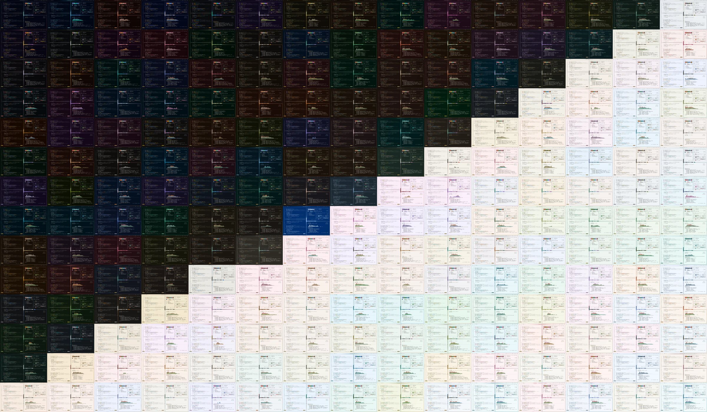](https://bjarneo.github.io/various-themes)

This repo has 100 themes for [Omarchy](https://omarchy.org). A slot can leave its usual hue: the yellow of Delft is a pale cobalt, and the blue of Kyoto Moss is a moss green. Each theme has a night variant and a day variant. That makes 200 Omarchy themes. Each variant has a 16-color ANSI palette and 5 backgrounds: 3 drawn at 6K, the Omarchy wordmark, a scene and a palette card, and 2 wallpapers from Wikimedia Commons between 4K and 6K.

- Site: [bjarneo.github.io/various-themes](https://bjarneo.github.io/various-themes)
- Screenshots: real captures of an Omarchy desktop with each variant applied
- Promo video: [`site/assets/promo.mp4`](site/assets/promo.mp4), all 100 themes, 2 beats each, with a transition for each pattern
- Backgrounds: 600 drawn images at 6K, 6144×3456, and 400 wallpapers from Wikimedia Commons

## Variants

| Variant | Theme name | What it is | Lowest ANSI contrast | Lowest muted contrast | Lowest text contrast |
| --- | --- | --- | --- | --- | --- |
| Night | `kyoto-moss-night` | A dark background in the hue of the theme. For the evening and dim rooms. | 4.6:1 | 3.6:1 | 10.6:1 |
| Day | `kyoto-moss-day` | A light background with the same hues. For bright rooms and daylight. | 4.6:1 | 3.6:1 | 13.0:1 |

The contrast columns show the lowest WCAG contrast ratio against the background, over all 100 themes. The 6 main ANSI colors and their brights reach at least 4.5:1, the WCAG AA level. The muted color reaches 3.6:1, because Neovim and Helix use it for comments and line numbers. Each variant is a complete Omarchy theme with its own folder, so you can install any mix of them.

## Patterns

Each theme follows 1 of 8 patterns. In every theme, `accent` equals the `blue` slot, and 83 of the 100 themes move at least 1 slot away from its usual hue.

| Pattern | Themes | Rule |
| --- | --- | --- |
| [Family and pops](#family-and-pops) | 26 | Most slots come from 1 hue family. Red and 1 or 2 other slots stay as pops. The brights of the family slots turn into pale tints. |
| [Monochrome](#monochrome) | 12 | All 6 slots stay inside 1 hue band. A lightness ladder keeps the slots apart, and the brights are pale tints. |
| [Duotone and triad](#duotone-and-triad) | 15 | 2 or 3 hue families share the 6 slots. The window border is a gradient between 2 of them. |
| [Analogous](#analogous) | 10 | The 6 slots spread along 1 arc of the color wheel. No slot takes the opposite hue. |
| [Earth](#earth) | 12 | Chroma stays low. Earth hues fill all slots, so cyan can be gold and blue can be olive. |
| [Grey and signal](#grey-and-signal) | 8 | Most slots are neutral greys. 1 or 2 slots carry a signal color. |
| [Tuned spectrum](#tuned-spectrum) | 11 | All 6 hues stay in their usual slots. 1 chroma and lightness mood ties them together. |
| [Pastel](#pastel) | 6 | The normal colors keep a mid chroma. The brights turn into near-white tints, and the foreground takes a contrasting hue. |

## Backgrounds

Each variant has 5 backgrounds. Omarchy shows them in this order. To show the next one, run `omarchy theme bg next`.

| File | What it shows |
| --- | --- |
| `0-omarchy-wordmark.jpg` | The Omarchy wordmark in the colors of the variant. The treatment follows the pattern: a lightness ladder for Monochrome, a print out of register for Duotone, a pressed wordmark for Earth, and so on. |
| `1-<scene>.jpg` | A drawn scene of the theme subject: a moss garden for Kyoto Moss, a fjord for Fjord, a circuit board for Resistor. |
| `2-palette-card.jpg` | A data card: the 16 ANSI colors with their contrast, the slots that left their usual hue, and the background and text ramps. |
| `3-<name>.jpg`, `4-<name>.jpg` | Photographs and artworks from Wikimedia Commons that fit the subject and the colors of the variant: dark images at night and light images in the day. They are between 3840 and 6144 pixels wide, cropped to 16:9. Each theme section lists their credits. |

## Install

`install.sh` copies themes into `~/.config/omarchy/themes`. Each theme variant becomes a normal Omarchy theme folder. The script installs the night and day variants of a theme unless you name one with `--variant`.

### Install one theme without a clone

The script downloads only the themes that you name:

```bash
curl -fsSL https://bjarneo.github.io/various-themes/install.sh | bash -s -- kyoto-moss --set
```

To install one variant only, add `--variant`:

```bash
curl -fsSL https://bjarneo.github.io/various-themes/install.sh | bash -s -- kyoto-moss fjord --variant day
```

`--set` applies the first installed variant of the last theme.

### Install from a clone

```bash
git clone --depth 1 https://github.com/bjarneo/various-themes ~/.local/share/various-themes
cd ~/.local/share/various-themes
./install.sh --all
omarchy theme set kyoto-moss-night
```

The full repo is about 2830 MB because it has 600 backgrounds at 6K. To download less, use the `curl` command above. It downloads only the folders that you name.

### Options

| Command | Result |
| --- | --- |
| `install.sh kyoto-moss fjord` | Installs the night and day variants of the named themes |
| `install.sh kyoto-moss --variant day` | Installs only this variant |
| `install.sh --all` | Installs all 200 themes |
| `install.sh --list` | Lists the 100 theme names |
| `install.sh kyoto-moss --set` | Installs the theme, then applies its night variant |
| `install.sh --update` | Installs again every theme variant that the script installed |
| `install.sh --remove kyoto-moss` | Removes the variants of a theme that the script installed |
| `install.sh --link kyoto-moss` | Links to the clone instead of copying. Run `git pull` in the clone to update. |
| `install.sh --force kyoto-moss` | Replaces a theme with the same name that the script did not install |

The variant names are `night` and `day`. The script writes a `.various-themes` marker file in each theme that it copies. `--update` and `--remove` use this file, so they never change a theme that you made.

### Apply with Aether

[Aether](https://github.com/omacom/aether) can apply a theme straight from the [site](https://bjarneo.github.io/various-themes). Select a theme, pick a variant and a background, and select 1 of these buttons:

| Button | Result |
| --- | --- |
| Apply with Aether | Aether loads the palette and the background, then applies them at once through its own theme. |
| Install as Omarchy theme | Aether adds the variant to `~/.config/omarchy/themes` and activates it at once. This stops if a theme with the same name exists, for example after `install.sh`. |
| Open in editor | Aether opens the palette in its editor. Nothing changes until you select Apply. |

Aether stops a download after 60 seconds. On a slow connection, a 6K background can take longer, so the links download a 3840×2160 copy from `site/assets/aether/`. GitHub does not render `aether://` links, so use the site or build a link yourself:

```text
aether://apply?colors=https://bjarneo.github.io/various-themes/kyoto-moss/night/colors.toml&wallpaper=https://bjarneo.github.io/various-themes/assets/aether/kyoto-moss/night/1-moss-garden.jpg&silent=true
```

Add `&as_omarchy_theme=kyoto-moss-night` to install the variant. Use `&edit=true` instead of `&silent=true` to open the editor.

### Name conflicts

All theme names end in `-night` or `-day`, so they do not collide with the themes that ship with Omarchy. The names also differ from the themes of [100-themes](https://github.com/bjarneo/100-themes), [coffee-themes](https://github.com/bjarneo/coffee-themes) and [mineral-themes](https://github.com/bjarneo/mineral-themes). The script does not replace a theme that it did not install. If `~/.config/omarchy/themes/kyoto-moss-night` exists, the script skips it and tells you. Rename your theme, or use `--force` to replace it.

`omarchy theme install <url>` does not work with this repo. That command expects one theme at the root of a repo.

## Switch themes and backgrounds

```bash
omarchy theme set kyoto-moss-night   # apply a theme
omarchy theme set kyoto-moss-day     # the same theme in daylight
omarchy theme bg next                # show the next background of the current theme
```

## The collection

| Pattern | Themes |
| --- | --- |
| Family and pops | [Flamingo](#flamingo), [Oxblood](#oxblood), [Poppy Field](#poppy-field), [Brickwork](#brickwork), [Persimmon](#persimmon), [Marigold](#marigold), [Honeycomb](#honeycomb), [Mimosa](#mimosa), [Mangrove](#mangrove), [Absinthe](#absinthe), [Pistachio](#pistachio), [Kyoto Moss](#kyoto-moss), [Celadon](#celadon), [Spruce](#spruce), [Verdigris](#verdigris), [Seaglass](#seaglass), [Peacock](#peacock), [Kingfisher](#kingfisher), [Fjord](#fjord), [Delft](#delft), [Shibori](#shibori), [Iris](#iris), [Wisteria](#wisteria), [Aubergine](#aubergine), [Bougainvillea](#bougainvillea), [Peony](#peony) |
| Monochrome | [Darkroom](#darkroom), [Oxide](#oxide), [Sepia](#sepia), [Brass](#brass), [Bottle Glass](#bottle-glass), [Viridian](#viridian), [Seafoam](#seafoam), [Petrol](#petrol), [Blueprint](#blueprint), [Heliotrope](#heliotrope), [Mauve](#mauve), [Bordeaux](#bordeaux) |
| Duotone and triad | [Anaglyph](#anaglyph), [Byzantine](#byzantine), [Regatta](#regatta), [Poolside](#poolside), [Reading Room](#reading-room), [Infrared](#infrared), [Cross Process](#cross-process), [Lava Lamp](#lava-lamp), [Koi Pond](#koi-pond), [Bauhaus](#bauhaus), [Nightshade](#nightshade), [Strawberry Mint](#strawberry-mint), [Aperitivo](#aperitivo), [Mid Century](#mid-century), [Rhubarb Custard](#rhubarb-custard) |
| Analogous | [Hydrangea](#hydrangea), [Forge](#forge), [Jewel Beetle](#jewel-beetle), [Thermal](#thermal), [Meadow](#meadow), [Kelp](#kelp), [Grapefruit](#grapefruit), [Mariana](#mariana), [Bramble](#bramble), [Ice Cave](#ice-cave) |
| Earth | [Peat](#peat), [Terracotta](#terracotta), [Tweed](#tweed), [Driftwood](#driftwood), [Olive Grove](#olive-grove), [Eucalyptus](#eucalyptus), [Lichen](#lichen), [Herbarium](#herbarium), [Antique Map](#antique-map), [Bracken](#bracken), [Adobe](#adobe), [Moorland](#moorland) |
| Grey and signal | [Sumi](#sumi), [Newsprint](#newsprint), [Brutalist](#brutalist), [Gunmetal](#gunmetal), [Nitrate](#nitrate), [Chalkboard](#chalkboard), [Overcast](#overcast), [Carbon](#carbon) |
| Tuned spectrum | [Stained Glass](#stained-glass), [Gouache](#gouache), [Tapestry](#tapestry), [Harbor](#harbor), [Resistor](#resistor), [Planetarium](#planetarium), [Night Garden](#night-garden), [Pebble](#pebble), [Fresco](#fresco), [Tin Toy](#tin-toy), [Watercolor](#watercolor) |
| Pastel | [Nacre](#nacre), [Sherbet](#sherbet), [Gelato](#gelato), [Rosewater](#rosewater), [Pastel Goth](#pastel-goth), [Mochi](#mochi) |

## Family and pops

Most slots come from 1 hue family. Red and 1 or 2 other slots stay as pops. The brights of the family slots turn into pale tints.

### Flamingo

[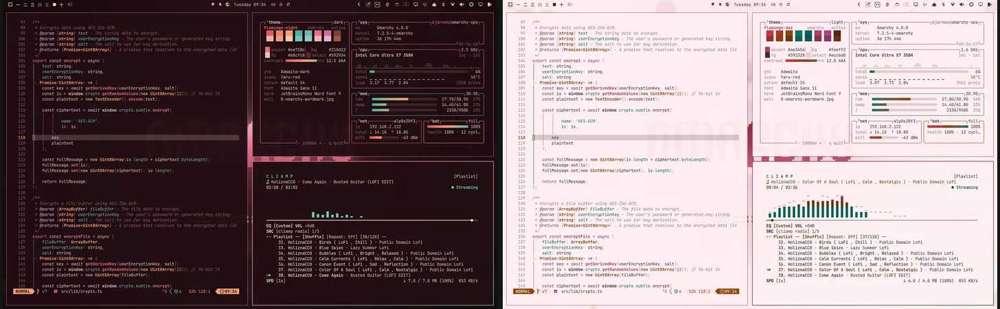](https://bjarneo.github.io/various-themes/#flamingo)

`001` · Folder: [`flamingo/`](flamingo/) · Scene: flamingos · [Open on the site](https://bjarneo.github.io/various-themes/#flamingo)

A flock of flamingos in a shallow lagoon. Coral and flamingo pinks fill 4 slots. The lagoon teal stays in green and cyan. Slots that leave their usual hue: `blue`.

| Variant | Theme name | `background` | `foreground` | `accent` | Icons |
| --- | --- | --- | --- | --- | --- |
| Night | [`flamingo-night`](flamingo/night/) | `#210d12` | `#e8cfc8` | `#ea718c` | `Yaru-red` |
| Day | [`flamingo-day`](flamingo/day/) | `#feeff2` | `#392328` | `#ae3456` | `Yaru-red` |

<details>
<summary>All 16 ANSI colors of each variant</summary>

| Variant | Normal, 0 to 7 | Bright, 8 to 15 |
| --- | --- | --- |
| Night | `#210d12` `#e65e60` `#4fb7a4` `#faa574` `#ea718c` `#d86fad` `#77bdbc` `#e8cfc8` | `#8b636b` `#f9b7b4` `#73cdbb` `#f8d0ba` `#f2b9c2` `#ecb9d4` `#93d1d1` `#fcefeb` |
| Day | `#feeff2` `#c1303b` `#056d60` `#873c00` `#ae3456` `#a63b7f` `#035b5b` `#392328` | `#92787d` `#8f292f` `#025e52` `#682e04` `#822b42` `#7c305f` `#024f50` `#1b0c10` |

</details>

<details>
<summary>Wallpaper credits</summary>

- Night, `3-flamingos-sunset-lagoon.jpg`: [Doha beach with flamingos at sunset in Kuwait 01](https://commons.wikimedia.org/wiki/File:Doha_beach_with_flamingos_at_sunset_in_Kuwait_01.jpg) by Mfalhajji, [CC BY-SA 4.0](https://creativecommons.org/licenses/by-sa/4.0)
- Night, `4-flamingo-head-dark.jpg`: [American Flamingo Head Profile Close-Up - Looking Right 4](https://commons.wikimedia.org/wiki/File:American_Flamingo_Head_Profile_Close-Up_-_Looking_Right_4.jpg) by Amaury Laporte, [CC BY 2.0](https://creativecommons.org/licenses/by/2.0)
- Day, `3-flamingos-djerba-lagoon.jpg`: [Un groupe de flamants roses à Guellala - Djerba](https://commons.wikimedia.org/wiki/File:Un_groupe_de_flamants_roses_%C3%A0_Guellala_-_Djerba.jpg) by Skander zarrad, [CC BY-SA 4.0](https://creativecommons.org/licenses/by-sa/4.0)
- Day, `4-flamingos-pink-bay.jpg`: [Greater flamingos at sunset in Kuwait Bay](https://commons.wikimedia.org/wiki/File:Greater_flamingos_at_sunset_in_Kuwait_Bay.jpg) by هويج محمود هويج, [CC BY-SA 4.0](https://creativecommons.org/licenses/by-sa/4.0)

</details>

```bash
curl -fsSL https://bjarneo.github.io/various-themes/install.sh | bash -s -- flamingo --set
```

### Oxblood

[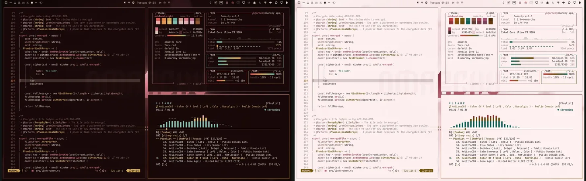](https://bjarneo.github.io/various-themes/#oxblood)

`002` · Folder: [`oxblood/`](oxblood/) · Scene: tufted leather · [Open on the site](https://bjarneo.github.io/various-themes/#oxblood)

Burgundy leather with brass studs. Deep reds fill 4 slots. Brass and a patina teal stay as pops. Slots that leave their usual hue: `blue`, `cyan`.

| Variant | Theme name | `background` | `foreground` | `accent` | Icons |
| --- | --- | --- | --- | --- | --- |
| Night | [`oxblood-night`](oxblood/night/) | `#180808` | `#deccbc` | `#dc7c89` | `Yaru-red` |
| Day | [`oxblood-day`](oxblood/day/) | `#fdf0f0` | `#392425` | `#9e3f50` | `Yaru-red` |

<details>
<summary>All 16 ANSI colors of each variant</summary>

| Variant | Normal, 0 to 7 | Bright, 8 to 15 |
| --- | --- | --- |
| Night | `#180808` `#da5b58` `#68aa9c` `#d6ac5c` `#dc7c89` `#c06f8f` `#d59d8f` `#deccbc` | `#856161` `#f1b4af` `#85c0b4` `#e7c17a` `#e6b7bb` `#e0b8c7` `#dfc5be` `#f4ebe2` |
| Day | `#fdf0f0` `#be393c` `#1e685d` `#6c4e02` `#9e3f50` `#a04d71` `#7d493c` `#392425` | `#91797a` `#8d2f2f` `#045b50` `#5f4301` `#77323e` `#773c54` `#5e3930` `#1a0d0e` |

</details>

<details>
<summary>Wallpaper credits</summary>

- Night, `3-leather-banquette-cinema.jpg`: [Salle d'attente, Cinéma du Parc](https://commons.wikimedia.org/wiki/File:Salle_d%27attente,_Cin%C3%A9ma_du_Parc.jpg) by Shawn à Montréal, [CC0](http://creativecommons.org/publicdomain/zero/1.0/deed.en)
- Night, `4-burgundy-leather-hides.jpg`: [A bunch of magenta leather](https://commons.wikimedia.org/wiki/File:A_bunch_of_magenta_leather.jpg) by m0851, [CC0](http://creativecommons.org/publicdomain/zero/1.0/deed.en)
- Day, `3-oxblood-wingback-chair.jpg`: [Oxblood queen anne chair](https://commons.wikimedia.org/wiki/File:Oxblood_queen_anne_chair.jpg) by Booby05, [CC BY-SA 4.0](https://creativecommons.org/licenses/by-sa/4.0)
- Day, `4-chesterfield-hotel-lounge.jpg`: [University Arms Hotel, Cambridge, July 2010 (01)](https://commons.wikimedia.org/wiki/File:University_Arms_Hotel,_Cambridge,_July_2010_(01).JPG) by Ardfern, [CC BY-SA 3.0](https://creativecommons.org/licenses/by-sa/3.0)

</details>

```bash
curl -fsSL https://bjarneo.github.io/various-themes/install.sh | bash -s -- oxblood --set
```

### Poppy Field

[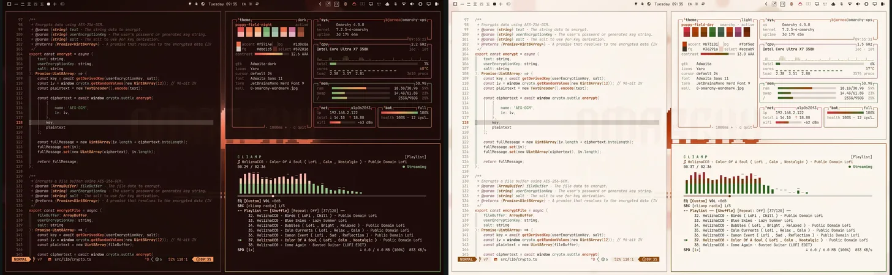](https://bjarneo.github.io/various-themes/#poppy-field)

`003` · Folder: [`poppy-field/`](poppy-field/) · Scene: poppies · [Open on the site](https://bjarneo.github.io/various-themes/#poppy-field)

Red poppies in a green field. Poppy reds fill 4 slots. Stem green and sage stay as pops. Slots that leave their usual hue: `blue`.

| Variant | Theme name | `background` | `foreground` | `accent` | Icons |
| --- | --- | --- | --- | --- | --- |
| Night | [`poppy-field-night`](poppy-field/night/) | `#1d0c0a` | `#dbd1c5` | `#f5714e` | `Yaru` |
| Day | [`poppy-field-day`](poppy-field/day/) | `#fbf5ed` | `#36291a` | `#b73101` | `Yaru` |

<details>
<summary>All 16 ANSI colors of each variant</summary>

| Variant | Normal, 0 to 7 | Bright, 8 to 15 |
| --- | --- | --- |
| Night | `#1d0c0a` `#ea5151` `#77ae6b` `#ff9d5f` `#f5714e` `#d16f98` `#95b59b` `#dbd1c5` | `#88635e` `#fcb4ae` `#93c488` `#f8cbb0` `#f5b7a6` `#e8b9c9` `#adcab2` `#f4efe8` |
| Day | `#fbf5ed` `#ce2632` `#346b27` `#894000` `#b73101` `#a74470` `#415f47` `#36291a` | `#8c7f6f` `#992529` `#255d16` `#6c3100` `#8a2a0e` `#7d3655` `#35533b` `#1b1209` |

</details>

<details>
<summary>Wallpaper credits</summary>

- Night, `3-poppy-field-sunset-dorset.jpg`: [At the Going Down of the Sun (49982266856)](https://commons.wikimedia.org/wiki/File:At_the_Going_Down_of_the_Sun_(49982266856).jpg) by JackPeasePhotography, [CC BY 2.0](https://creativecommons.org/licenses/by/2.0)
- Night, `4-red-poppy-sunset.jpg`: [Red Poppy Sunset (49995207452)](https://commons.wikimedia.org/wiki/File:Red_Poppy_Sunset_(49995207452).jpg) by Theo Crazzolara, [CC BY 2.0](https://creativecommons.org/licenses/by/2.0)
- Day, `3-monet-poppy-field-giverny.jpg`: [Poppy Field](https://commons.wikimedia.org/wiki/File:Monet,_Claude_-_Poppy_Field.jpg) by Claude Monet, Public domain
- Day, `4-wild-poppy-field-lida.jpg`: [Wild poppy field near Lida](https://commons.wikimedia.org/wiki/File:Wild_poppy_field_near_Lida.jpg) by Budgawl, [CC BY-SA 4.0](https://creativecommons.org/licenses/by-sa/4.0)

</details>

```bash
curl -fsSL https://bjarneo.github.io/various-themes/install.sh | bash -s -- poppy-field --set
```

### Brickwork

[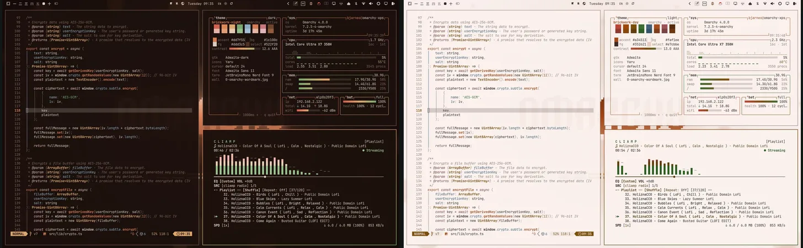](https://bjarneo.github.io/various-themes/#brickwork)

`004` · Folder: [`brickwork/`](brickwork/) · Scene: brick wall · [Open on the site](https://bjarneo.github.io/various-themes/#brickwork)

An old brick wall with ivy. Brick oranges fill 4 slots. Ivy green and slate blue stay as pops. Slots that leave their usual hue: `blue`.

| Variant | Theme name | `background` | `foreground` | `accent` | Icons |
| --- | --- | --- | --- | --- | --- |
| Night | [`brickwork-night`](brickwork/night/) | `#1c100c` | `#ddd3c5` | `#dd7f55` | `Yaru` |
| Day | [`brickwork-day`](brickwork/day/) | `#faf1ee` | `#352621` | `#a34513` | `Yaru` |

<details>
<summary>All 16 ANSI colors of each variant</summary>

| Variant | Normal, 0 to 7 | Bright, 8 to 15 |
| --- | --- | --- |
| Night | `#1c100c` `#d96453` `#7cae72` `#e3ac70` `#dd7f55` `#cd7c81` `#90b1c8` `#ddd3c5` | `#83675e` `#f2baaf` `#97c58e` `#ebd2b7` `#ebbeaa` `#e5bebf` `#a8c7dd` `#f6f1e9` |
| Day | `#faf1ee` `#b94032` `#37682c` `#784801` `#a34513` `#9b4c53` `#3b5b72` `#352621` | `#8e7b75` `#893328` `#285b1d` `#5c3804` `#7a3616` `#743b40` `#2f4f66` `#180e0b` |

</details>

<details>
<summary>Wallpaper credits</summary>

- Night, `3-fauti-masjid-brick-arches.jpg`: [Fauti Masjid Interior](https://commons.wikimedia.org/wiki/File:Fauti_Masjid_Interior.jpg) by DeepanjanGhosh, [CC BY-SA 4.0](https://creativecommons.org/licenses/by-sa/4.0)
- Night, `4-creeper-on-brick-wall.jpg`: [Heale House and Garden Clematis](https://commons.wikimedia.org/wiki/File:Heale_House_and_Garden_Clematis.JPG) by HARTLEPOOLMARINA2014, [CC BY-SA 4.0](https://creativecommons.org/licenses/by-sa/4.0)
- Day, `3-ivy-on-orange-brick.jpg`: [11-11-28-angermuende-17](https://commons.wikimedia.org/wiki/File:11-11-28-angermuende-17.jpg) by Ralf Roletschek - Fahrradtechnik auf fahrradmonteur.de, [CC BY-SA 3.0](https://creativecommons.org/licenses/by-sa/3.0)
- Day, `4-creeper-tendrils-brick.jpg`: [11-11-28-angermuende-16](https://commons.wikimedia.org/wiki/File:11-11-28-angermuende-16.jpg) by Ralf Roletschek - Fahrradtechnik auf fahrradmonteur.de, [CC BY-SA 3.0](https://creativecommons.org/licenses/by-sa/3.0)

</details>

```bash
curl -fsSL https://bjarneo.github.io/various-themes/install.sh | bash -s -- brickwork --set
```

### Persimmon

[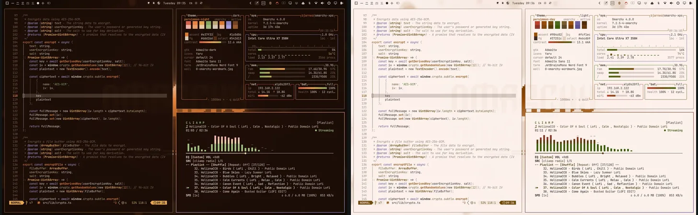](https://bjarneo.github.io/various-themes/#persimmon)

`005` · Folder: [`persimmon/`](persimmon/) · Scene: persimmons · [Open on the site](https://bjarneo.github.io/various-themes/#persimmon)

Ripe persimmons on a bare branch. Persimmon oranges fill 4 slots. Leaf green and dusk violet stay as pops. Slots that leave their usual hue: `blue`, `cyan`.

| Variant | Theme name | `background` | `foreground` | `accent` | Icons |
| --- | --- | --- | --- | --- | --- |
| Night | [`persimmon-night`](persimmon/night/) | `#1c0d06` | `#ddd1bd` | `#e37f33` | `Yaru` |
| Day | [`persimmon-day`](persimmon/day/) | `#fcf1ec` | `#37251c` | `#984c02` | `Yaru` |

<details>
<summary>All 16 ANSI colors of each variant</summary>

| Variant | Normal, 0 to 7 | Bright, 8 to 15 |
| --- | --- | --- |
| Night | `#1c0d06` `#df634c` `#89ad62` `#eeac53` `#e37f33` `#9289cd` `#c6ac7c` `#ddd1bd` | `#856654` `#f3b8ab` `#a2c480` `#f1d2ae` `#ebbc9e` `#aca4e2` `#daceb8` `#f5efe4` |
| Day | `#fcf1ec` `#bc3a25` `#446611` `#6d4400` `#984c02` `#665b9f` `#715726` `#37251c` | `#907b71` `#8b3020` `#385801` `#543401` `#763901` `#594c90` `#564321` `#1a0e08` |

</details>

<details>
<summary>Wallpaper credits</summary>

- Night, `3-fuyu-persimmons.jpg`: [Fuyu persimmon fruits, one cut open](https://commons.wikimedia.org/wiki/File:Fuyu_persimmon_fruits,_one_cut_open.jpg) by Frank Schulenburg, [CC BY-SA 4.0](https://creativecommons.org/licenses/by-sa/4.0)
- Night, `4-persimmons-at-dusk.jpg`: [Sooc fruit - Flickr - Robert Couse-Baker](https://commons.wikimedia.org/wiki/File:Sooc_fruit_-_Flickr_-_Robert_Couse-Baker.jpg) by Robert Couse-Baker, [CC BY 2.0](https://creativecommons.org/licenses/by/2.0)
- Day, `3-persimmons-bare-branch.jpg`: [Autumn in Qom Province - IRAN Nature 01](https://commons.wikimedia.org/wiki/File:Autumn_in_Qom_Province_-_IRAN_Nature_01.jpg) by Mostafameraji, [CC BY-SA 4.0](https://creativecommons.org/licenses/by-sa/4.0)
- Day, `4-white-eye-persimmons.jpg`: [柿目白 (52094134594)](https://commons.wikimedia.org/wiki/File:%E6%9F%BF%E7%9B%AE%E7%99%BD_(52094134594).jpg) by m-louis .®, [CC BY-SA 2.0](https://creativecommons.org/licenses/by-sa/2.0)

</details>

```bash
curl -fsSL https://bjarneo.github.io/various-themes/install.sh | bash -s -- persimmon --set
```

### Marigold

[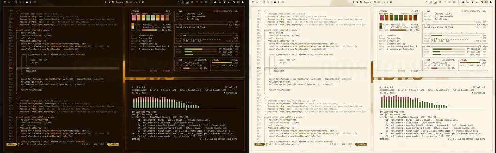](https://bjarneo.github.io/various-themes/#marigold)

`006` · Folder: [`marigold/`](marigold/) · Scene: marigolds · [Open on the site](https://bjarneo.github.io/various-themes/#marigold)

Marigold garlands in the sun. Golds and oranges fill 4 slots. Maroon and leaf green stay as pops. Slots that leave their usual hue: `blue`, `magenta`, `cyan`.

| Variant | Theme name | `background` | `foreground` | `accent` | Icons |
| --- | --- | --- | --- | --- | --- |
| Night | [`marigold-night`](marigold/night/) | `#1a0f04` | `#dad2bc` | `#d88b07` | `Yaru-yellow` |
| Day | [`marigold-day`](marigold/day/) | `#fbf5e7` | `#322a18` | `#885602` | `Yaru-yellow` |

<details>
<summary>All 16 ANSI colors of each variant</summary>

| Variant | Normal, 0 to 7 | Bright, 8 to 15 |
| --- | --- | --- |
| Night | `#1a0f04` `#ce6772` `#7ead6f` `#e1b640` `#d88b07` `#d97841` `#b1ae7a` `#dad2bc` | `#80684f` `#e7878f` `#99c48b` `#ead8aa` `#e4c097` `#ebbca4` `#cfceb6` `#f4f0e5` |
| Day | `#fbf5e7` `#b14856` `#3c692b` `#644c00` `#885602` `#a84a00` `#615e28` `#322a18` | `#8a8067` `#a03546` `#2e5c1c` `#4e3b01` `#6a4100` `#80390a` `#4b4823` `#181308` |

</details>

<details>
<summary>Wallpaper credits</summary>

- Night, `3-pot-marigolds-on-black.jpg`: [Calendula 0023-2](https://commons.wikimedia.org/wiki/File:Calendula_0023-2.jpg) by Borisbg88, [CC BY 4.0](https://creativecommons.org/licenses/by/4.0)
- Night, `4-orange-marigold-kobona.jpg`: [Кобона, бархатцы в саду 2](https://commons.wikimedia.org/wiki/File:%D0%9A%D0%BE%D0%B1%D0%BE%D0%BD%D0%B0,_%D0%B1%D0%B0%D1%80%D1%85%D0%B0%D1%82%D1%86%D1%8B_%D0%B2_%D1%81%D0%B0%D0%B4%D1%83_2.jpg) by Екатерина Борисова, [CC BY-SA 4.0](https://creativecommons.org/licenses/by-sa/4.0)
- Day, `3-marigolds-in-the-sun.jpg`: [Tagetes erecta(marigold)](https://commons.wikimedia.org/wiki/File:Tagetes_erecta(marigold).jpg) by Ahtk2000, [CC BY-SA 4.0](https://creativecommons.org/licenses/by-sa/4.0)
- Day, `4-orange-marigold-bloom.jpg`: [Tagetes erecta DSC 4440](https://commons.wikimedia.org/wiki/File:Tagetes_erecta_DSC_4440.jpg) by Ranjithsiji, [CC BY-SA 4.0](https://creativecommons.org/licenses/by-sa/4.0)

</details>

```bash
curl -fsSL https://bjarneo.github.io/various-themes/install.sh | bash -s -- marigold --set
```

### Honeycomb

[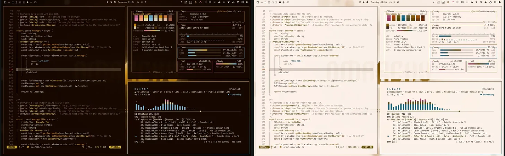](https://bjarneo.github.io/various-themes/#honeycomb)

`007` · Folder: [`honeycomb/`](honeycomb/) · Scene: honeycomb · [Open on the site](https://bjarneo.github.io/various-themes/#honeycomb)

Wax cells full of honey. Ambers and golds fill 4 slots. Clover pink and sky blue stay as pops. Slots that leave their usual hue: `green`, `blue`, `magenta`, `cyan`.

| Variant | Theme name | `background` | `foreground` | `accent` | Icons |
| --- | --- | --- | --- | --- | --- |
| Night | [`honeycomb-night`](honeycomb/night/) | `#160700` | `#d8ceb1` | `#ca8c11` | `Yaru-yellow` |
| Day | [`honeycomb-day`](honeycomb/day/) | `#fcf1e9` | `#372618` | `#825703` | `Yaru-yellow` |

<details>
<summary>All 16 ANSI colors of each variant</summary>

| Variant | Normal, 0 to 7 | Bright, 8 to 15 |
| --- | --- | --- |
| Night | `#160700` `#c7678f` `#64a5c3` `#d7b43a` `#ca8c11` `#c97b43` `#b6ae83` `#d8ceb1` | `#82634b` `#df86a9` `#82bcd8` `#e3d4a5` `#dabe95` `#dfbba2` `#d0cdb9` `#f0ebdc` |
| Day | `#fcf1e9` `#a84671` `#1a6483` `#5d4a02` `#825703` `#9d4f01` `#625a2e` `#372618` | `#8f7b6d` `#973462` `#025774` `#483900` `#644200` `#753d0f` `#4b4526` `#190e06` |

</details>

<details>
<summary>Wallpaper credits</summary>

- Night, `3-golden-comb-layers.jpg`: [Honeycomb structure (6248780733)](https://commons.wikimedia.org/wiki/File:Honeycomb_structure_(6248780733).jpg) by Gavin Mackintosh, [CC BY 2.0](https://creativecommons.org/licenses/by/2.0)
- Night, `4-comb-cells-pollen.jpg`: [ComputerHotline - Alveoles pleines de pollen (by)](https://commons.wikimedia.org/wiki/File:ComputerHotline_-_Alveoles_pleines_de_pollen_(by).jpg) by Thomas Bresson, [CC BY 2.0](https://creativecommons.org/licenses/by/2.0)
- Day, `3-bee-on-honeycomb.jpg`: [Western honey bee on a honeycomb](https://commons.wikimedia.org/wiki/File:Western_honey_bee_on_a_honeycomb.jpg) by Matthew T Rader, [CC BY-SA 4.0](https://creativecommons.org/licenses/by-sa/4.0)
- Day, `4-comb-honey-pollen.jpg`: [Starr-180406-0674-bee monitoring training-comb with honey and pollen-HDOA Hilo-Hawaii…](https://commons.wikimedia.org/wiki/File:Starr-180406-0674-bee_monitoring_training-comb_with_honey_and_pollen-HDOA_Hilo-Hawaii_(41326343022).jpg) by Forest and Kim Starr, [CC BY 3.0 us](https://creativecommons.org/licenses/by/3.0/us/deed.en)

</details>

```bash
curl -fsSL https://bjarneo.github.io/various-themes/install.sh | bash -s -- honeycomb --set
```

### Mimosa

[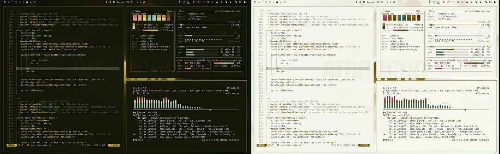](https://bjarneo.github.io/various-themes/#mimosa)

`008` · Folder: [`mimosa/`](mimosa/) · Scene: mimosa · [Open on the site](https://bjarneo.github.io/various-themes/#mimosa)

Mimosa blossoms on silver leaves. Yellows fill 3 slots. Silver green, rose and a pale sky stay as pops. Slots that leave their usual hue: `blue`, `magenta`.

| Variant | Theme name | `background` | `foreground` | `accent` | Icons |
| --- | --- | --- | --- | --- | --- |
| Night | [`mimosa-night`](mimosa/night/) | `#14150a` | `#d9d6bf` | `#baa130` | `Yaru-yellow` |
| Day | [`mimosa-day`](mimosa/day/) | `#f4f4ed` | `#2a2b1d` | `#6e5c02` | `Yaru-yellow` |

<details>
<summary>All 16 ANSI colors of each variant</summary>

| Variant | Normal, 0 to 7 | Bright, 8 to 15 |
| --- | --- | --- |
| Night | `#14150a` `#ce6f7c` `#89a88e` `#d2be44` `#baa130` `#b7904a` `#98bbb0` `#d9d6bf` | `#6e7057` `#e78e99` `#a3bfa7` `#e4ddad` `#d3c99d` `#d8c6a8` `#b0cfc6` `#f5f3e8` |
| Day | `#f4f4ed` `#a94959` `#4b6951` `#5a4e00` `#6e5c02` `#875f02` `#385950` `#2a2b1d` | `#7f8170` `#98384a` `#3d5b43` `#453c00` `#554600` `#65480f` `#2c4e45` `#12120a` |

</details>

<details>
<summary>Wallpaper credits</summary>

- Night, `3-wattle-pompoms-on-black.jpg`: [Acacia pycnantha 1DS-II 3-8849](https://commons.wikimedia.org/wiki/File:Acacia_pycnantha_1DS-II_3-8849.jpg) by SAplants, [CC BY-SA 4.0](https://creativecommons.org/licenses/by-sa/4.0)
- Night, `4-silver-wattle-at-night.jpg`: [Acacia baileyana inflorescences Girraween National Park Wyberba Queensland 1980s IMG…](https://commons.wikimedia.org/wiki/File:Acacia_baileyana_inflorescences_Girraween_National_Park_Wyberba_Queensland_1980s_IMG_0082_(4).jpg) by John Robert McPherson, [CC BY-SA 4.0](https://creativecommons.org/licenses/by-sa/4.0)
- Day, `3-mimosa-in-snow-rome.jpg`: [Unexpected snowfall in Rome, 2018](https://commons.wikimedia.org/wiki/File:Unexpected_snowfall_in_Rome,_2018.jpg) by Albarubescens, [CC BY-SA 4.0](https://creativecommons.org/licenses/by-sa/4.0)
- Day, `4-mimosa-esterel-sky.jpg`: [Acacia dealbata in Massif de l'Esterel (5)](https://commons.wikimedia.org/wiki/File:Acacia_dealbata_in_Massif_de_l%27Esterel_(5).jpg) by Tournasol7, [CC BY 4.0](https://creativecommons.org/licenses/by/4.0)

</details>

```bash
curl -fsSL https://bjarneo.github.io/various-themes/install.sh | bash -s -- mimosa --set
```

### Mangrove

[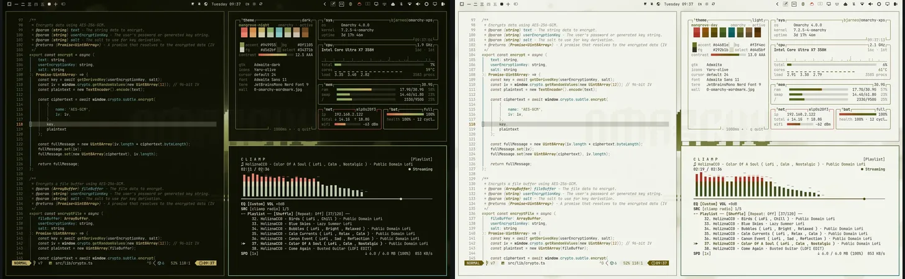](https://bjarneo.github.io/various-themes/#mangrove)

`009` · Folder: [`mangrove/`](mangrove/) · Scene: mangrove · [Open on the site](https://bjarneo.github.io/various-themes/#mangrove)

Mangrove roots in brackish water. Olives fill 4 slots. Crab red and water teal stay as pops. Slots that leave their usual hue: `blue`, `magenta`.

| Variant | Theme name | `background` | `foreground` | `accent` | Icons |
| --- | --- | --- | --- | --- | --- |
| Night | [`mangrove-night`](mangrove/night/) | `#0f1105` | `#d5d2bf` | `#949955` | `Yaru-olive` |
| Day | [`mangrove-day`](mangrove/day/) | `#f3f4ec` | `#292b1b` | `#64681e` | `Yaru-olive` |

<details>
<summary>All 16 ANSI colors of each variant</summary>

| Variant | Normal, 0 to 7 | Bright, 8 to 15 |
| --- | --- | --- |
| Night | `#0f1105` `#da6554` `#8ead68` `#c8b467` `#949955` `#ae8b62` `#70b6b5` `#d5d2bf` | `#6a6f52` `#f18675` `#bccbac` `#dcd4b2` `#c4c8aa` `#d3c3b0` `#8dcbca` `#f0efe6` |
| Day | `#f3f4ec` `#b83f30` `#476319` `#635203` `#64681e` `#815d33` `#0b6263` `#292b1b` | `#7e816f` `#a72b1f` `#374b18` `#4d3f01` `#4c4f1c` `#61472a` `#005556` `#111208` |

</details>

<details>
<summary>Wallpaper credits</summary>

- Night, `3-mangrove-roots-dark-water.jpg`: [Mangrove Roots 1](https://commons.wikimedia.org/wiki/File:Mangrove_Roots_1.jpg) by Amaury Laporte, [CC BY 2.0](https://creativecommons.org/licenses/by/2.0)
- Night, `4-mangrove-roots-detail.jpg`: [Detail of mangrove roots](https://commons.wikimedia.org/wiki/File:Detail_of_mangrove_roots.jpg) by Jonathan Wilkins, [CC BY-SA 3.0](https://creativecommons.org/licenses/by-sa/3.0)
- Day, `3-mangrove-islet.jpg`: [Mangrove Islet](https://commons.wikimedia.org/wiki/File:Mangrove_Islet.jpg) by Armusaofficial, [CC BY-SA 4.0](https://creativecommons.org/licenses/by-sa/4.0)
- Day, `4-mangrove-ashtamudi-mist.jpg`: [Mangrove Reflection Wide Ashtamudi Kollam Kerala Mar22 A7C 01464](https://commons.wikimedia.org/wiki/File:Mangrove_Reflection_Wide_Ashtamudi_Kollam_Kerala_Mar22_A7C_01464.jpg) by Timothy A. Gonsalves, [CC BY-SA 4.0](https://creativecommons.org/licenses/by-sa/4.0)

</details>

```bash
curl -fsSL https://bjarneo.github.io/various-themes/install.sh | bash -s -- mangrove --set
```

### Absinthe

[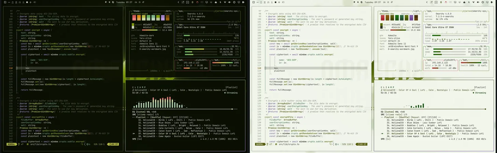](https://bjarneo.github.io/various-themes/#absinthe)

`010` · Folder: [`absinthe/`](absinthe/) · Scene: absinthe · [Open on the site](https://bjarneo.github.io/various-themes/#absinthe)

A glass of absinthe with a sugar cube. Chartreuse greens fill 4 slots. Bitter red and wormwood violet stay as pops. Slots that leave their usual hue: `blue`.

| Variant | Theme name | `background` | `foreground` | `accent` | Icons |
| --- | --- | --- | --- | --- | --- |
| Night | [`absinthe-night`](absinthe/night/) | `#0a0f03` | `#d1d1c2` | `#82a007` | `Yaru-olive` |
| Day | [`absinthe-day`](absinthe/day/) | `#f1f5eb` | `#262c1b` | `#556a00` | `Yaru-olive` |

<details>
<summary>All 16 ANSI colors of each variant</summary>

| Variant | Normal, 0 to 7 | Bright, 8 to 15 |
| --- | --- | --- |
| Night | `#0a0f03` `#dd5f59` `#69b662` `#b9c03c` `#82a007` `#a47fcd` `#80ba8b` `#d1d1c2` | `#636f50` `#f58079` `#adcfa9` `#d6dba7` `#b9ca96` `#bc9be3` `#b9d3bd` `#eeede6` |
| Day | `#f1f5eb` `#bd3838` `#106907` `#525401` `#556a00` `#7a52a2` `#246236` `#262c1b` | `#7b826f` `#ab2227` `#165011` `#3f4100` `#405101` `#6b4393` `#214b2c` `#0f1308` |

</details>

<details>
<summary>Wallpaper credits</summary>

- Night, `3-wormwood-in-bloom.jpg`: [Artemisia absinthium in Austria](https://commons.wikimedia.org/wiki/File:Artemisia_absinthium_in_Austria.jpg) by Henderl, [CC BY 4.0](https://creativecommons.org/licenses/by/4.0)
- Night, `4-wormwood-flower-spray.jpg`: [Artemisia absinthium NoviPazar1](https://commons.wikimedia.org/wiki/File:Artemisia_absinthium_NoviPazar1.JPG) by Wlodzimierz, [CC BY-SA 4.0](https://creativecommons.org/licenses/by-sa/4.0)
- Day, `3-wormwood-foliage.jpg`: [Artemisia absinthium in Jardin Botanique de l'Aubrac](https://commons.wikimedia.org/wiki/File:Artemisia_absinthium_in_Jardin_Botanique_de_l%27Aubrac.jpg) by Krzysztof Golik, [CC BY-SA 4.0](https://creativecommons.org/licenses/by-sa/4.0)
- Day, `4-aniseed-on-leaf.jpg`: [Pimpinella anisum](https://commons.wikimedia.org/wiki/File:Pimpinella_anisum.jpg) by Thamizhpparithi Maari, [CC BY-SA 4.0](https://creativecommons.org/licenses/by-sa/4.0)

</details>

```bash
curl -fsSL https://bjarneo.github.io/various-themes/install.sh | bash -s -- absinthe --set
```

### Pistachio

[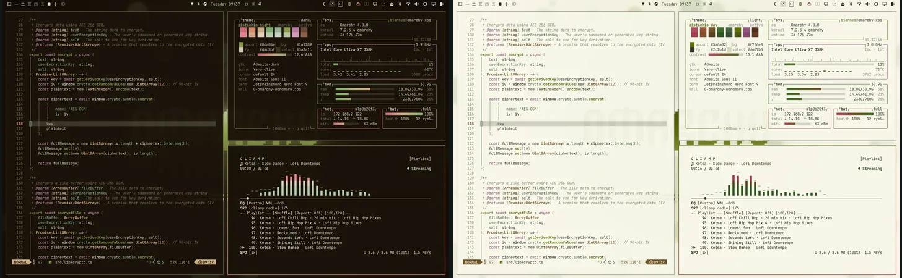](https://bjarneo.github.io/various-themes/#pistachio)

`011` · Folder: [`pistachio/`](pistachio/) · Scene: pistachios · [Open on the site](https://bjarneo.github.io/various-themes/#pistachio)

Shelled pistachios on a warm brown board. Pistachio greens fill 3 slots. The red skin and the tan shell stay as pops. Slots that leave their usual hue: `blue`, `cyan`.

| Variant | Theme name | `background` | `foreground` | `accent` | Icons |
| --- | --- | --- | --- | --- | --- |
| Night | [`pistachio-night`](pistachio/night/) | `#1a1209` | `#dad5bf` | `#8da04e` | `Yaru-olive` |
| Day | [`pistachio-day`](pistachio/day/) | `#f7f6e8` | `#2c2b1d` | `#5a6a02` | `Yaru-olive` |

<details>
<summary>All 16 ANSI colors of each variant</summary>

| Variant | Normal, 0 to 7 | Bright, 8 to 15 |
| --- | --- | --- |
| Night | `#1a1209` `#d26b7b` `#80b46f` `#d0b385` `#8da04e` `#c17eaa` `#9abc9a` `#dad5bf` | `#7d6b56` `#ea8b97` `#b8d0b0` `#e2d5c0` `#c2cca8` `#d89ac3` `#c8d7c8` `#f5f2e7` |
| Day | `#f7f6e8` `#af4659` `#366821` `#6c4f20` `#5a6a02` `#914f7d` `#3e5e3f` `#2c2b1d` | `#83816a` `#9e344a` `#2b4f1e` `#523d1c` `#45510f` `#82406e` `#314832` `#14140a` |

</details>

<details>
<summary>Wallpaper credits</summary>

- Night, `3-pistachios-on-board.jpg`: [Pistachios meet Avocados (26746999968)](https://commons.wikimedia.org/wiki/File:Pistachios_meet_Avocados_(26746999968).jpg) by Theo Crazzolara, [CC BY 2.0](https://creativecommons.org/licenses/by/2.0)
- Night, `4-pistachio-cluster.jpg`: [Eagle Ranch Pistachios LLC, owned and operated by George and Marianne Schweers, with…](https://commons.wikimedia.org/wiki/File:Eagle_Ranch_Pistachios_LLC,_owned_and_operated_by_George_and_Marianne_Schweers,_with_105_acres_insured_with_Risk_Management_Agency_crop_insurance_as_seen_on_21_May_2024_-_2.jpg) by USDAgov, Public domain
- Day, `3-pistachios-warm-wood.jpg`: [Pistachios (39799740255)](https://commons.wikimedia.org/wiki/File:Pistachios_(39799740255).jpg) by Theo Crazzolara, [CC BY 2.0](https://creativecommons.org/licenses/by/2.0)
- Day, `4-bronte-pistachios.jpg`: [Pistacchio di Bronte](https://commons.wikimedia.org/wiki/File:Pistacchio_di_Bronte.jpg) by Paolo Galli, [CC BY-SA 3.0](https://creativecommons.org/licenses/by-sa/3.0)

</details>

```bash
curl -fsSL https://bjarneo.github.io/various-themes/install.sh | bash -s -- pistachio --set
```

### Kyoto Moss

[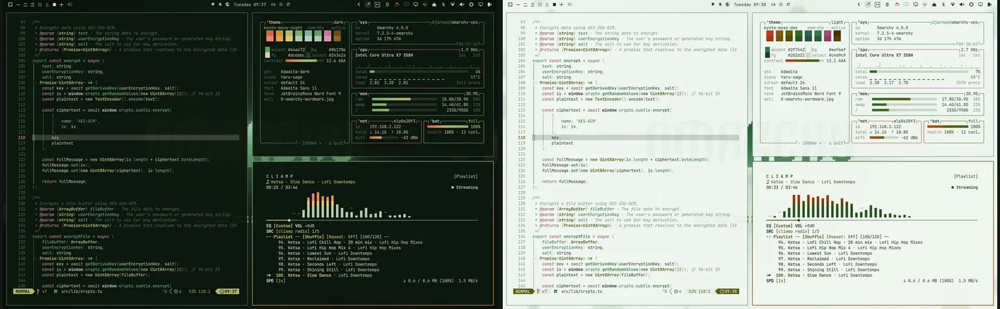](https://bjarneo.github.io/various-themes/#kyoto-moss)

`012` · Folder: [`kyoto-moss/`](kyoto-moss/) · Scene: moss garden · [Open on the site](https://bjarneo.github.io/various-themes/#kyoto-moss)

A moss garden at a temple in Kyoto. Moss greens fill 4 slots. Torii vermilion and plum blossom stay as pops. Slots that leave their usual hue: `blue`.

| Variant | Theme name | `background` | `foreground` | `accent` | Icons |
| --- | --- | --- | --- | --- | --- |
| Night | [`kyoto-moss-night`](kyoto-moss/night/) | `#0b170e` | `#dcd6bc` | `#64a472` | `Yaru-sage` |
| Day | [`kyoto-moss-day`](kyoto-moss/day/) | `#eef6ef` | `#202d22` | `#2f7442` | `Yaru-sage` |

<details>
<summary>All 16 ANSI colors of each variant</summary>

| Variant | Normal, 0 to 7 | Bright, 8 to 15 |
| --- | --- | --- |
| Night | `#0b170e` `#e56342` `#78b46a` `#babf6a` `#64a472` `#cf78a2` `#80bca4` `#dcd6bc` | `#5c7460` `#fd8567` `#b4d0af` `#ebd065` `#b3d0b8` `#e695bb` `#bdd7cb` `#f6f3e6` |
| Day | `#eef6ef` `#c03710` `#29671a` `#545601` `#2f7442` `#9e4674` `#22624d` `#202d22` | `#748376` `#a92901` `#234e19` `#514200` `#275733` `#8e3665` `#1f4b3c` `#0b140d` |

</details>

<details>
<summary>Wallpaper credits</summary>

- Night, `3-saihoji-moss-shadows.jpg`: [Saihoji Temple moss gardens, Kyoto (6289621641)](https://commons.wikimedia.org/wiki/File:Saihoji_Temple_moss_gardens,_Kyoto_(6289621641).jpg) by Bryan Ledgard, [CC BY 2.0](https://creativecommons.org/licenses/by/2.0)
- Night, `4-sanzen-in-moss-lantern.jpg`: [200828 Sanzen-in Kyoto Japan01s3](https://commons.wikimedia.org/wiki/File:200828_Sanzen-in_Kyoto_Japan01s3.jpg) by 663highland, [CC BY-SA 4.0](https://creativecommons.org/licenses/by-sa/4.0)
- Day, `3-gioji-moss-mounds.jpg`: [Giō-ji - Kyoto - DSC06276](https://commons.wikimedia.org/wiki/File:Gi%C5%8D-ji_-_Kyoto_-_DSC06276.JPG) by Daderot, [CC0](http://creativecommons.org/publicdomain/zero/1.0/deed.en)
- Day, `4-gioji-moss-garden.jpg`: [Giō-ji - Kyoto - DSC06265](https://commons.wikimedia.org/wiki/File:Gi%C5%8D-ji_-_Kyoto_-_DSC06265.JPG) by Daderot, [CC0](http://creativecommons.org/publicdomain/zero/1.0/deed.en)

</details>

```bash
curl -fsSL https://bjarneo.github.io/various-themes/install.sh | bash -s -- kyoto-moss --set
```

### Celadon

[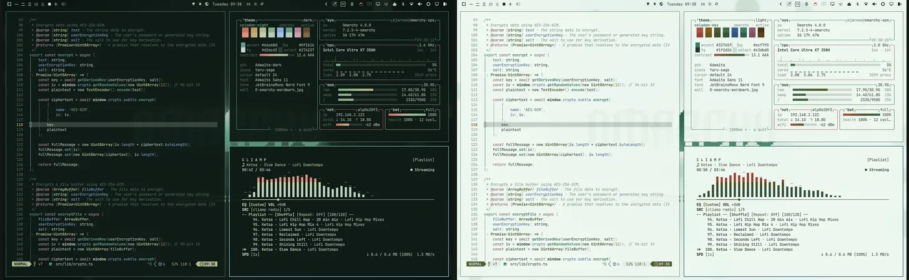](https://bjarneo.github.io/various-themes/#celadon)

`013` · Folder: [`celadon/`](celadon/) · Scene: celadon bowl · [Open on the site](https://bjarneo.github.io/various-themes/#celadon)

A celadon bowl with a crackled glaze. Grey greens fill 3 slots. Iron red, peach bloom and cobalt stay as pops. Slots that leave their usual hue: `blue`, `cyan`.

| Variant | Theme name | `background` | `foreground` | `accent` | Icons |
| --- | --- | --- | --- | --- | --- |
| Night | [`celadon-night`](celadon/night/) | `#0f1b16` | `#d2dcd3` | `#66a68d` | `Yaru-sage` |
| Day | [`celadon-day`](celadon/day/) | `#ecf7f0` | `#1f2d26` | `#32765f` | `Yaru-sage` |

<details>
<summary>All 16 ANSI colors of each variant</summary>

| Variant | Normal, 0 to 7 | Bright, 8 to 15 |
| --- | --- | --- |
| Night | `#0f1b16` `#d27466` `#8ab58f` `#b6c094` `#66a68d` `#bd889b` `#8eb4e3` `#d2dcd3` | `#5c776a` `#ea9485` `#bfd3c1` `#cbd5ad` `#b7d3c7` `#d5a4b6` `#a8caf5` `#f4f9f4` |
| Day | `#ecf7f0` `#aa4c3f` `#3b6542` `#4c5329` `#32765f` `#8a556a` `#375a88` `#1f2d26` | `#708478` `#993b2e` `#304d34` `#41481e` `#295848` `#7a475b` `#2a4e7b` `#0c1410` |

</details>

<details>
<summary>Wallpaper credits</summary>

- Night, `3-longquan-celadon-censer.jpg`: [Celadon Tripod Incense Burner with Bowstring Patterns, Longquan Ware](https://commons.wikimedia.org/wiki/File:Celadon_Tripod_Incense_Burner_with_Bowstring_Patterns,_Longquan_Ware.jpg) by Siyuwj, [CC BY-SA 4.0](https://creativecommons.org/licenses/by-sa/4.0)
- Night, `4-goryeo-crackled-crane-bowl.jpg`: [Celadon, Goryeo Dynasty (17671504592)](https://commons.wikimedia.org/wiki/File:Celadon,_Goryeo_Dynasty_(17671504592).jpg) by Gary Todd, [CC0](http://creativecommons.org/publicdomain/zero/1.0/deed.en)
- Day, `3-joseon-crackled-bowl.jpg`: [Bowl with greyish green, crackled glaze, Korea, Joseon, 15th century AD, stoneware…](https://commons.wikimedia.org/wiki/File:Bowl_with_greyish_green,_crackled_glaze,_Korea,_Joseon,_15th_century_AD,_stoneware_-_%C3%96stasiatiska_museet,_Stockholm_-_DSC09428.JPG) by Daderot, [CC0](http://creativecommons.org/publicdomain/zero/1.0/deed.en)
- Day, `4-incised-celadon-bowl.jpg`: [Celadon Guimet 11](https://commons.wikimedia.org/wiki/File:Celadon_Guimet_11.JPG) by Miguel Hermoso Cuesta, [CC BY-SA 4.0](https://creativecommons.org/licenses/by-sa/4.0)

</details>

```bash
curl -fsSL https://bjarneo.github.io/various-themes/install.sh | bash -s -- celadon --set
```

### Spruce

[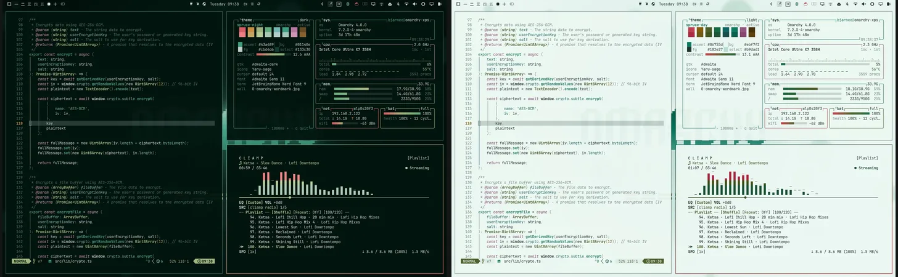](https://bjarneo.github.io/various-themes/#spruce)

`014` · Folder: [`spruce/`](spruce/) · Scene: spruce forest · [Open on the site](https://bjarneo.github.io/various-themes/#spruce)

A spruce forest in fresh snow. Conifer blue greens fill 4 slots. Berry red and lingonberry pink stay as pops. Slots that leave their usual hue: `blue`.

| Variant | Theme name | `background` | `foreground` | `accent` | Icons |
| --- | --- | --- | --- | --- | --- |
| Night | [`spruce-night`](spruce/night/) | `#01140e` | `#cbd4d6` | `#43a489` | `Yaru-sage` |
| Day | [`spruce-day`](spruce/day/) | `#ebf7f2` | `#182e27` | `#06755d` | `Yaru-sage` |

<details>
<summary>All 16 ANSI colors of each variant</summary>

| Variant | Normal, 0 to 7 | Bright, 8 to 15 |
| --- | --- | --- |
| Night | `#01140e` `#df6069` `#68b183` `#a7bd84` `#43a489` `#bf7ca9` `#76bbb7` `#cbd4d6` | `#4d7467` `#f78288` `#adcdb7` `#bdd19d` `#a7cec0` `#d698c0` `#b7d5d3` `#ecf0f1` |
| Day | `#ebf7f2` `#bd3848` `#10673c` `#485a22` `#06755d` `#904f7c` `#0a615f` `#182e27` | `#6d857d` `#ac2139` `#164f2f` `#3c4f13` `#015947` `#81406d` `#134a49` `#071511` |

</details>

<details>
<summary>Wallpaper credits</summary>

- Night, `3-pokljuka-spruce-milky-way.jpg`: [Winter night at Pokljuka forest in Slovenia](https://commons.wikimedia.org/wiki/File:Winter_night_at_Pokljuka_forest_in_Slovenia.jpg) by Dreamy Pixel, [CC BY 4.0](https://creativecommons.org/licenses/by/4.0)
- Night, `4-riisitunturi-spruce-twilight.jpg`: [Riisitunturi, Finland - 49786050856](https://commons.wikimedia.org/wiki/File:Riisitunturi,_Finland_-_49786050856.jpg) by Ninara, [CC BY 2.0](https://creativecommons.org/licenses/by/2.0)
- Day, `3-denali-first-snow-spruce.jpg`: [Snowy Forest](https://commons.wikimedia.org/wiki/File:Scene_from_the_first_snow,_near_mile_8_of_the_Denali_Park_Road,_on_Tuesday,_October_10,_2017._(c0f93981-ce54-46b2-9ed1-b8d44b6778ee).JPG) by NPS Photo / Emily Mesner, Public domain
- Day, `4-banff-frosty-spruce.jpg`: [Banff park at frosty day (52718917178)](https://commons.wikimedia.org/wiki/File:Banff_park_at_frosty_day_(52718917178).jpg) by John D., [CC BY 2.0](https://creativecommons.org/licenses/by/2.0)

</details>

```bash
curl -fsSL https://bjarneo.github.io/various-themes/install.sh | bash -s -- spruce --set
```

### Verdigris

[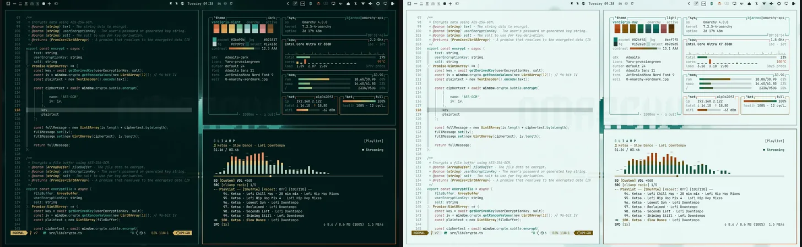](https://bjarneo.github.io/various-themes/#verdigris)

`015` · Folder: [`verdigris/`](verdigris/) · Scene: patina · [Open on the site](https://bjarneo.github.io/various-themes/#verdigris)

Copper roofs with a green patina. Patina teals fill 3 slots. Copper, brass and rust stay as pops. Slots that leave their usual hue: `blue`, `magenta`.

| Variant | Theme name | `background` | `foreground` | `accent` | Icons |
| --- | --- | --- | --- | --- | --- |
| Night | [`verdigris-night`](verdigris/night/) | `#021817` | `#c9d9d2` | `#3ba99b` | `Yaru-prussiangreen` |
| Day | [`verdigris-day`](verdigris/day/) | `#eaf7f5` | `#152e2d` | `#026f65` | `Yaru-prussiangreen` |

<details>
<summary>All 16 ANSI colors of each variant</summary>

| Variant | Normal, 0 to 7 | Bright, 8 to 15 |
| --- | --- | --- |
| Night | `#021817` `#d56f45` `#67b78e` `#d8b361` `#3ba99b` `#c9817e` `#83bebf` `#c9d9d2` | `#4b7672` `#ed8f69` `#b0d2be` `#eac87f` `#a7d1ca` `#e09d9a` `#bfd9d9` `#ecf5f2` |
| Day | `#eaf7f5` `#b14818` `#016944` `#6b4f02` `#026f65` `#98504f` `#1e5e60` `#152e2d` | `#6b8583` `#9d3900` `#0e5035` `#5d4400` `#00554d` `#884141` `#1d484a` `#051514` |

</details>

<details>
<summary>Wallpaper credits</summary>

- Night, `3-copper-dome.jpg`: [Copper Dome (48514858807)](https://commons.wikimedia.org/wiki/File:Copper_Dome_(48514858807).jpg) by Rob Deutscher, [CC BY 2.0](https://creativecommons.org/licenses/by/2.0)
- Night, `4-michaelerkuppel-night.jpg`: [Michaelerplatz 9027](https://commons.wikimedia.org/wiki/File:Michaelerplatz_9027.jpg) by Karl Gruber, [CC BY 3.0 at](https://creativecommons.org/licenses/by/3.0/at/deed.en)
- Day, `3-helsinki-cathedral-dome.jpg`: [Dome - Helsinki Lutheran Cathedral - DSC05574](https://commons.wikimedia.org/wiki/File:Dome_-_Helsinki_Lutheran_Cathedral_-_DSC05574.JPG) by Daderot, [CC0](http://creativecommons.org/publicdomain/zero/1.0/deed.en)
- Day, `4-copenhagen-spires.jpg`: [View south east from Rundetårn, Copenhagen 2](https://commons.wikimedia.org/wiki/File:View_south_east_from_Rundet%C3%A5rn,_Copenhagen_2.jpg) by Colin, [CC BY-SA 4.0](https://creativecommons.org/licenses/by-sa/4.0)

</details>

```bash
curl -fsSL https://bjarneo.github.io/various-themes/install.sh | bash -s -- verdigris --set
```

### Seaglass

[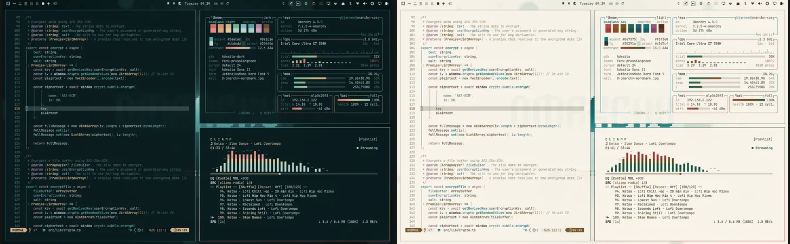](https://bjarneo.github.io/various-themes/#seaglass)

`016` · Folder: [`seaglass/`](seaglass/) · Scene: sea glass · [Open on the site](https://bjarneo.github.io/various-themes/#seaglass)

Frosted glass pebbles on a sandy beach. Soft aquas fill 3 slots. Coral, shell pink and driftwood stay as pops. Slots that leave their usual hue: `blue`.

| Variant | Theme name | `background` | `foreground` | `accent` | Icons |
| --- | --- | --- | --- | --- | --- |
| Night | [`seaglass-night`](seaglass/night/) | `#091c1e` | `#cbdedd` | `#5aacac` | `Yaru-prussiangreen` |
| Day | [`seaglass-day`](seaglass/day/) | `#f8f3e8` | `#30291a` | `#067375` | `Yaru-prussiangreen` |

<details>
<summary>All 16 ANSI colors of each variant</summary>

| Variant | Normal, 0 to 7 | Bright, 8 to 15 |
| --- | --- | --- |
| Night | `#091c1e` `#d8716a` `#71b69b` `#d9b68b` `#5aacac` `#bf87a6` `#87bfca` `#cbdedd` | `#52787c` `#f19189` `#b6d4c7` `#eccba5` `#b2d4d3` `#d7a3bf` `#c3dbe0` `#f0faf9` |
| Day | `#f8f3e8` `#af4643` `#14654e` `#6e4d21` `#067375` `#8a5373` `#1f5b67` `#30291a` | `#897e6a` `#9e3433` `#184d3c` `#624213` `#135657` `#7b4464` `#1d464e` `#151107` |

</details>

<details>
<summary>Wallpaper credits</summary>

- Night, `3-glass-beach-rocks.jpg`: [Glass Beach - 36767310643](https://commons.wikimedia.org/wiki/File:Glass_Beach_-_36767310643.jpg) by a200/a77Wells, [CC BY 2.0](https://creativecommons.org/licenses/by/2.0)
- Night, `4-fort-bragg-amber-glass.jpg`: [Sea glass at Glass Beach in Fort Bragg 2](https://commons.wikimedia.org/wiki/File:Sea_glass_at_Glass_Beach_in_Fort_Bragg_2.jpg) by Grendelkhan, [CC BY-SA 4.0](https://creativecommons.org/licenses/by-sa/4.0)
- Day, `3-glass-bay-aqua-glass.jpg`: [Кусочки битого стекла в бухте Стеклянная во Владивостоке](https://commons.wikimedia.org/wiki/File:%D0%9A%D1%83%D1%81%D0%BE%D1%87%D0%BA%D0%B8_%D0%B1%D0%B8%D1%82%D0%BE%D0%B3%D0%BE_%D1%81%D1%82%D0%B5%D0%BA%D0%BB%D0%B0_%D0%B2_%D0%B1%D1%83%D1%85%D1%82%D0%B5_%D0%A1%D1%82%D0%B5%D0%BA%D0%BB%D1%8F%D0%BD%D0%BD%D0%B0%D1%8F_%D0%B2%D0%BE_%D0%92%D0%BB%D0%B0%D0%B4%D0%B8%D0%B2%D0%BE%D1%81%D1%82%D0%BE%D0%BA%D0%B5.jpg) by Angelikagub, [CC BY 4.0](https://creativecommons.org/licenses/by/4.0)
- Day, `4-glass-bay-surf.jpg`: [Бухте Стеклянная во Владивостоке усыпана кусочками битого стекла](https://commons.wikimedia.org/wiki/File:%D0%91%D1%83%D1%85%D1%82%D0%B5_%D0%A1%D1%82%D0%B5%D0%BA%D0%BB%D1%8F%D0%BD%D0%BD%D0%B0%D1%8F_%D0%B2%D0%BE_%D0%92%D0%BB%D0%B0%D0%B4%D0%B8%D0%B2%D0%BE%D1%81%D1%82%D0%BE%D0%BA%D0%B5_%D1%83%D1%81%D1%8B%D0%BF%D0%B0%D0%BD%D0%B0_%D0%BA%D1%83%D1%81%D0%BE%D1%87%D0%BA%D0%B0%D0%BC%D0%B8_%D0%B1%D0%B8%D1%82%D0%BE%D0%B3%D0%BE_%D1%81%D1%82%D0%B5%D0%BA%D0%BB%D0%B0.jpg) by Angelikagub, [CC BY 4.0](https://creativecommons.org/licenses/by/4.0)

</details>

```bash
curl -fsSL https://bjarneo.github.io/various-themes/install.sh | bash -s -- seaglass --set
```

### Peacock

[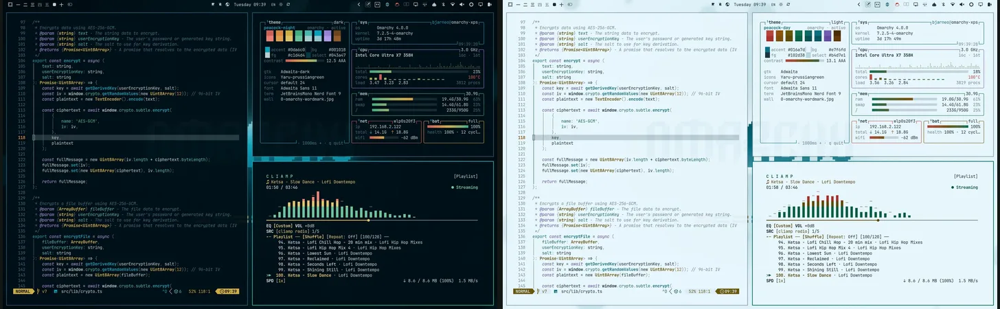](https://bjarneo.github.io/various-themes/#peacock)

`017` · Folder: [`peacock/`](peacock/) · Scene: peacock feather · [Open on the site](https://bjarneo.github.io/various-themes/#peacock)

The eye of a peacock feather. Peacock blues and greens fill 3 slots. Gold, violet and copper stay as pops.

| Variant | Theme name | `background` | `foreground` | `accent` | Icons |
| --- | --- | --- | --- | --- | --- |
| Night | [`peacock-night`](peacock/night/) | `#001018` | `#c1d4d4` | `#0da6c0` | `Yaru-prussiangreen` |
| Day | [`peacock-day`](peacock/day/) | `#e7f6fd` | `#102d38` | `#016a7d` | `Yaru-prussiangreen` |

<details>
<summary>All 16 ANSI colors of each variant</summary>

| Variant | Normal, 0 to 7 | Bright, 8 to 15 |
| --- | --- | --- |
| Night | `#001018` `#d96357` `#48b385` `#d8b349` `#0da6c0` `#9c84dc` `#4dbcb8` `#c1d4d4` | `#417183` `#f08476` `#6ec99e` `#e8c86c` `#9accd8` `#b39ff1` `#a9d4d1` `#e6efef` |
| Day | `#e7f6fd` `#b83e35` `#036a48` `#654f00` `#016a7d` `#6e53ad` `#056260` `#102d38` | `#69838f` `#a72a24` `#005b3d` `#584402` `#035160` `#60449e` `#014c4a` `#03131a` |

</details>

<details>
<summary>Wallpaper credits</summary>

- Night, `3-peacock-feather-eye.jpg`: [Beautiful peacock feathers](https://commons.wikimedia.org/wiki/File:Beautiful_peacock_feathers.jpg) by Gausanchennai, [CC BY-SA 4.0](https://creativecommons.org/licenses/by-sa/4.0)
- Night, `4-peacock-feather-barbs.jpg`: [Перо павлина](https://commons.wikimedia.org/wiki/File:%D0%9F%D0%B5%D1%80%D0%BE_%D0%BF%D0%B0%D0%B2%D0%BB%D0%B8%D0%BD%D0%B0.jpg) by Михайлюк Кирилл Александрович, [CC BY 4.0](https://creativecommons.org/licenses/by/4.0)
- Day, `3-peacock-feathers-white.jpg`: [Peacock Feather02](https://commons.wikimedia.org/wiki/File:Peacock_Feather02.JPG) by Ashlyak, [CC BY-SA 3.0](https://creativecommons.org/licenses/by-sa/3.0)
- Day, `4-peacock-train-eyes.jpg`: [Wall of Peacock Feathers - Flickr - Eric Kilby](https://commons.wikimedia.org/wiki/File:Wall_of_Peacock_Feathers_-_Flickr_-_Eric_Kilby.jpg) by Eric Kilby, [CC BY-SA 2.0](https://creativecommons.org/licenses/by-sa/2.0)

</details>

```bash
curl -fsSL https://bjarneo.github.io/various-themes/install.sh | bash -s -- peacock --set
```

### Kingfisher

[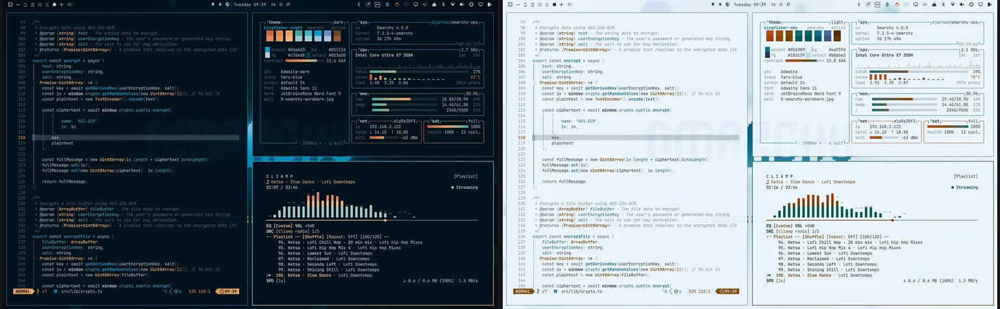](https://bjarneo.github.io/various-themes/#kingfisher)

`018` · Folder: [`kingfisher/`](kingfisher/) · Scene: kingfisher · [Open on the site](https://bjarneo.github.io/various-themes/#kingfisher)

A kingfisher over a river. Cyan blues fill 4 slots. Its rufous orange breast stays as the pop. Slots that leave their usual hue: `magenta`.

| Variant | Theme name | `background` | `foreground` | `accent` | Icons |
| --- | --- | --- | --- | --- | --- |
| Night | [`kingfisher-night`](kingfisher/night/) | `#01111d` | `#c7d4d8` | `#04a4d3` | `Yaru-blue` |
| Day | [`kingfisher-day`](kingfisher/day/) | `#eaf5fd` | `#182c39` | `#056989` | `Yaru-blue` |

<details>
<summary>All 16 ANSI colors of each variant</summary>

| Variant | Normal, 0 to 7 | Bright, 8 to 15 |
| --- | --- | --- |
| Night | `#01111d` `#d76840` `#45b2a5` `#f0a664` `#04a4d3` `#6f91ce` `#3fbfcc` `#c7d4d8` | `#4d7086` `#ef8864` `#a3cdc6` `#ffbc81` `#9ccce1` `#b5c6e3` `#a7d7dc` `#e9f0f2` |
| Day | `#eaf5fd` `#b54311` `#006b63` `#7c4500` `#056989` `#4364a1` `#015d66` `#182c39` | `#6e8291` `#9f3501` `#00524b` `#6c3c00` `#02506a` `#354c79` `#02484f` `#06121b` |

</details>

<details>
<summary>Wallpaper credits</summary>

- Night, `3-kingfisher-diving-splash.jpg`: [Létající drahokam](https://commons.wikimedia.org/wiki/File:L%C3%A9taj%C3%ADc%C3%AD_drahokam.jpg) by Luckhy86, [CC BY-SA 4.0](https://creativecommons.org/licenses/by-sa/4.0)
- Night, `4-kingfisher-river-rock.jpg`: [Ledňáček říční (Alcedo atthis), říčka Rokytka v Praze 05](https://commons.wikimedia.org/wiki/File:Led%C5%88%C3%A1%C4%8Dek_%C5%99%C3%AD%C4%8Dn%C3%AD_(Alcedo_atthis),_%C5%99%C3%AD%C4%8Dka_Rokytka_v_Praze_05.jpg) by Skot, [CC BY-SA 4.0](https://creativecommons.org/licenses/by-sa/4.0)
- Day, `3-kingfisher-blue-water.jpg`: [Common Kingfisher 2025 09 12](https://commons.wikimedia.org/wiki/File:Common_Kingfisher_2025_09_12.jpg) by Alexis Lours, [CC BY 4.0](https://creativecommons.org/licenses/by/4.0)
- Day, `4-kingfisher-flight-reflection.jpg`: [Common Kingfisher in flight with a catch](https://commons.wikimedia.org/wiki/File:Common_Kingfisher_in_flight_with_a_catch.jpg) by Sunuwargr, [CC BY-SA 4.0](https://creativecommons.org/licenses/by-sa/4.0)

</details>

```bash
curl -fsSL https://bjarneo.github.io/various-themes/install.sh | bash -s -- kingfisher --set
```

### Fjord

[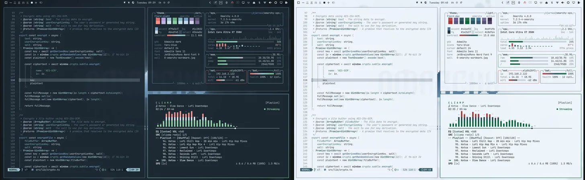](https://bjarneo.github.io/various-themes/#fjord)

`019` · Folder: [`fjord/`](fjord/) · Scene: fjord · [Open on the site](https://bjarneo.github.io/various-themes/#fjord)

A Norwegian fjord in winter. Slate blues fill 4 slots on a lighter base. Falu red and aurora green stay as pops. Slots that leave their usual hue: `yellow`.

| Variant | Theme name | `background` | `foreground` | `accent` | Icons |
| --- | --- | --- | --- | --- | --- |
| Night | [`fjord-night`](fjord/night/) | `#1c2832` | `#d4dfe5` | `#79a3c7` | `Yaru-blue` |
| Day | [`fjord-day`](fjord/day/) | `#edf4fb` | `#1e2b37` | `#446e92` | `Yaru-blue` |

<details>
<summary>All 16 ANSI colors of each variant</summary>

| Variant | Normal, 0 to 7 | Bright, 8 to 15 |
| --- | --- | --- |
| Night | `#1c2832` `#e2726c` `#70b98a` `#9dc9d7` `#79a3c7` `#9590bf` `#84bdc7` `#d4dfe5` | `#677f94` `#fe968e` `#91d3a8` `#d5e9ef` `#ccdff1` `#dddbf2` `#c9e1e6` `#ffffff` |
| Day | `#edf4fb` `#b74642` `#1d6f43` `#2d5866` `#446e92` `#6c6595` `#2c6873` `#1e2b37` | `#72818f` `#a53232` `#026035` `#25434d` `#34536d` `#514c6f` `#264f57` `#0a1219` |

</details>

<details>
<summary>Wallpaper credits</summary>

- Night, `3-lofoten-aurora-fjord.jpg`: [Lofoten, Norway (Unsplash)](https://commons.wikimedia.org/wiki/File:Lofoten,_Norway_(Unsplash).jpg) by Johannes Groll followhansi, [CC0](http://creativecommons.org/publicdomain/zero/1.0/deed.en)
- Night, `4-lauklines-aurora-fjord.jpg`: [Northern Lights at Lauklines Norway](https://commons.wikimedia.org/wiki/File:Northern_Lights_at_Lauklines_Norway.jpg) by Sebastian Kowalski, [CC0](http://creativecommons.org/publicdomain/zero/1.0/deed.en)
- Day, `3-austnesfjorden-cirrus.jpg`: [Cirrus front over Austnesfjorden, Austvågøya, Lofoten, Norway, 2015 April](https://commons.wikimedia.org/wiki/File:Cirrus_front_over_Austnesfjorden,_Austv%C3%A5g%C3%B8ya,_Lofoten,_Norway,_2015_April.jpg) by Ximonic (Simo Räsänen), [CC BY-SA 3.0](https://creativecommons.org/licenses/by-sa/3.0)
- Day, `4-raftsundet-winter-peaks.jpg`: [Raftsund Berge](https://commons.wikimedia.org/wiki/File:Raftsund_Berge.jpg) by Clemensfranz, [CC BY 2.5](https://creativecommons.org/licenses/by/2.5)

</details>

```bash
curl -fsSL https://bjarneo.github.io/various-themes/install.sh | bash -s -- fjord --set
```

### Delft

[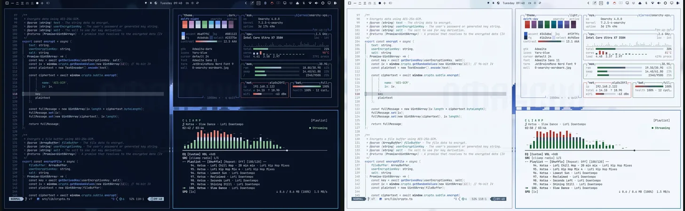](https://bjarneo.github.io/various-themes/#delft)

`020` · Folder: [`delft/`](delft/) · Scene: delft tiles · [Open on the site](https://bjarneo.github.io/various-themes/#delft)

Blue and white tiles from Delft. Cobalt blues fill 4 slots, on glaze white in the day variant. Iron red and copper green stay as pops. Slots that leave their usual hue: `yellow`.

| Variant | Theme name | `background` | `foreground` | `accent` | Icons |
| --- | --- | --- | --- | --- | --- |
| Night | [`delft-night`](delft/night/) | `#081123` | `#cbd4dc` | `#6a97f6` | `Yaru-blue` |
| Day | [`delft-day`](delft/day/) | `#f3f7fc` | `#1b2b4a` | `#345dbe` | `Yaru-blue` |

<details>
<summary>All 16 ANSI colors of each variant</summary>

| Variant | Normal, 0 to 7 | Bright, 8 to 15 |
| --- | --- | --- |
| Night | `#081123` `#db6659` `#6eaf7c` `#a3beda` `#6a97f6` `#9389cd` `#59b4d6` `#cbd4dc` | `#5a6d8f` `#f38779` `#8bc697` `#cedbe8` `#b0c7f3` `#c6c3e3` `#abd0e0` `#ecf1f5` |
| Day | `#f3f7fc` `#ba4137` `#266c3b` `#3b546f` `#345dbe` `#695da1` `#01637f` `#1b2b4a` | `#77828f` `#a92d26` `#125e2d` `#2f4154` `#2a488d` `#4f4779` `#004d62` `#0a1428` |

</details>

<details>
<summary>Wallpaper credits</summary>

- Night, `3-delftware-shelf-rijksmuseum.jpg`: [Delft blue,rijksmuseum (54) (15009164407)](https://commons.wikimedia.org/wiki/File:Delft_blue,rijksmuseum_(54)_(15009164407).jpg) by bertknot from scarborough, australia, [CC BY-SA 2.0](https://creativecommons.org/licenses/by-sa/2.0)
- Night, `4-delft-tile-plaques.jpg`: [Delft blue,rijksmuseum (23) (15195780795)](https://commons.wikimedia.org/wiki/File:Delft_blue,rijksmuseum_(23)_(15195780795).jpg) by bertknot from scarborough, australia, [CC BY-SA 2.0](https://creativecommons.org/licenses/by-sa/2.0)
- Day, `3-delft-tile-wall-lille.jpg`: [Lille hospice comtesse carreaux cuisine](https://commons.wikimedia.org/wiki/File:Lille_hospice_comtesse_carreaux_cuisine.jpg) by Velvet, [CC BY-SA 4.0](https://creativecommons.org/licenses/by-sa/4.0)
- Day, `4-delft-blue-vases.jpg`: [Maakproces Delfts blauw aardewerk](https://commons.wikimedia.org/wiki/File:Maakproces_Delfts_blauw_aardewerk.jpg) by Anneteoshea, [CC BY-SA 4.0](https://creativecommons.org/licenses/by-sa/4.0)

</details>

```bash
curl -fsSL https://bjarneo.github.io/various-themes/install.sh | bash -s -- delft --set
```

### Shibori

[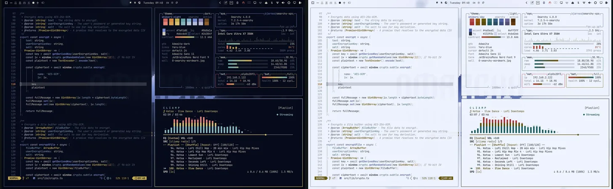](https://bjarneo.github.io/various-themes/#shibori)

`021` · Folder: [`shibori/`](shibori/) · Scene: shibori · [Open on the site](https://bjarneo.github.io/various-themes/#shibori)

Indigo cloth dyed with folds and ties. Indigo blues fill 4 slots. Madder red and weld yellow stay as pops. Slots that leave their usual hue: `green`.

| Variant | Theme name | `background` | `foreground` | `accent` | Icons |
| --- | --- | --- | --- | --- | --- |
| Night | [`shibori-night`](shibori/night/) | `#060a1a` | `#d6cdc0` | `#7a91d8` | `Yaru-blue` |
| Day | [`shibori-day`](shibori/day/) | `#eff3ff` | `#23293c` | `#4a5ea5` | `Yaru-blue` |

<details>
<summary>All 16 ANSI colors of each variant</summary>

| Variant | Normal, 0 to 7 | Bright, 8 to 15 |
| --- | --- | --- |
| Night | `#060a1a` `#d2655e` `#6da6ac` `#cbb251` `#7a91d8` `#9187bd` `#84aed2` `#d6cdc0` | `#5d6989` `#ea857d` `#8abcc2` `#ddc672` `#b6c2e3` `#c2bfd8` `#b8ccdc` `#efebe4` |
| Day | `#eff3ff` `#b3423f` `#28666c` `#625103` `#4a5ea5` `#675d93` `#305a7d` `#23293c` | `#787f93` `#a22f2f` `#16595f` `#554601` `#39487c` `#4e476e` `#27455e` `#0d101c` |

</details>

<details>
<summary>Wallpaper credits</summary>

- Night, `3-indigo-resist-cloth.jpg`: [Blaudruckerei Wagner Blaudruck Musterstoffe 04](https://commons.wikimedia.org/wiki/File:Blaudruckerei_Wagner_Blaudruck_Musterstoffe_04.jpg) by Geolina163, [CC BY-SA 4.0](https://creativecommons.org/licenses/by-sa/4.0)
- Night, `4-arimatsu-shibori-cloths.jpg`: [Arimatsu Shibori 2019-06 ac (1)](https://commons.wikimedia.org/wiki/File:Arimatsu_Shibori_2019-06_ac_(1).jpg) by Asturio Cantabrio, [CC BY-SA 4.0](https://creativecommons.org/licenses/by-sa/4.0)
- Day, `3-itajime-shibori-cloths.jpg`: [Zeugfärberei Gutau Workshopergebnisse 10](https://commons.wikimedia.org/wiki/File:Zeugf%C3%A4rberei_Gutau_Workshopergebnisse_10.jpg) by Geolina163, [CC BY-SA 4.0](https://creativecommons.org/licenses/by-sa/4.0)
- Day, `4-shibori-circles-indigo.jpg`: [Zeugfärberei Gutau Workshopergebnisse 9](https://commons.wikimedia.org/wiki/File:Zeugf%C3%A4rberei_Gutau_Workshopergebnisse_9.jpg) by Geolina163, [CC BY-SA 4.0](https://creativecommons.org/licenses/by-sa/4.0)

</details>

```bash
curl -fsSL https://bjarneo.github.io/various-themes/install.sh | bash -s -- shibori --set
```

### Iris

[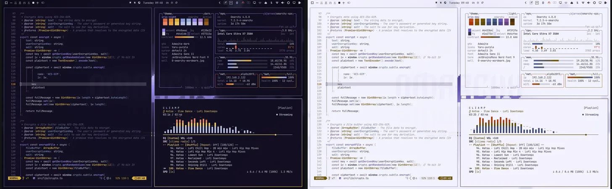](https://bjarneo.github.io/various-themes/#iris)

`022` · Folder: [`iris/`](iris/) · Scene: irises · [Open on the site](https://bjarneo.github.io/various-themes/#iris)

Bearded irises in bloom. Violets fill 4 slots. The gold and orange of the beards stay as pops. Slots that leave their usual hue: `green`, `cyan`.

| Variant | Theme name | `background` | `foreground` | `accent` | Icons |
| --- | --- | --- | --- | --- | --- |
| Night | [`iris-night`](iris/night/) | `#120e22` | `#d4d1db` | `#968aea` | `Yaru-purple` |
| Day | [`iris-day`](iris/day/) | `#f3f2fe` | `#2a273d` | `#6453b4` | `Yaru-purple` |

<details>
<summary>All 16 ANSI colors of each variant</summary>

| Variant | Normal, 0 to 7 | Bright, 8 to 15 |
| --- | --- | --- |
| Night | `#120e22` `#d96845` `#8da0e2` `#dfb43d` `#968aea` `#ae7fca` `#97b0dd` `#d4d1db` | `#6c688d` `#f08968` `#bcc5e4` `#f0c965` `#c5c1ef` `#d3bee2` `#c4d0e4` `#f0eff4` |
| Day | `#f3f2fe` `#b6421a` `#4c5b9d` `#674e00` `#6453b4` `#81509d` `#3d547d` `#2a273d` | `#7f7c94` `#a33100` `#3b4675` `#594401` `#4c4086` `#613e75` `#30415e` `#120f1d` |

</details>

<details>
<summary>Wallpaper credits</summary>

- Night, `3-violet-bearded-iris-on-black.jpg`: [Iris pallida subsp. cengialti (Ambrosi ex A.Kern.) Foster in Gard. Chron.- n.s.- 25…](https://commons.wikimedia.org/wiki/File:Iris_pallida_subsp._cengialti_(Ambrosi_ex_A.Kern.)_Foster_in_Gard._Chron.-_n.s.-_25-_555_(1886)_20240425_093420.jpg) by Motohiro Sunouchi, [CC BY 4.0](https://creativecommons.org/licenses/by/4.0)
- Night, `4-bearded-iris-gold-beard.jpg`: [Schwertlilie -- 2025 -- 7594](https://commons.wikimedia.org/wiki/File:Schwertlilie_--_2025_--_7594.jpg) by Dietmar Rabich, [CC BY-SA 4.0](https://creativecommons.org/licenses/by-sa/4.0)
- Day, `3-van-gogh-irises.jpg`: [Irises](https://commons.wikimedia.org/wiki/File:Vincent_van_Gogh_-_Irises_(1889).jpg) by Vincent van Gogh, Public domain
- Day, `4-siberian-iris-sunlit.jpg`: [Beautiful Siberian iris flower](https://commons.wikimedia.org/wiki/File:Beautiful_Siberian_iris_flower.jpg) by Retro Lenses, [CC BY 4.0](https://creativecommons.org/licenses/by/4.0)

</details>

```bash
curl -fsSL https://bjarneo.github.io/various-themes/install.sh | bash -s -- iris --set
```

### Wisteria

[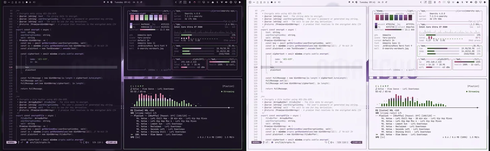](https://bjarneo.github.io/various-themes/#wisteria)

`023` · Folder: [`wisteria/`](wisteria/) · Scene: wisteria · [Open on the site](https://bjarneo.github.io/various-themes/#wisteria)

Wisteria hanging from a pergola. Lavenders fill 4 slots. Leaf green and blush pink stay as pops. Slots that leave their usual hue: `yellow`, `cyan`.

| Variant | Theme name | `background` | `foreground` | `accent` | Icons |
| --- | --- | --- | --- | --- | --- |
| Night | [`wisteria-night`](wisteria/night/) | `#191221` | `#d8d4de` | `#af8dd6` | `Yaru-purple` |
| Day | [`wisteria-day`](wisteria/day/) | `#f7f3fc` | `#2f2738` | `#75519a` | `Yaru-purple` |

<details>
<summary>All 16 ANSI colors of each variant</summary>

| Variant | Normal, 0 to 7 | Bright, 8 to 15 |
| --- | --- | --- |
| Night | `#191221` `#d06c8d` `#80af71` `#ceb1d5` `#af8dd6` `#bb7cb6` `#acacdd` `#d8d4de` | `#766987` `#e88ca9` `#9bc68d` `#e3d5e6` `#d1c3e5` `#dec0da` `#cfd0e6` `#f5f3f8` |
| Day | `#f7f3fc` `#ab466b` `#3c692b` `#65496b` `#75519a` `#904f8a` `#555382` `#2f2738` | `#857d8f` `#9a345c` `#2d5c1b` `#4d3952` `#583f73` `#6b3e68` `#424062` `#15111b` |

</details>

<details>
<summary>Wallpaper credits</summary>

- Night, `3-wisteria-wall-berkeley.jpg`: [N20170406-0018—Wisteria sinensis—Shoko—DxO (33762273152)](https://commons.wikimedia.org/wiki/File:N20170406-0018%E2%80%94Wisteria_sinensis%E2%80%94Shoko%E2%80%94DxO_(33762273152).jpg) by John Rusk, [CC BY 2.0](https://creativecommons.org/licenses/by/2.0)
- Night, `4-wisteria-pergola-okayama.jpg`: [岡山城の藤花 by takeokahp - panoramio](https://commons.wikimedia.org/wiki/File:%E5%B2%A1%E5%B1%B1%E5%9F%8E%E3%81%AE%E8%97%A4%E8%8A%B1_by_takeokahp_-_panoramio.jpg) by takeokahp, [CC BY 3.0](https://creativecommons.org/licenses/by/3.0)
- Day, `3-wisteria-raceme-pale-wall.jpg`: [Wisteria–IMG 5784~2](https://commons.wikimedia.org/wiki/File:Wisteria%E2%80%93IMG_5784~2.jpg) by Kızıl, [CC BY-SA 4.0](https://creativecommons.org/licenses/by-sa/4.0)
- Day, `4-wisteria-over-woerthersee.jpg`: [Pörtschach Halbinsel Johannes-Brahms-Promenade blühende Wisteria 03052015 3119](https://commons.wikimedia.org/wiki/File:P%C3%B6rtschach_Halbinsel_Johannes-Brahms-Promenade_bl%C3%BChende_Wisteria_03052015_3119.jpg) by Johann Jaritz, [CC BY-SA 4.0](https://creativecommons.org/licenses/by-sa/4.0)

</details>

```bash
curl -fsSL https://bjarneo.github.io/various-themes/install.sh | bash -s -- wisteria --set
```

### Aubergine

[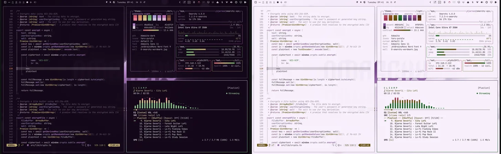](https://bjarneo.github.io/various-themes/#aubergine)

`024` · Folder: [`aubergine/`](aubergine/) · Scene: aubergines · [Open on the site](https://bjarneo.github.io/various-themes/#aubergine)

Glossy aubergines with green calyxes. Eggplant purples fill 3 slots. Calyx green, the cream flesh and a red stay as pops. Slots that leave their usual hue: `blue`, `cyan`.

| Variant | Theme name | `background` | `foreground` | `accent` | Icons |
| --- | --- | --- | --- | --- | --- |
| Night | [`aubergine-night`](aubergine/night/) | `#140719` | `#d4cdd6` | `#b683cd` | `Yaru-purple` |
| Day | [`aubergine-day`](aubergine/day/) | `#f8f0fc` | `#322438` | `#804b96` | `Yaru-purple` |

<details>
<summary>All 16 ANSI colors of each variant</summary>

| Variant | Normal, 0 to 7 | Bright, 8 to 15 |
| --- | --- | --- |
| Night | `#140719` `#d26478` `#6eae70` `#c9b278` `#b683cd` `#c473b3` `#afa3da` `#d4cdd6` | `#796283` `#ea8495` `#8ac48b` `#dbc692` `#d2bbdd` `#deb7d4` `#cdc7e1` `#eeebef` |
| Day | `#f8f0fc` `#b24059` `#26692c` `#664f0c` `#804b96` `#974688` `#5c4f83` `#322438` | `#887a8f` `#a12d4b` `#135c1d` `#5a4400` `#603a70` `#713766` `#473d63` `#160d1a` |

</details>

<details>
<summary>Wallpaper credits</summary>

- Night, `3-glossy-aubergine-pile.jpg`: [Shimla-Bazar-40-Auberginen-2016-gje](https://commons.wikimedia.org/wiki/File:Shimla-Bazar-40-Auberginen-2016-gje.jpg) by Gerd Eichmann, [CC BY 4.0](https://creativecommons.org/licenses/by/4.0)
- Night, `4-mini-aubergines-calyx.jpg`: [Mini eggplant](https://commons.wikimedia.org/wiki/File:Mini_eggplant.jpg) by Hannah Clover, [CC BY 4.0](https://creativecommons.org/licenses/by/4.0)
- Day, `3-cut-aubergine.jpg`: [AubergineGeschnitten](https://commons.wikimedia.org/wiki/File:AubergineGeschnitten.jpg) by Frédérique Voisin-Demery, [CC BY 2.0](https://creativecommons.org/licenses/by/2.0)
- Day, `4-four-aubergines.jpg`: [Four eggplants 2017 A](https://commons.wikimedia.org/wiki/File:Four_eggplants_2017_A.jpg) by Fructibus, [CC0](http://creativecommons.org/publicdomain/zero/1.0/deed.en)

</details>

```bash
curl -fsSL https://bjarneo.github.io/various-themes/install.sh | bash -s -- aubergine --set
```

### Bougainvillea

[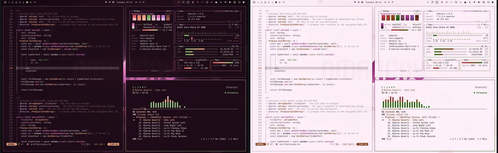](https://bjarneo.github.io/various-themes/#bougainvillea)

`025` · Folder: [`bougainvillea/`](bougainvillea/) · Scene: bougainvillea · [Open on the site](https://bjarneo.github.io/various-themes/#bougainvillea)

Bougainvillea over a white wall. Hot magentas fill 4 slots. Leaf green and terracotta stay as pops. Slots that leave their usual hue: `blue`, `cyan`.

| Variant | Theme name | `background` | `foreground` | `accent` | Icons |
| --- | --- | --- | --- | --- | --- |
| Night | [`bougainvillea-night`](bougainvillea/night/) | `#1d0a17` | `#d4d2ca` | `#e370c0` | `Yaru-magenta` |
| Day | [`bougainvillea-day`](bougainvillea/day/) | `#fceff7` | `#382231` | `#a52f87` | `Yaru-magenta` |

<details>
<summary>All 16 ANSI colors of each variant</summary>

| Variant | Normal, 0 to 7 | Bright, 8 to 15 |
| --- | --- | --- |
| Night | `#1d0a17` `#e45b67` `#75b168` `#eda47f` `#e370c0` `#ba78cd` `#d6a0b4` `#d4d2ca` | `#866179` `#f6b5b5` `#90c784` `#fdba99` `#ebb6d8` `#d9bce3` `#e3c8d1` `#f1efec` |
| Day | `#fceff7` `#c03045` `#2b681b` `#844018` `#a52f87` `#8c48a0` `#79465b` `#382231` | `#8f7887` `#8f2935` `#1b5b06` `#783406` `#7c2865` `#683977` `#5b3745` `#1a0c15` |

</details>

<details>
<summary>Wallpaper credits</summary>

- Night, `3-magenta-bougainvillea-dark-wall.jpg`: [Bougainvillea à Mangily, Toliary (85105)](https://commons.wikimedia.org/wiki/File:Bougainvillea_%C3%A0_Mangily,_Toliary_(85105).jpg) by Anai171, [CC BY-SA 4.0](https://creativecommons.org/licenses/by-sa/4.0)
- Night, `4-bougainvillea-bract-macro.jpg`: [Bougainvillea spectabilis (19387284339)](https://commons.wikimedia.org/wiki/File:Bougainvillea_spectabilis_(19387284339).jpg) by Graham Wise, [CC BY 2.0](https://creativecommons.org/licenses/by/2.0)
- Day, `3-bougainvillea-white-facade-mogan.jpg`: [Bougainvilleas - Puerto de Mogán - 03](https://commons.wikimedia.org/wiki/File:Bougainvilleas_-_Puerto_de_Mog%C3%A1n_-_03.jpg) by H. Zell, [CC BY-SA 3.0](https://creativecommons.org/licenses/by-sa/3.0)
- Day, `4-bougainvillea-white-wall-santorini.jpg`: [Santorin (GR), Akrotiri -- 2017 -- 2452](https://commons.wikimedia.org/wiki/File:Santorin_(GR),_Akrotiri_--_2017_--_2452.jpg) by Dietmar Rabich, [CC BY-SA 4.0](https://creativecommons.org/licenses/by-sa/4.0)

</details>

```bash
curl -fsSL https://bjarneo.github.io/various-themes/install.sh | bash -s -- bougainvillea --set
```

### Peony

[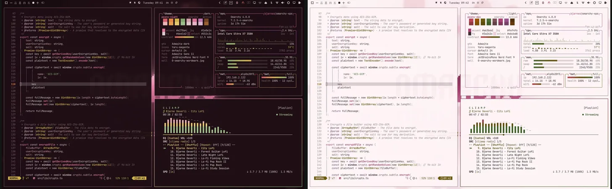](https://bjarneo.github.io/various-themes/#peony)

`026` · Folder: [`peony/`](peony/) · Scene: peonies · [Open on the site](https://bjarneo.github.io/various-themes/#peony)

Peonies in full bloom. Peony pinks fill 4 slots. Leaf green and stamen gold stay as pops. Slots that leave their usual hue: `blue`, `cyan`.

| Variant | Theme name | `background` | `foreground` | `accent` | Icons |
| --- | --- | --- | --- | --- | --- |
| Night | [`peony-night`](peony/night/) | `#1e0e14` | `#ded1d2` | `#e278a4` | `Yaru-magenta` |
| Day | [`peony-day`](peony/day/) | `#fef4f6` | `#3a262c` | `#a63b6d` | `Yaru-magenta` |

<details>
<summary>All 16 ANSI colors of each variant</summary>

| Variant | Normal, 0 to 7 | Bright, 8 to 15 |
| --- | --- | --- |
| Night | `#1e0e14` `#d9616a` `#86ac72` `#d8b84c` `#e278a4` `#c47ab4` `#d6a4aa` `#ded1d2` | `#866470` `#f3b9b9` `#a0c38e` `#eacc70` `#ecbacc` `#e0bdd7` `#e3cbce` `#f6f0f0` |
| Day | `#fef4f6` `#bc3f4d` `#44682f` `#665103` `#a63b6d` `#964b88` `#794b52` `#3a262c` | `#917c81` `#8c333b` `#375b20` `#594600` `#7c3153` `#713b66` `#5c3b40` `#1d1115` |

</details>

<details>
<summary>Wallpaper credits</summary>

- Night, `3-pink-peonies-on-black.jpg`: [Peony Summer (4736000345)](https://commons.wikimedia.org/wiki/File:Peony_Summer_(4736000345).jpg) by THOR, [CC BY 2.0](https://creativecommons.org/licenses/by/2.0)
- Night, `4-pink-peony-dark-garden.jpg`: [Pink peony (14516653971)](https://commons.wikimedia.org/wiki/File:Pink_peony_(14516653971).jpg) by Valentin Hintikka, [CC BY-SA 2.0](https://creativecommons.org/licenses/by-sa/2.0)
- Day, `3-pink-peony-on-white.jpg`: [Peony Summer (4736003501)](https://commons.wikimedia.org/wiki/File:Peony_Summer_(4736003501).jpg) by THOR, [CC BY 2.0](https://creativecommons.org/licenses/by/2.0)
- Day, `4-pale-peony-petals.jpg`: [Pink Peony (48224703141)](https://commons.wikimedia.org/wiki/File:Pink_Peony_(48224703141).jpg) by Mustang Joe, [CC0](http://creativecommons.org/publicdomain/zero/1.0/deed.en)

</details>

```bash
curl -fsSL https://bjarneo.github.io/various-themes/install.sh | bash -s -- peony --set
```

## Monochrome

All 6 slots stay inside 1 hue band. A lightness ladder keeps the slots apart, and the brights are pale tints.

### Darkroom

[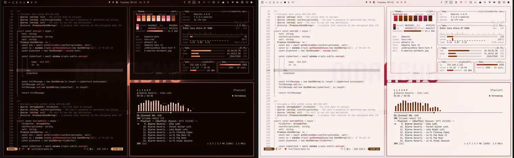](https://bjarneo.github.io/various-themes/#darkroom)

`027` · Folder: [`darkroom/`](darkroom/) · Scene: darkroom · [Open on the site](https://bjarneo.github.io/various-themes/#darkroom)

A photo darkroom under a red safelight. Every slot is a red, and a lightness ladder keeps the slots apart. Slots that leave their usual hue: `green`, `blue`, `cyan`.

| Variant | Theme name | `background` | `foreground` | `accent` | Icons |
| --- | --- | --- | --- | --- | --- |
| Night | [`darkroom-night`](darkroom/night/) | `#0e0504` | `#e5bab4` | `#ea5861` | `Yaru-red` |
| Day | [`darkroom-day`](darkroom/day/) | `#f9f1f0` | `#352524` | `#b91934` | `Yaru-red` |

<details>
<summary>All 16 ANSI colors of each variant</summary>

| Variant | Normal, 0 to 7 | Bright, 8 to 15 |
| --- | --- | --- |
| Night | `#0e0504` `#e23f40` `#e4744b` `#f3a06c` `#ea5861` `#ef7f96` `#ebb3a4` `#e5bab4` | `#7e615f` `#f8ada6` `#e9b4a1` `#f0c9b3` `#f3aead` `#eab5bd` `#f0d6cf` `#f3ddd9` |
| Day | `#f9f1f0` `#d21b2a` `#9a3300` `#662e01` `#b91934` `#8e1e41` `#57271c` `#352524` | `#8e7a78` `#9b1f23` `#782703` `#4f2200` `#8a1d2a` `#6b1c32` `#401d15` `#180e0e` |

</details>

<details>
<summary>Wallpaper credits</summary>

- Night, `3-safelight-darkroom-bench.jpg`: [WAU 2025 Congress - La Casa del Mango](https://commons.wikimedia.org/wiki/File:WAU_2025_Congress_-_Casa_del_Mango_022.jpg) by Jorge Rosendo Negroe Álvarez, [CC BY-SA 4.0](https://creativecommons.org/licenses/by-sa/4.0)
- Night, `4-safelight-developing-tray.jpg`: [WAU 2025 Congress - La Casa del Mango](https://commons.wikimedia.org/wiki/File:WAU_2025_Congress_-_Casa_del_Mango_020.jpg) by Jorge Rosendo Negroe Álvarez, [CC BY-SA 4.0](https://creativecommons.org/licenses/by-sa/4.0)
- Day, `3-prints-drying-line.jpg`: [WAU 2025 Congress - La Casa del Mango](https://commons.wikimedia.org/wiki/File:WAU_2025_Congress_-_Casa_del_Mango_026.jpg) by Jorge Rosendo Negroe Álvarez, [CC BY-SA 4.0](https://creativecommons.org/licenses/by-sa/4.0)
- Day, `4-darkroom-developing-tray.jpg`: [Eastman Kodak Darkroom Tray](https://commons.wikimedia.org/wiki/File:Eastman_Kodak_Darkroom_Tray_-_DPLA_-_6d4d4f5c4399519ab48bed18a53562eb_(page_1).jpg) by Eastman Kodak Company, Public domain

</details>

```bash
curl -fsSL https://bjarneo.github.io/various-themes/install.sh | bash -s -- darkroom --set
```

### Oxide

[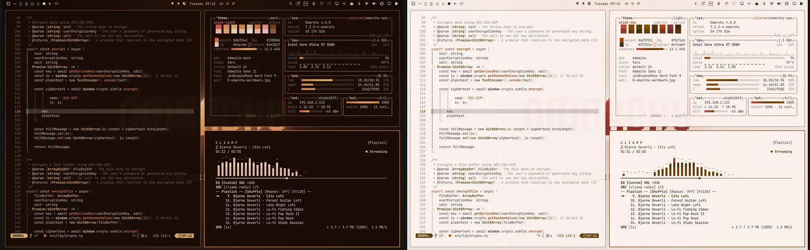](https://bjarneo.github.io/various-themes/#oxide)

`028` · Folder: [`oxide/`](oxide/) · Scene: rust · [Open on the site](https://bjarneo.github.io/various-themes/#oxide)

Iron oxide on old steel. Every slot is a rust orange. Slots that leave their usual hue: `green`, `blue`, `magenta`, `cyan`.

| Variant | Theme name | `background` | `foreground` | `accent` | Icons |
| --- | --- | --- | --- | --- | --- |
| Night | [`oxide-night`](oxide/night/) | `#190b06` | `#e4ccbc` | `#d67244` | `Yaru` |
| Day | [`oxide-day`](oxide/day/) | `#fbf1ed` | `#37251e` | `#a23f01` | `Yaru` |

<details>
<summary>All 16 ANSI colors of each variant</summary>

| Variant | Normal, 0 to 7 | Bright, 8 to 15 |
| --- | --- | --- |
| Night | `#190b06` `#ce5c47` `#d18648` `#e1ae6f` `#d67244` `#e68d8a` `#e3bd9e` `#e4ccbc` | `#846456` `#efb7ab` `#e1bda4` `#e9d2b6` `#eabaa5` `#e7bdba` `#eeddce` `#f8ece3` |
| Day | `#fbf1ed` `#bb422e` `#854500` `#5a3900` `#a23f01` `#832f31` `#4c2c0d` `#37251e` | `#8f7b72` `#8a3526` `#673501` `#462b00` `#7a320b` `#632627` `#37200b` `#190e0a` |

</details>

<details>
<summary>Wallpaper credits</summary>

- Night, `3-rusty-chain.jpg`: [Very rusty chain in rain 4](https://commons.wikimedia.org/wiki/File:Very_rusty_chain_in_rain_4.jpg) by W.carter, [CC0](http://creativecommons.org/publicdomain/zero/1.0/deed.en)
- Night, `4-rusty-rebar.jpg`: [Rusty rebar nets](https://commons.wikimedia.org/wiki/File:Rusty_rebar_nets.jpg) by W.carter, [CC BY-SA 4.0](https://creativecommons.org/licenses/by-sa/4.0)
- Day, `3-rusty-plates.jpg`: [Rusty scrap plates 1](https://commons.wikimedia.org/wiki/File:Rusty_scrap_plates_1.jpg) by W.carter, [CC0](http://creativecommons.org/publicdomain/zero/1.0/deed.en)
- Day, `4-weathering-steel-corner.jpg`: [Richard Serra-Skulptur ohne Titel 1978-16-obere Ecke-2010-gje](https://commons.wikimedia.org/wiki/File:Richard_Serra-Skulptur_ohne_Titel_1978-16-obere_Ecke-2010-gje.jpg) by Gerd Eichmann, [CC BY-SA 4.0](https://creativecommons.org/licenses/by-sa/4.0)

</details>

```bash
curl -fsSL https://bjarneo.github.io/various-themes/install.sh | bash -s -- oxide --set
```

### Sepia

[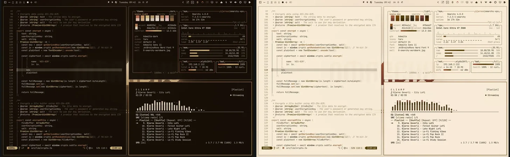](https://bjarneo.github.io/various-themes/#sepia)

`029` · Folder: [`sepia/`](sepia/) · Scene: old photo · [Open on the site](https://bjarneo.github.io/various-themes/#sepia)

An old photograph in sepia tones. Every slot is a brown, on aged paper in the day variant. Slots that leave their usual hue: `green`, `blue`, `magenta`, `cyan`.

| Variant | Theme name | `background` | `foreground` | `accent` | Icons |
| --- | --- | --- | --- | --- | --- |
| Night | [`sepia-night`](sepia/night/) | `#150e06` | `#decfbc` | `#b88256` | `Yaru` |
| Day | [`sepia-day`](sepia/day/) | `#f8ebd7` | `#2c2418` | `#834e1c` | `Yaru` |

<details>
<summary>All 16 ANSI colors of each variant</summary>

| Variant | Normal, 0 to 7 | Bright, 8 to 15 |
| --- | --- | --- |
| Night | `#150e06` `#b56d51` `#ba9c6f` `#cfb57c` `#b88256` `#d0988e` `#d7c1aa` `#decfbc` | `#7b6855` `#e1bdaf` `#d1c3af` `#e0d5bb` `#d9c0ab` `#dcc1bd` `#e9dfd4` `#f5ede4` |
| Day | `#f8ebd7` `#9c5336` `#6a4d1e` `#4c3700` `#834e1c` `#6d3931` `#402e19` `#2c2418` | `#8a785b` `#733e2a` `#503a1a` `#382800` `#623b19` `#512c27` `#2d2012` `#0c0703` |

</details>

<details>
<summary>Wallpaper credits</summary>

- Night, `3-le-gray-ship-and-tugboat.jpg`: [Seascape with Sailing Ship and Tugboat](https://commons.wikimedia.org/wiki/File:Gustave_Le_Gray_(French_-_Seascape_with_Sailing_Ship_and_Tugboat_-_Google_Art_Project.jpg) by Gustave Le Gray, Public domain
- Night, `4-chauvassaignes-dark-hills.jpg`: [Dark Landscape with Hills](https://commons.wikimedia.org/wiki/File:Frank_Chauvassaignes_-_Dark_Landscape_with_Hills_-_1999.196_-_Cleveland_Museum_of_Art.tif) by Frank Chauvassaignes, [CC0](http://creativecommons.org/publicdomain/zero/1.0/deed.en)
- Day, `3-muybridge-lone-tree.jpg`: [Untitled (Landscape near Watsonville, California)](https://commons.wikimedia.org/wiki/File:Eadweard_J._Muybridge_-_Untitled_(Landscape_near_Watsonville,_California)_-_1994.187_-_Cleveland_Museum_of_Art.tif) by Eadweard J. Muybridge, [CC0](http://creativecommons.org/publicdomain/zero/1.0/deed.en)
- Day, `4-aswan-nile-ruin.jpg`: [Aswan, Landscape, Pictures, 1870-1888](https://commons.wikimedia.org/wiki/File:Aswan,_Landscape,_Pictures,_1870-1888,_photo_5_of_9_-_Archivio_fotografico_Museo_Egizio,_Turin_INV33_010.jpg) by Antonio Beato, [CC0](http://creativecommons.org/publicdomain/zero/1.0/deed.en)

</details>

```bash
curl -fsSL https://bjarneo.github.io/various-themes/install.sh | bash -s -- sepia --set
```

### Brass

[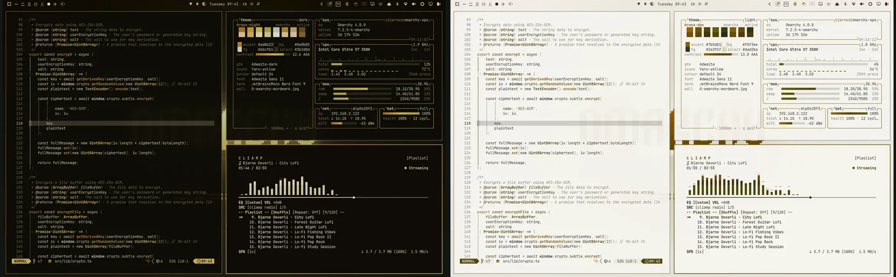](https://bjarneo.github.io/various-themes/#brass)

`030` · Folder: [`brass/`](brass/) · Scene: brass · [Open on the site](https://bjarneo.github.io/various-themes/#brass)

Polished brass on smoked black. Every slot is a brass yellow. Slots that leave their usual hue: `blue`, `magenta`, `cyan`.

| Variant | Theme name | `background` | `foreground` | `accent` | Icons |
| --- | --- | --- | --- | --- | --- |
| Night | [`brass-night`](brass/night/) | `#0e0b05` | `#d6cfb1` | `#ad8622` | `Yaru-yellow` |
| Day | [`brass-day`](brass/day/) | `#f5f3ee` | `#2e291f` | `#7b5d01` | `Yaru-yellow` |

<details>
<summary>All 16 ANSI colors of each variant</summary>

| Variant | Normal, 0 to 7 | Bright, 8 to 15 |
| --- | --- | --- |
| Night | `#0e0b05` `#ac711b` `#aba048` `#cfb447` `#ad8622` `#c49d61` `#c4c598` `#d6cfb1` | `#716955` `#dabe9e` `#c8c39f` `#dfd3a8` `#d2c19b` `#d4c3a8` `#dfdfcb` `#efecdd` |
| Day | `#f5f3ee` `#965f01` `#605700` `#4c3f00` `#7b5d01` `#634300` `#373507` `#2e291f` | `#847f71` `#724702` `#4a4300` `#3b2f00` `#5f4600` `#4d3300` `#272707` `#13110a` |

</details>

<details>
<summary>Wallpaper credits</summary>

- Night, `3-orrery-gears.jpg`: [Orrery-MnM 15 NA 13-IMG 6376](https://commons.wikimedia.org/wiki/File:Orrery-MnM_15_NA_13-IMG_6376.JPG) by Rama, [CC BY-SA 3.0 fr](https://creativecommons.org/licenses/by-sa/3.0/fr/deed.en)
- Night, `4-clock-cogs.jpg`: [Clock Cogs](https://commons.wikimedia.org/wiki/File:Clock_Cogs.jpg) by SomeDriftwood, [CC BY 3.0](https://creativecommons.org/licenses/by/3.0)
- Day, `3-horn-valves.jpg`: [Horn, french (52689892685)](https://commons.wikimedia.org/wiki/File:Horn,_french_(52689892685).jpg) by Auckland Museum Collections, [CC BY 2.0](https://creativecommons.org/licenses/by/2.0)
- Day, `4-horn-tubing.jpg`: [Horn, french (52689472151)](https://commons.wikimedia.org/wiki/File:Horn,_french_(52689472151).jpg) by Auckland Museum Collections, [CC BY 2.0](https://creativecommons.org/licenses/by/2.0)

</details>

```bash
curl -fsSL https://bjarneo.github.io/various-themes/install.sh | bash -s -- brass --set
```

### Bottle Glass

[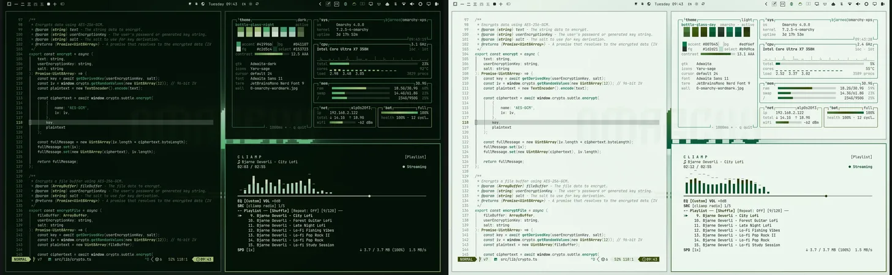](https://bjarneo.github.io/various-themes/#bottle-glass)

`031` · Folder: [`bottle-glass/`](bottle-glass/) · Scene: bottles · [Open on the site](https://bjarneo.github.io/various-themes/#bottle-glass)

Old green bottles on a windowsill. Every slot is a bottle green. Slots that leave their usual hue: `red`, `blue`, `magenta`, `cyan`.

| Variant | Theme name | `background` | `foreground` | `accent` | Icons |
| --- | --- | --- | --- | --- | --- |
| Night | [`bottle-glass-night`](bottle-glass/night/) | `#041107` | `#c2d5c4` | `#41996b` | `Yaru-sage` |
| Day | [`bottle-glass-day`](bottle-glass/day/) | `#edf6ef` | `#1d2d21` | `#007045` | `Yaru-sage` |

<details>
<summary>All 16 ANSI colors of each variant</summary>

| Variant | Normal, 0 to 7 | Bright, 8 to 15 |
| --- | --- | --- |
| Night | `#041107` `#5a8c49` `#50ae6e` `#a6c179` `#41996b` `#64b496` `#afcbae` `#c2d5c4` | `#55725c` `#b3cbac` `#a6cdaf` `#cedaba` `#a8ccb6` `#accec0` `#d6e3d5` `#e6f0e7` |
| Day | `#edf6ef` `#447731` `#00612f` `#324400` `#007045` `#015740` `#223b23` `#1d2d21` | `#728476` `#355928` `#004b23` `#253400` `#0c5535` `#004331` `#192b1a` `#0a140d` |

</details>

<details>
<summary>Wallpaper credits</summary>

- Night, `3-glowing-green-glass.jpg`: [Glass Objects and Bottles Illuminated by Intense Color](https://commons.wikimedia.org/wiki/File:Glass_Objects_and_Bottles_Illuminated_by_Intense_Color.jpg) by A S M Jobaer, [CC BY-SA 4.0](https://creativecommons.org/licenses/by-sa/4.0)
- Night, `4-inside-green-bottle.jpg`: [Green Glass Bottle (54182239626)](https://commons.wikimedia.org/wiki/File:Green_Glass_Bottle_(54182239626).jpg) by Tony Webster, [CC BY 2.0](https://creativecommons.org/licenses/by/2.0)
- Day, `3-bottles-on-windowsill.jpg`: [Dülmen, Alte Brennerei Löhning -- 2015 -- 8677-81](https://commons.wikimedia.org/wiki/File:D%C3%BClmen,_Alte_Brennerei_L%C3%B6hning_--_2015_--_8677-81.jpg) by Dietmar Rabich, [CC BY-SA 4.0](https://creativecommons.org/licenses/by-sa/4.0)
- Day, `4-backlit-bottle-shelves.jpg`: [47 green bottles - Flickr - conall..](https://commons.wikimedia.org/wiki/File:47_green_bottles_-_Flickr_-_conall...jpg) by Conall, [CC BY 2.0](https://creativecommons.org/licenses/by/2.0)

</details>

```bash
curl -fsSL https://bjarneo.github.io/various-themes/install.sh | bash -s -- bottle-glass --set
```

### Viridian

[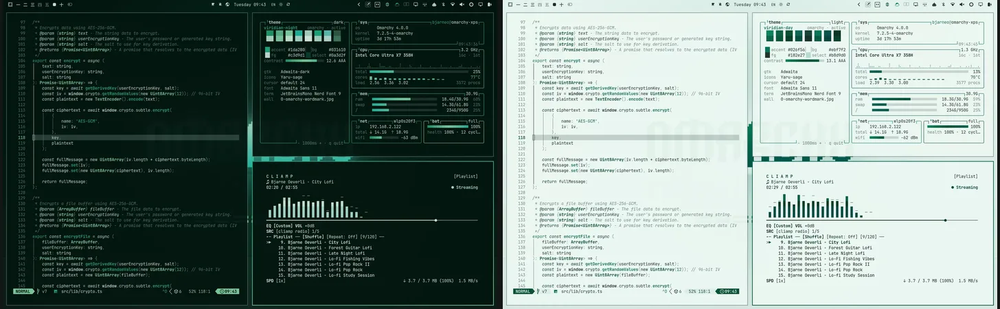](https://bjarneo.github.io/various-themes/#viridian)

`032` · Folder: [`viridian/`](viridian/) · Scene: oil paint · [Open on the site](https://bjarneo.github.io/various-themes/#viridian)

Viridian pigment ground in oil. Every slot is a blue green. Slots that leave their usual hue: `red`, `yellow`, `blue`, `magenta`.

| Variant | Theme name | `background` | `foreground` | `accent` | Icons |
| --- | --- | --- | --- | --- | --- |
| Night | [`viridian-night`](viridian/night/) | `#031610` | `#c3d9d1` | `#1da280` | `Yaru-sage` |
| Day | [`viridian-day`](viridian/day/) | `#ebf7f2` | `#182e27` | `#026f56` | `Yaru-sage` |

<details>
<summary>All 16 ANSI colors of each variant</summary>

| Variant | Normal, 0 to 7 | Bright, 8 to 15 |
| --- | --- | --- |
| Night | `#031610` `#1f9367` `#20b29a` `#7dca9e` `#1da280` `#5ebbb0` `#a6d0bf` `#c3d9d1` | `#4e7568` `#a7d1ba` `#9fd1c4` `#bfe1cc` `#a2d1bf` `#afd5cf` `#d5e8df` `#e9f4f0` |
| Day | `#ebf7f2` `#037f57` `#045f52` `#004b2c` `#026f56` `#014f49` `#113b2e` `#182e27` | `#6d857d` `#015f40` `#004a3f` `#003921` `#005541` `#023d39` `#0e2b21` `#071511` |

</details>

<details>
<summary>Wallpaper credits</summary>

- Night, `3-kuindzhi-moonlit-dnieper.jpg`: [0857Ha. Куинджи А.И. Лунная ночь на Днепре](https://commons.wikimedia.org/wiki/File:0857Ha._%D0%9A%D1%83%D0%B8%D0%BD%D0%B4%D0%B6%D0%B8_%D0%90.%D0%98._%D0%9B%D1%83%D0%BD%D0%BD%D0%B0%D1%8F_%D0%BD%D0%BE%D1%87%D1%8C_%D0%BD%D0%B0_%D0%94%D0%BD%D0%B5%D0%BF%D1%80%D0%B5.jpg) by Arkhip Kuindzhi, Public domain
- Night, `4-polished-malachite.jpg`: [Malachite polie (République démocratique du Congo)](https://commons.wikimedia.org/wiki/File:Malachite_polie_(R%C3%A9publique_d%C3%A9mocratique_du_Congo).JPG) by Parent Géry, [CC BY-SA 3.0](https://creativecommons.org/licenses/by-sa/3.0)
- Day, `3-monet-waterlilies-blue-green.jpg`: [Waterlilies](https://commons.wikimedia.org/wiki/File:Claude_Monet_-_Waterlilies_-_Google_Art_Project.jpg) by Claude Monet, Public domain
- Day, `4-monet-nympheas-lily-pads.jpg`: [Water Lilies](https://commons.wikimedia.org/wiki/File:Nympheas_71293_3.jpg) by Claude Monet, Public domain

</details>

```bash
curl -fsSL https://bjarneo.github.io/various-themes/install.sh | bash -s -- viridian --set
```

### Seafoam

[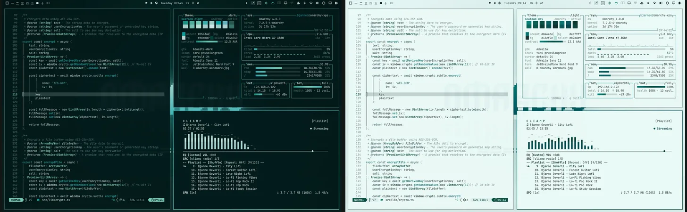](https://bjarneo.github.io/various-themes/#seafoam)

`033` · Folder: [`seafoam/`](seafoam/) · Scene: sea foam · [Open on the site](https://bjarneo.github.io/various-themes/#seafoam)

Sea foam on a pale shore. Every slot is an aqua, on white in the day variant. Slots that leave their usual hue: `red`, `green`, `yellow`, `blue`, `magenta`.

| Variant | Theme name | `background` | `foreground` | `accent` | Icons |
| --- | --- | --- | --- | --- | --- |
| Night | [`seafoam-night`](seafoam/night/) | `#031a1a` | `#c8dbd9` | `#05a3a2` | `Yaru-prussiangreen` |
| Day | [`seafoam-day`](seafoam/day/) | `#eaf9f7` | `#162f2e` | `#046e6e` | `Yaru-prussiangreen` |

<details>
<summary>All 16 ANSI colors of each variant</summary>

| Variant | Normal, 0 to 7 | Bright, 8 to 15 |
| --- | --- | --- |
| Night | `#031a1a` `#1a9489` `#3fb1b4` `#76cdba` `#05a3a2` `#6bbbc6` `#a4d4d0` `#c8dbd9` | `#4c7776` `#a8d3cd` `#a8d3d3` `#bfe4da` `#a4d4d2` `#b5d7dc` `#d6ecea` `#eef7f6` |
| Day | `#eaf9f7` `#007e75` `#055f62` `#014a3f` `#046e6e` `#00515b` `#033a38` `#162f2e` | `#6b8684` `#025f58` `#004a4d` `#023930` `#045454` `#003f47` `#062a29` `#061615` |

</details>

<details>
<summary>Wallpaper credits</summary>

- Night, `3-crashing-waves-aerial.jpg`: [Crashing waves (Unsplash)](https://commons.wikimedia.org/wiki/File:Crashing_waves_(Unsplash).jpg) by Matt Palmer visualworld, [CC0](http://creativecommons.org/publicdomain/zero/1.0/deed.en)
- Night, `4-oahu-surf-aerial.jpg`: [Hawaii helicopter view of ocean Oahu](https://commons.wikimedia.org/wiki/File:Hawaii_helicopter_view_of_ocean_Oahu.jpg) by David Paul Pinter, [CC BY-SA 4.0](https://creativecommons.org/licenses/by-sa/4.0)
- Day, `3-palm-coast-surf-aerial.jpg`: [Ocean waves drone view of Palm Coast beach](https://commons.wikimedia.org/wiki/File:Ocean_waves_drone_view_of_Palm_Coast_beach.jpg) by Lance Asper lance\_asper, [CC0](http://creativecommons.org/publicdomain/zero/1.0/deed.en)
- Day, `4-sea-foam-rock.jpg`: [Sea foam around a rock (Unsplash)](https://commons.wikimedia.org/wiki/File:Sea_foam_around_a_rock_(Unsplash).jpg) by Clark yu clarkyu, [CC0](http://creativecommons.org/publicdomain/zero/1.0/deed.en)

</details>

```bash
curl -fsSL https://bjarneo.github.io/various-themes/install.sh | bash -s -- seafoam --set
```

### Petrol

[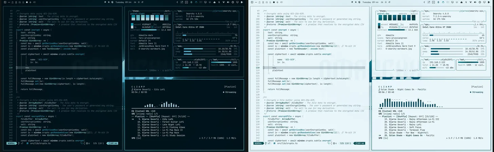](https://bjarneo.github.io/various-themes/#petrol)

`034` · Folder: [`petrol/`](petrol/) · Scene: marbling · [Open on the site](https://bjarneo.github.io/various-themes/#petrol)

Petrol blue, deep and cool. Every slot is a blue teal. Slots that leave their usual hue: `red`, `green`, `yellow`, `magenta`.

| Variant | Theme name | `background` | `foreground` | `accent` | Icons |
| --- | --- | --- | --- | --- | --- |
| Night | [`petrol-night`](petrol/night/) | `#00121a` | `#c3d5d9` | `#189bb7` | `Yaru-prussiangreen` |
| Day | [`petrol-day`](petrol/day/) | `#e9f6fb` | `#132d36` | `#056b81` | `Yaru-prussiangreen` |

<details>
<summary>All 16 ANSI colors of each variant</summary>

| Variant | Normal, 0 to 7 | Bright, 8 to 15 |
| --- | --- | --- |
| Night | `#00121a` `#0b8d9e` `#4ba7c9` `#74c5cd` `#189bb7` `#6cb2d8` `#9fcdd6` `#c3d5d9` | `#467281` `#a2ccd4` `#a6cbda` `#bbdde0` `#a0ccd9` `#b1cfe0` `#d0e5e9` `#e8f0f3` |
| Day | `#e9f6fb` `#017a8a` `#015b76` `#00484d` `#056b81` `#014b6a` `#053a42` `#132d36` | `#6a838d` `#035b67` `#01465c` `#01373c` `#035263` `#003a53` `#082a31` `#041419` |

</details>

<details>
<summary>Wallpaper credits</summary>

- Night, `3-whistler-lagoon-venice.jpg`: [Nocturne in Blue and Silver: The Lagoon, Venice](https://commons.wikimedia.org/wiki/File:James_Abbott_McNeill_Whistler_-_Nocturne_in_Blue_and_Silver-_The_Lagoon,_Venice_-_Google_Art_Project.jpg) by James McNeill Whistler, Public domain
- Night, `4-dusk-on-gjende.jpg`: [Dusk on Gjende, Norway - Flickr - Gael Varoquaux](https://commons.wikimedia.org/wiki/File:Dusk_on_Gjende,_Norway_-_Flickr_-_Gael_Varoquaux.jpg) by Gael Varoquaux, [CC BY 2.0](https://creativecommons.org/licenses/by/2.0)
- Day, `3-marbled-endpaper-stone.jpg`: [Galileo-6](https://commons.wikimedia.org/wiki/File:Galileo-6.jpg) by Galileo Galilei, Public domain
- Day, `4-condensation-on-glass.jpg`: [Texture325-26 (5559430529)](https://commons.wikimedia.org/wiki/File:Texture325-26_(5559430529).jpg) by Pink Sherbet Photography, [CC BY 2.0](https://creativecommons.org/licenses/by/2.0)

</details>

```bash
curl -fsSL https://bjarneo.github.io/various-themes/install.sh | bash -s -- petrol --set
```

### Blueprint

[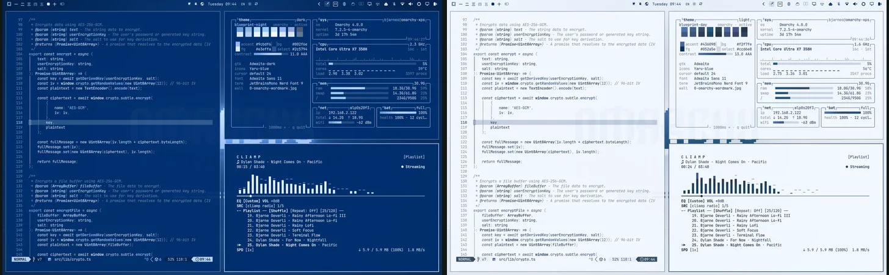](https://bjarneo.github.io/various-themes/#blueprint)

`035` · Folder: [`blueprint/`](blueprint/) · Scene: blueprint · [Open on the site](https://bjarneo.github.io/various-themes/#blueprint)

A technical drawing on blueprint paper. Every slot is a pale blue on a saturated blue background. Slots that leave their usual hue: `red`, `green`, `yellow`, `magenta`.

| Variant | Theme name | `background` | `foreground` | `accent` | Icons |
| --- | --- | --- | --- | --- | --- |
| Night | [`blueprint-night`](blueprint/night/) | `#002f6e` | `#e3effa` | `#9cbdf6` | `Yaru-blue` |
| Day | [`blueprint-day`](blueprint/day/) | `#f2f7fe` | `#052a5e` | `#436098` | `Yaru-blue` |

<details>
<summary>All 16 ANSI colors of each variant</summary>

| Variant | Normal, 0 to 7 | Bright, 8 to 15 |
| --- | --- | --- |
| Night | `#002f6e` `#749dd9` `#9ccef8` `#bcd8f5` `#9cbdf6` `#97a9df` `#cde9fd` `#e3effa` | `#7189ac` `#e3efff` `#e3f2ff` `#f5faff` `#e4eefe` `#e7edff` `#ffffff` `#ffffff` |
| Day | `#f2f7fe` `#4871ad` `#1d5078` `#2e4660` `#436098` `#425184` `#213a4b` `#052a5e` | `#778291` `#385581` `#1b3e5b` `#253649` `#354a72` `#343f64` `#1a2b38` `#011334` |

</details>

<details>
<summary>Wallpaper credits</summary>

- Night, `3-carnegie-library-blueprint.jpg`: [West Elevation, Saint Anthony Park Branch Library Blueprints, St. Paul, Minnesota](https://commons.wikimedia.org/wiki/File:West_Elevation,_Saint_Anthony_Park_Branch_Library_Blueprints,_St._Paul,_Minnesota_-_DPLA_-_6ab78ecd0854043ccb79fdc5f2800430_(cropped).jpg) by Hausler, Charles A., 1889-1981, Public domain
- Night, `4-ss-virgo-blueprint.jpg`: [Ritning av ångaren SS Virgo - Andréexpeditionen](https://commons.wikimedia.org/wiki/File:Ritning_av_%C3%A5ngaren_SS_Virgo_-_Andr%C3%A9expeditionen.tif) by Andrées polarexpedition, Public domain
- Day, `3-bosse-mississippi-bluff.jpg`: [Henry-Peter-Bosse-Cyanotype-Mississippi-03](https://commons.wikimedia.org/wiki/File:Henry-Peter-Bosse-Cyanotype-Mississippi-03.jpg) by Henry Peter Bosse (1844-1903), Public domain
- Day, `4-bosse-mississippi-vista.jpg`: [Henry-Peter-Bosse-Cyanotype-Mississippi-06](https://commons.wikimedia.org/wiki/File:Henry-Peter-Bosse-Cyanotype-Mississippi-06.jpg) by Henry Peter Bosse (1844-1903), Public domain

</details>

```bash
curl -fsSL https://bjarneo.github.io/various-themes/install.sh | bash -s -- blueprint --set
```

### Heliotrope

[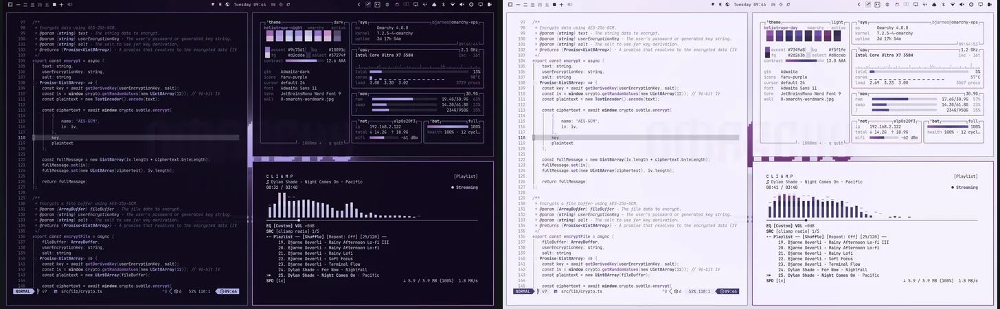](https://bjarneo.github.io/various-themes/#heliotrope)

`036` · Folder: [`heliotrope/`](heliotrope/) · Scene: heliotrope · [Open on the site](https://bjarneo.github.io/various-themes/#heliotrope)

Heliotrope flowers in late summer. Every slot is a violet. Slots that leave their usual hue: `red`, `green`, `yellow`, `cyan`.

| Variant | Theme name | `background` | `foreground` | `accent` | Icons |
| --- | --- | --- | --- | --- | --- |
| Night | [`heliotrope-night`](heliotrope/night/) | `#10091c` | `#d2cdde` | `#9c75d1` | `Yaru-purple` |
| Day | [`heliotrope-day`](heliotrope/day/) | `#f5f1fe` | `#2d263b` | `#7349a8` | `Yaru-purple` |

<details>
<summary>All 16 ANSI colors of each variant</summary>

| Variant | Normal, 0 to 7 | Bright, 8 to 15 |
| --- | --- | --- |
| Night | `#10091c` `#a368b5` `#9f8fe2` `#b0b1f0` `#9c75d1` `#cb90ce` `#c7bde7` `#d2cdde` | `#716489` `#d5bade` `#c4bfe5` `#d1d2ef` `#ccbce7` `#d8bdd9` `#e0dcef` `#edebf4` |
| Day | `#f5f1fe` `#9052a3` `#5c489a` `#3b3770` `#7349a8` `#6e3572` `#3a2f54` `#2d263b` | `#837b92` `#6b3f79` `#463972` `#2d2a54` `#57397d` `#532b56` `#2a233d` `#130e1c` |

</details>

<details>
<summary>Wallpaper credits</summary>

- Night, `3-heliotrope-cyme-close-up.jpg`: [Heliotrope flower (Heliotropium arborescens), Fundação Calouste Gulbenkian, Lisbon…](https://commons.wikimedia.org/wiki/File:Heliotrope_flower_(Heliotropium_arborescens),_Funda%C3%A7%C3%A3o_Calouste_Gulbenkian,_Lisbon,_Portugal_julesvernex2.jpg) by Jules Verne Times Two, [CC BY-SA 4.0](https://creativecommons.org/licenses/by-sa/4.0)
- Night, `4-heliotrope-lilac-clusters.jpg`: [Heliotropium arborescens-IMG 8742](https://commons.wikimedia.org/wiki/File:Heliotropium_arborescens-IMG_8742.JPG) by C T Johansson, [CC BY-SA 3.0](https://creativecommons.org/licenses/by-sa/3.0)
- Day, `3-heliotrope-violet-mass.jpg`: [Boraginaceae - Heliotropium arborescens - 3](https://commons.wikimedia.org/wiki/File:Boraginaceae_-_Heliotropium_arborescens_-_3.jpg) by Emőke Dénes, [CC BY-SA 4.0](https://creativecommons.org/licenses/by-sa/4.0)
- Day, `4-heliotrope-marine-silver-leaves.jpg`: [Heliotropium arborescens JRVdH 03](https://commons.wikimedia.org/wiki/File:Heliotropium_arborescens_JRVdH_03.jpg) by Cephas, [CC BY-SA 4.0](https://creativecommons.org/licenses/by-sa/4.0)

</details>

```bash
curl -fsSL https://bjarneo.github.io/various-themes/install.sh | bash -s -- heliotrope --set
```

### Mauve

[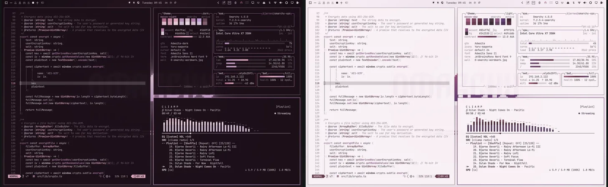](https://bjarneo.github.io/various-themes/#mauve)

`037` · Folder: [`mauve/`](mauve/) · Scene: silk · [Open on the site](https://bjarneo.github.io/various-themes/#mauve)

Dusty mauve, the color of the first aniline dye. Every slot is a muted mauve. Slots that leave their usual hue: `green`, `yellow`, `blue`, `cyan`.

| Variant | Theme name | `background` | `foreground` | `accent` | Icons |
| --- | --- | --- | --- | --- | --- |
| Night | [`mauve-night`](mauve/night/) | `#1b0f18` | `#ddd0da` | `#b47fac` | `Yaru-magenta` |
| Day | [`mauve-day`](mauve/day/) | `#f9f1f6` | `#342530` | `#854f7d` | `Yaru-magenta` |

<details>
<summary>All 16 ANSI colors of each variant</summary>

| Variant | Normal, 0 to 7 | Bright, 8 to 15 |
| --- | --- | --- |
| Night | `#1b0f18` `#b16c90` `#b991bf` `#e2abc2` `#b47fac` `#c49ed6` `#dcbfd1` `#ddd0da` | `#7f6678` `#e0bece` `#d4c2d7` `#ecd2dc` `#d9c0d5` `#d8c7e1` `#ede0e8` `#f6f0f5` |
| Day | `#f9f1f6` `#9b547a` `#6f4875` `#5e2f45` `#854f7d` `#603a70` `#462e3e` `#342530` | `#8b7a87` `#74405b` `#543859` `#472434` `#643d5e` `#492e54` `#33222e` `#170e15` |

</details>

<details>
<summary>Wallpaper credits</summary>

- Night, `3-purple-silk-kosode.jpg`: [Kosode (garment with small wrist openings), view 2, Edo period, 19th century, stream…](https://commons.wikimedia.org/wiki/File:Kosode_(garment_with_small_wrist_openings),_view_2,_Edo_period,_19th_century,_stream,_flowing_plant,_house_and_insect_cage_design_on_purple_and_light_green_tussah_silk_crepe_ground_-_Tokyo_National_Museum_-_DSC06000.JPG) by Daderot, [CC0](http://creativecommons.org/publicdomain/zero/1.0/deed.en)
- Night, `4-baroque-silk-damask.jpg`: [Damask with floral sprigs, Italy, Baroque, 1600-1650, silk two-tone damask - Royal…](https://commons.wikimedia.org/wiki/File:Damask_with_floral_sprigs,_Italy,_Baroque,_1600-1650,_silk_two-tone_damask_-_Royal_Ontario_Museum_-_DSC04376.JPG) by Daderot, [CC0](http://creativecommons.org/publicdomain/zero/1.0/deed.en)
- Day, `3-lilac-silk-damask.jpg`: [Damask - pearlescent shine](https://commons.wikimedia.org/wiki/File:Damask_-_pearlescent_shine.jpg) by BuhaM, [CC BY-SA 4.0](https://creativecommons.org/licenses/by-sa/4.0)
- Day, `4-woven-silk-texture.jpg`: [Pink Woven Cotton Silk Fabric Texture Free Creative Commons (6962346249)](https://commons.wikimedia.org/wiki/File:Pink_Woven_Cotton_Silk_Fabric_Texture_Free_Creative_Commons_(6962346249).jpg) by Pink Sherbet Photography, [CC BY 2.0](https://creativecommons.org/licenses/by/2.0)

</details>

```bash
curl -fsSL https://bjarneo.github.io/various-themes/install.sh | bash -s -- mauve --set
```

### Bordeaux

[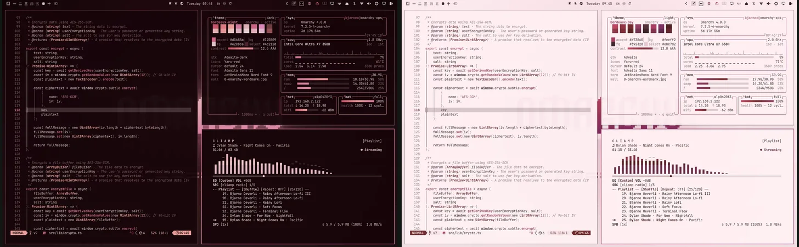](https://bjarneo.github.io/various-themes/#bordeaux)

`038` · Folder: [`bordeaux/`](bordeaux/) · Scene: wine · [Open on the site](https://bjarneo.github.io/various-themes/#bordeaux)

Red wine from Bordeaux. Every slot is a wine red. Slots that leave their usual hue: `green`, `yellow`, `blue`, `cyan`.

| Variant | Theme name | `background` | `foreground` | `accent` | Icons |
| --- | --- | --- | --- | --- | --- |
| Night | [`bordeaux-night`](bordeaux/night/) | `#170509` | `#e2c8ca` | `#d5688a` | `Yaru-red` |
| Day | [`bordeaux-day`](bordeaux/day/) | `#feeff2` | `#392328` | `#a73860` | `Yaru-red` |

<details>
<summary>All 16 ANSI colors of each variant</summary>

| Variant | Normal, 0 to 7 | Bright, 8 to 15 |
| --- | --- | --- |
| Night | `#170509` `#cc566a` `#d87ea2` `#f29f9b` `#d5688a` `#e18cbd` `#e2b7b9` `#e2c8ca` | `#875e67` `#ecb3b8` `#e1b6c5` `#f1cac7` `#e8b4c1` `#e4bcd1` `#edd8d9` `#f5e8e9` |
| Day | `#feeff2` `#ba3e58` `#8e365e` `#6f2427` `#a73860` `#7b2a5e` `#4e2b2e` `#392328` | `#92787d` `#893242` `#6b2c48` `#531d1e` `#7d2e49` `#5d2347` `#392021` `#1b0c10` |

</details>

<details>
<summary>Wallpaper credits</summary>

- Night, `3-chateau-kirwan-cellar.jpg`: [Wine Cellar at Chateau Kirwan](https://commons.wikimedia.org/wiki/File:Wine_Cellar_at_Chateau_Kirwan.jpg) by Jon, [CC BY 2.0](https://creativecommons.org/licenses/by/2.0)
- Night, `4-red-wine-bottle-glass.jpg`: [Bottle and glass of red wine](https://commons.wikimedia.org/wiki/File:Bottle_and_glass_of_red_wine.jpg) by congerdesign, [CC0](http://creativecommons.org/publicdomain/zero/1.0/deed.en)
- Day, `3-saint-emilion-vines.jpg`: [Vignoble Saint-Emilion](https://commons.wikimedia.org/wiki/File:Vignoble_Saint-Emilion.jpg) by Lauchantoiseau, [CC BY-SA 4.0](https://creativecommons.org/licenses/by-sa/4.0)
- Day, `4-medoc-tower-vineyard.jpg`: [Chateau La Tour de By Vignoble](https://commons.wikimedia.org/wiki/File:Chateau_La_Tour_de_By_Vignoble.jpg) by Slywire, [CC BY-SA 4.0](https://creativecommons.org/licenses/by-sa/4.0)

</details>

```bash
curl -fsSL https://bjarneo.github.io/various-themes/install.sh | bash -s -- bordeaux --set
```

## Duotone and triad

2 or 3 hue families share the 6 slots. The window border is a gradient between 2 of them.

### Anaglyph

[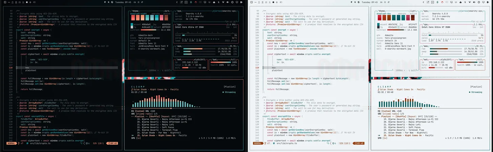](https://bjarneo.github.io/various-themes/#anaglyph)

`039` · Folder: [`anaglyph/`](anaglyph/) · Scene: anaglyph · [Open on the site](https://bjarneo.github.io/various-themes/#anaglyph)

Red and cyan 3D glasses. Reds fill 3 slots and cyans fill 3 slots. Slots that leave their usual hue: `yellow`, `blue`.

| Variant | Theme name | `background` | `foreground` | `accent` | Icons |
| --- | --- | --- | --- | --- | --- |
| Night | [`anaglyph-night`](anaglyph/night/) | `#06090d` | `#c8ced3` | `#08a0a9` | `Yaru-prussiangreen` |
| Day | [`anaglyph-day`](anaglyph/day/) | `#f1f4f7` | `#242a32` | `#04767d` | `Yaru-prussiangreen` |

<details>
<summary>All 16 ANSI colors of each variant</summary>

| Variant | Normal, 0 to 7 | Bright, 8 to 15 |
| --- | --- | --- |
| Night | `#06090d` `#e94f4d` `#43b4b3` `#fb9972` `#08a0a9` `#e36378` `#74b7c2` `#c8ced3` | `#5d6a77` `#ff756e` `#6ac9c8` `#ffb496` `#3bbac3` `#f88394` `#8fcbd5` `#e7eaec` |
| Day | `#f1f4f7` `#cb222c` `#056667` `#923400` `#04767d` `#b73251` `#025763` `#242a32` | `#76818b` `#b6031c` `#055859` `#802c00` `#03656a` `#a71b42` `#004c56` `#0e1217` |

</details>

<details>
<summary>Wallpaper credits</summary>

- Night, `3-phobos-anaglyph.jpg`: [Phobos in 3-D ESA202291](https://commons.wikimedia.org/wiki/File:Phobos_in_3-D_ESA202291.tiff) by European Space Agency, [CC BY-SA 3.0 igo](https://creativecommons.org/licenses/by-sa/3.0/igo/deed.en)
- Night, `4-lin-garden-pond-anaglyph.jpg`: [BanQiao Lin Garden in 3D No 3](https://commons.wikimedia.org/wiki/File:BanQiao_Lin_Garden_in_3D_No_3.jpg) by Yaonanlien, [CC BY-SA 4.0](https://creativecommons.org/licenses/by-sa/4.0)
- Day, `3-tempe-terra-grabens-anaglyph.jpg`: [3D anaglyph view of grabens in Tempe Terra ESA202852](https://commons.wikimedia.org/wiki/File:3D_anaglyph_view_of_grabens_in_Tempe_Terra_ESA202852.tiff) by European Space Agency, [CC BY-SA 3.0 igo](https://creativecommons.org/licenses/by-sa/3.0/igo/deed.en)
- Day, `4-orchid-anaglyph.jpg`: [3D CMS CC-BY (15549814168)](https://commons.wikimedia.org/wiki/File:3D_CMS_CC-BY_(15549814168).jpg) by Carlos ZGZ, [CC0](http://creativecommons.org/publicdomain/zero/1.0/deed.en)

</details>

```bash
curl -fsSL https://bjarneo.github.io/various-themes/install.sh | bash -s -- anaglyph --set
```

### Byzantine

[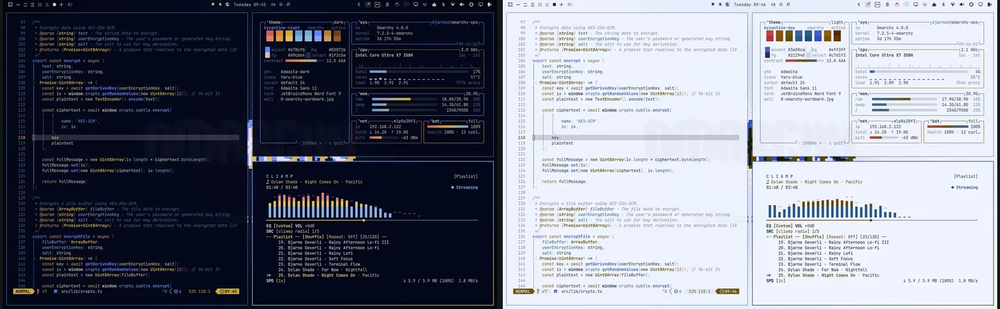](https://bjarneo.github.io/various-themes/#byzantine)

`040` · Folder: [`byzantine/`](byzantine/) · Scene: mosaic · [Open on the site](https://bjarneo.github.io/various-themes/#byzantine)

A gold mosaic under a blue dome. Ultramarine fills 3 slots and gold fills 2. Porphyry red marks errors. Slots that leave their usual hue: `green`, `magenta`.

| Variant | Theme name | `background` | `foreground` | `accent` | Icons |
| --- | --- | --- | --- | --- | --- |
| Night | [`byzantine-night`](byzantine/night/) | `#03071b` | `#d9cbb4` | `#678cfb` | `Yaru-blue` |
| Day | [`byzantine-day`](byzantine/day/) | `#eff3ff` | `#212940` | `#3a58ca` | `Yaru-blue` |

<details>
<summary>All 16 ANSI colors of each variant</summary>

| Variant | Normal, 0 to 7 | Bright, 8 to 15 |
| --- | --- | --- |
| Night | `#03071b` `#d6605a` `#709ed8` `#d7b036` `#678cfb` `#be8431` `#7fafd9` `#d9cbb4` | `#5a688c` `#ed8179` `#8bb5ea` `#e8c45f` `#88a8fe` `#d49f59` `#97c4ea` `#efe9dd` |
| Day | `#eff3ff` `#b83d3c` `#33619b` `#644f02` `#3a58ca` `#895902` `#25577f` `#212940` | `#767f97` `#a7292b` `#24538d` `#584400` `#2d48bc` `#774b00` `#164b73` `#0b101f` |

</details>

<details>
<summary>Wallpaper credits</summary>

- Night, `3-galla-placidia-deer.jpg`: [The deer (left). Detail of the mosaic in Mausoleum of Galla Placidia. Ravenna, Italy](https://commons.wikimedia.org/wiki/File:The_deer_(left)._Detail_of_the_mosaic_in_Mausoleum_of_Galla_Placidia._Ravenna,_Italy.jpg) by Ввласенко, [CC BY-SA 3.0](https://creativecommons.org/licenses/by-sa/3.0)
- Night, `4-galla-placidia-star-ceiling.jpg`: [Mausoleum of Galla Placidia ceiling mosaics](https://commons.wikimedia.org/wiki/File:Mausoleum_of_Galla_Placidia_ceiling_mosaics.jpg) by Petar Milošević, [CC BY-SA 4.0](https://creativecommons.org/licenses/by-sa/4.0)
- Day, `3-hagia-sophia-gold-vault.jpg`: [1. Ceiling mosaics, Hagia Sophia, Istanbul, Turkey](https://commons.wikimedia.org/wiki/File:1._Ceiling_mosaics,_Hagia_Sophia,_Istanbul,_Turkey.jpg) by Osama Shukir Muhammed Amin FRCP(Glasg), [CC BY-SA 4.0](https://creativecommons.org/licenses/by-sa/4.0)
- Day, `4-byzantine-glass-tesserae.jpg`: [Mosaic Tesserae](https://commons.wikimedia.org/wiki/File:Mosaic_Tesserae_MET_2016_11_1_50_MED_s01.jpg) by This file was donated to Wikimedia Commons as part of a project by the Metropolitan Museum of Art. See the Image and Data Resources Open Access Policy, [CC0](http://creativecommons.org/publicdomain/zero/1.0/deed.en)

</details>

```bash
curl -fsSL https://bjarneo.github.io/various-themes/install.sh | bash -s -- byzantine --set
```

### Regatta

[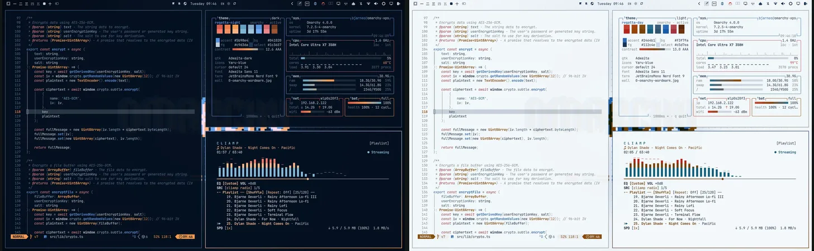](https://bjarneo.github.io/various-themes/#regatta)

`041` · Folder: [`regatta/`](regatta/) · Scene: regatta · [Open on the site](https://bjarneo.github.io/various-themes/#regatta)

Sailboats at a regatta. Navy blues fill 3 slots and signal oranges fill 3 slots. Slots that leave their usual hue: `green`.

| Variant | Theme name | `background` | `foreground` | `accent` | Icons |
| --- | --- | --- | --- | --- | --- |
| Night | [`regatta-night`](regatta/night/) | `#041020` | `#c9d3da` | `#5b98e4` | `Yaru-blue` |
| Day | [`regatta-day`](regatta/day/) | `#f3f7fa` | `#112c4e` | `#2464b1` | `Yaru-blue` |

<details>
<summary>All 16 ANSI colors of each variant</summary>

| Variant | Normal, 0 to 7 | Bright, 8 to 15 |
| --- | --- | --- |
| Night | `#041020` `#e35e4c` `#68a7c7` `#fea051` `#5b98e4` `#df6e75` `#8eb5d2` `#c9d3da` | `#556d8e` `#fb806e` `#85bedb` `#ffbc8a` `#7bb1f8` `#f48d91` `#a6cae5` `#eaf0f3` |
| Day | `#f3f7fa` `#c33727` `#236988` `#824400` `#2464b1` `#b13e4a` `#325875` `#112c4e` | `#76838d` `#b21e11` `#0c5b7b` `#723b00` `#0e55a2` `#a12c3b` `#264d69` `#04152a` |

</details>

<details>
<summary>Wallpaper credits</summary>

- Night, `3-sailboat-sunset-storm.jpg`: [Sailboat on water at sunset](https://commons.wikimedia.org/wiki/File:Sailboat_on_water_at_sunset.jpg) by Johannes Plenio, [CC0](http://creativecommons.org/publicdomain/zero/1.0/deed.en)
- Night, `4-sloop-orange-dusk.jpg`: [Ship at sunset](https://commons.wikimedia.org/wiki/File:Ship_at_sunset.jpg) by J.R.Photography, [CC BY-SA 4.0](https://creativecommons.org/licenses/by-sa/4.0)
- Day, `3-cowes-week-fleet.jpg`: [Cowes Week 2017 - geograph.org.uk - 5487433](https://commons.wikimedia.org/wiki/File:Cowes_Week_2017_-_geograph.org.uk_-_5487433.jpg) by Peter Trimming, [CC BY-SA 2.0](https://creativecommons.org/licenses/by-sa/2.0)
- Day, `4-cowes-week-start.jpg`: [Cowes Week 2018 - geograph.org.uk - 5867927](https://commons.wikimedia.org/wiki/File:Cowes_Week_2018_-_geograph.org.uk_-_5867927.jpg) by Peter Trimming, [CC BY-SA 2.0](https://creativecommons.org/licenses/by-sa/2.0)

</details>

```bash
curl -fsSL https://bjarneo.github.io/various-themes/install.sh | bash -s -- regatta --set
```

### Poolside

[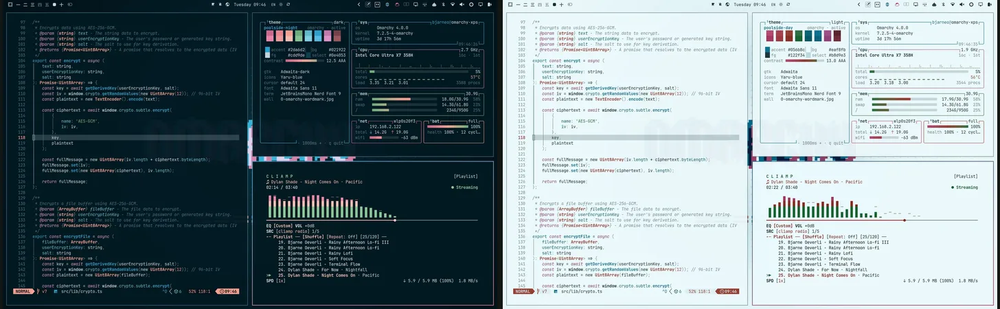](https://bjarneo.github.io/various-themes/#poolside)

`042` · Folder: [`poolside/`](poolside/) · Scene: pool · [Open on the site](https://bjarneo.github.io/various-themes/#poolside)

A pool in the sun with pink tiles and palms. Pool blues fill 3 slots. Pinks fill 2 and palm green fills 1. Slots that leave their usual hue: `yellow`.

| Variant | Theme name | `background` | `foreground` | `accent` | Icons |
| --- | --- | --- | --- | --- | --- |
| Night | [`poolside-night`](poolside/night/) | `#021922` | `#cdd9de` | `#2da6d2` | `Yaru-blue` |
| Day | [`poolside-day`](poolside/day/) | `#eaf8fb` | `#122f34` | `#056b8c` | `Yaru-blue` |

<details>
<summary>All 16 ANSI colors of each variant</summary>

| Variant | Normal, 0 to 7 | Bright, 8 to 15 |
| --- | --- | --- |
| Night | `#021922` `#d66a8f` `#72b27f` `#fea495` `#2da6d2` `#cb7bb1` `#65c0d2` `#cdd9de` | `#4c7587` `#ee8baa` `#8ec999` `#ffc1b5` `#5dbfe7` `#e298ca` `#85d5e5` `#f0f6f8` |
| Day | `#eaf8fb` `#b0426c` `#256b3a` `#91352a` `#056b8c` `#994981` `#04606e` `#122f34` | `#6b858a` `#9f305c` `#115e2c` `#85271d` `#045c79` `#893a72` `#005360` `#05161a` |

</details>

<details>
<summary>Wallpaper credits</summary>

- Night, `3-livingstone-pool-night.jpg`: [Swimming pool Livingstone by night - panoramio](https://commons.wikimedia.org/wiki/File:Swimming_pool_Livingstone_by_night_-_panoramio.jpg) by René Bongard, [CC BY-SA 3.0](https://creativecommons.org/licenses/by-sa/3.0)
- Night, `4-pool-glow-palms-night.jpg`: [Swimming pool at night (37833944571)](https://commons.wikimedia.org/wiki/File:Swimming_pool_at_night_(37833944571).jpg) by oatsy40, [CC BY 2.0](https://creativecommons.org/licenses/by/2.0)
- Day, `3-twin-palms-pool.jpg`: [Frank Sinatra's Twin Palms Estate, a spectacular example of mid-century architecture in…](https://commons.wikimedia.org/wiki/File:Frank_Sinatra%27s_Twin_Palms_Estate,_a_spectacular_example_of_mid-century_architecture_in_the_heart_of_Palm_Springs,_California_LCCN2013635061.tif) by Carol M. Highsmith, Public domain
- Day, `4-pool-palm-reflections.jpg`: [Swimming Pool in a hotel in Tamil Nadu 03](https://commons.wikimedia.org/wiki/File:Swimming_Pool_in_a_hotel_in_Tamil_Nadu_03.jpg) by Kritzolina, [CC BY-SA 4.0](https://creativecommons.org/licenses/by-sa/4.0)

</details>

```bash
curl -fsSL https://bjarneo.github.io/various-themes/install.sh | bash -s -- poolside --set
```

### Reading Room

[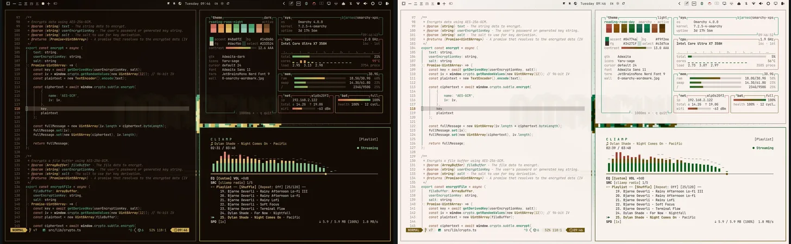](https://bjarneo.github.io/various-themes/#reading-room)

`043` · Folder: [`reading-room/`](reading-room/) · Scene: reading room · [Open on the site](https://bjarneo.github.io/various-themes/#reading-room)

A library with green desk lamps and brass rails. Lamp greens fill 3 slots. Brass and mahogany fill 3 slots. Slots that leave their usual hue: `blue`, `magenta`.

| Variant | Theme name | `background` | `foreground` | `accent` | Icons |
| --- | --- | --- | --- | --- | --- |
| Night | [`reading-room-night`](reading-room/night/) | `#140b06` | `#dacfb6` | `#48a072` | `Yaru-sage` |
| Day | [`reading-room-day`](reading-room/day/) | `#f9f2ee` | `#34271f` | `#04774a` | `Yaru-sage` |

<details>
<summary>All 16 ANSI colors of each variant</summary>

| Variant | Normal, 0 to 7 | Bright, 8 to 15 |
| --- | --- | --- |
| Night | `#140b06` `#ce6a5a` `#6bb26e` `#d7b053` `#48a072` `#c6815d` `#7ebba5` `#dacfb6` | `#7c6657` `#e68979` `#88c88a` `#e9c474` `#6cb98e` `#dc9c7a` `#98cfbb` `#f2ecdf` |
| Day | `#f9f2ee` `#ae483a` `#176622` `#694e03` `#04774a` `#96512b` `#1d604c` `#34271f` | `#8c7c72` `#9d3629` `#005913` `#5b4401` `#02663e` `#874219` `#095441` `#17100a` |

</details>

<details>
<summary>Wallpaper credits</summary>

- Night, `3-sainte-genevieve-lamps.jpg`: [Paris - bibliothèque Sainte-Geneviève - 2026-09-16 14-03-55 005](https://commons.wikimedia.org/wiki/File:Paris_-_biblioth%C3%A8que_Sainte-Genevi%C3%A8ve_-_2026-09-16_14-03-55_005.jpg) by Matthias\_Süßen, [CC BY-SA 4.0](https://creativecommons.org/licenses/by-sa/4.0)
- Night, `4-sainte-genevieve-green-lamp.jpg`: [Paris - bibliothèque Sainte-Geneviève - 2026-09-16 14-03-55 009](https://commons.wikimedia.org/wiki/File:Paris_-_biblioth%C3%A8que_Sainte-Genevi%C3%A8ve_-_2026-09-16_14-03-55_009.jpg) by Matthias\_Süßen, [CC BY-SA 4.0](https://creativecommons.org/licenses/by-sa/4.0)
- Day, `3-salle-labrouste.jpg`: [Salle Labrouste BNF INHA](https://commons.wikimedia.org/wiki/File:Salle_Labrouste_BNF_INHA.jpg) by Peccadille, [CC BY 4.0](https://creativecommons.org/licenses/by/4.0)
- Day, `4-sainte-genevieve-hall.jpg`: [Salle de lecture Bibliotheque Sainte-Genevieve n01](https://commons.wikimedia.org/wiki/File:Salle_de_lecture_Bibliotheque_Sainte-Genevieve_n01.jpg) by Marie-Lan Nguyen, [CC BY 2.0 fr](https://creativecommons.org/licenses/by/2.0/fr/deed.en)

</details>

```bash
curl -fsSL https://bjarneo.github.io/various-themes/install.sh | bash -s -- reading-room --set
```

### Infrared

[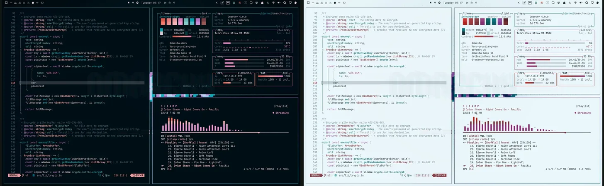](https://bjarneo.github.io/various-themes/#infrared)

`044` · Folder: [`infrared/`](infrared/) · Scene: infrared · [Open on the site](https://bjarneo.github.io/various-themes/#infrared)

Infrared photographs turn leaves pink and skies dark. Pinks fill 3 slots and red marks errors. The teal sky fills 2. Slots that leave their usual hue: `green`, `yellow`, `blue`.

| Variant | Theme name | `background` | `foreground` | `accent` | Icons |
| --- | --- | --- | --- | --- | --- |
| Night | [`infrared-night`](infrared/night/) | `#000e15` | `#dbcbd1` | `#0aa3b0` | `Yaru-prussiangreen` |
| Day | [`infrared-day`](infrared/day/) | `#eaf6fa` | `#172d36` | `#056d77` | `Yaru-prussiangreen` |

<details>
<summary>All 16 ANSI colors of each variant</summary>

| Variant | Normal, 0 to 7 | Bright, 8 to 15 |
| --- | --- | --- |
| Night | `#000e15` `#e15b4e` `#de80c0` `#f19ea3` `#0aa3b0` `#b975c9` `#68bab9` `#dbcbd1` | `#4a6f7e` `#f97d70` `#f19ad5` `#feb5b9` `#4fbbc6` `#d092de` `#86cecd` `#f2eaed` |
| Day | `#eaf6fa` `#c2332c` `#96397c` `#873a43` `#056d77` `#8f489e` `#046161` `#172d36` | `#6d838d` `#b01b19` `#882970` `#7b2e38` `#025e67` `#80388f` `#035455` `#061319` |

</details>

<details>
<summary>Wallpaper credits</summary>

- Night, `3-infrared-park-pond.jpg`: [Just another day at the park (9593736082)](https://commons.wikimedia.org/wiki/File:Just_another_day_at_the_park_(9593736082).jpg) by greg westfall, [CC BY 2.0](https://creativecommons.org/licenses/by/2.0)
- Night, `4-infrared-pink-forest-bridge.jpg`: [Meadowside Nature Center in Infrared (52356364638)](https://commons.wikimedia.org/wiki/File:Meadowside_Nature_Center_in_Infrared_(52356364638).jpg) by John Brighenti, [CC BY 2.0](https://creativecommons.org/licenses/by/2.0)
- Day, `3-infrared-pink-treeline.jpg`: [Landschaft Ladeburger Schäferpfühle in Infrarot - Ansicht von Norden](https://commons.wikimedia.org/wiki/File:Landschaft_Ladeburger_Sch%C3%A4ferpf%C3%BChle_in_Infrarot_-_Ansicht_von_Norden.png) by Andromix12, [CC BY-SA 4.0](https://creativecommons.org/licenses/by-sa/4.0)
- Day, `4-infrared-pagny-pond.jpg`: [Pagny-le-Château 2011 08 20 08 IR](https://commons.wikimedia.org/wiki/File:Pagny-le-Ch%C3%A2teau_2011_08_20_08_IR.jpg) by Bertrand GRONDIN, [CC BY-SA 3.0](https://creativecommons.org/licenses/by-sa/3.0)

</details>

```bash
curl -fsSL https://bjarneo.github.io/various-themes/install.sh | bash -s -- infrared --set
```

### Cross Process

[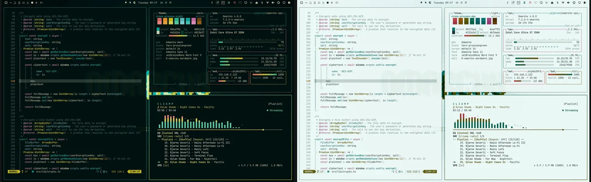](https://bjarneo.github.io/various-themes/#cross-process)

`045` · Folder: [`cross-process/`](cross-process/) · Scene: cross process · [Open on the site](https://bjarneo.github.io/various-themes/#cross-process)

Slide film developed in the wrong chemicals. Cyan greens fill 3 slots and acid yellow fills 1. Magenta and red casts fill 2. Slots that leave their usual hue: `blue`.

| Variant | Theme name | `background` | `foreground` | `accent` | Icons |
| --- | --- | --- | --- | --- | --- |
| Night | [`cross-process-night`](cross-process/night/) | `#001110` | `#d3d2b4` | `#06a79b` | `Yaru-prussiangreen` |
| Day | [`cross-process-day`](cross-process/day/) | `#eaf7f5` | `#152e2d` | `#01726a` | `Yaru-prussiangreen` |

<details>
<summary>All 16 ANSI colors of each variant</summary>

| Variant | Normal, 0 to 7 | Bright, 8 to 15 |
| --- | --- | --- |
| Night | `#001110` `#d46665` `#25b38a` `#c8bc1c` `#06a79b` `#cc72a7` `#5cbcc1` `#d3d2b4` | `#48736f` `#ec8683` `#59c9a2` `#d9d053` `#46c0b4` `#e38fbf` `#7dd0d4` `#efeedf` |
| Day | `#eaf7f5` `#b44245` `#05684e` `#585301` `#01726a` `#9f447c` `#026065` `#152e2d` | `#6b8583` `#a32f36` `#005a43` `#4d4800` `#03625b` `#8f346e` `#045357` `#051514` |

</details>

<details>
<summary>Wallpaper credits</summary>

- Night, `3-lough-foyle-aurora-cross-processed.jpg`: [Aurora 2015 09 09-3 (21094984028)](https://commons.wikimedia.org/wiki/File:Aurora_2015_09_09-3_(21094984028).jpg) by john.purvis, [CC BY 2.0](https://creativecommons.org/licenses/by/2.0)
- Night, `4-lomo-sunset-sea.jpg`: [Lomo Sunset (9121965870)](https://commons.wikimedia.org/wiki/File:Lomo_Sunset_(9121965870).jpg) by Paul, [CC BY 2.0](https://creativecommons.org/licenses/by/2.0)
- Day, `3-death-valley-kodachrome-c41.jpg`: [Death Valley (49343995126)](https://commons.wikimedia.org/wiki/File:Death_Valley_(49343995126).jpg) by Adan Garcia, [CC BY 2.0](https://creativecommons.org/licenses/by/2.0)
- Day, `4-mint-sky-dome-lomochrome-purple.jpg`: [Parque Ibirapuera São Paulo MINOLTA SRT-101 Lomography Purple 2024-000017430001 16](https://commons.wikimedia.org/wiki/File:Parque_Ibirapuera_S%C3%A3o_Paulo_MINOLTA_SRT-101_Lomography_Purple_2024-000017430001_16.jpg) by Prburley, [CC BY 4.0](https://creativecommons.org/licenses/by/4.0)

</details>

```bash
curl -fsSL https://bjarneo.github.io/various-themes/install.sh | bash -s -- cross-process --set
```

### Lava Lamp

[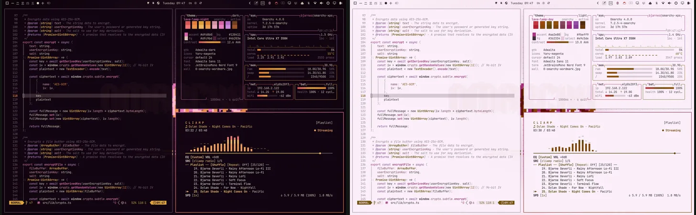](https://bjarneo.github.io/various-themes/#lava-lamp)

`046` · Folder: [`lava-lamp/`](lava-lamp/) · Scene: lava lamp · [Open on the site](https://bjarneo.github.io/various-themes/#lava-lamp)

Wax rising in a lava lamp. Oranges fill 3 slots and magentas fill 3 slots. Slots that leave their usual hue: `green`, `blue`, `cyan`.

| Variant | Theme name | `background` | `foreground` | `accent` | Icons |
| --- | --- | --- | --- | --- | --- |
| Night | [`lava-lamp-night`](lava-lamp/night/) | `#120411` | `#dfc9bd` | `#df68b0` | `Yaru-magenta` |
| Day | [`lava-lamp-day`](lava-lamp/day/) | `#fbeff9` | `#362334` | `#aa2e80` | `Yaru-magenta` |

<details>
<summary>All 16 ANSI colors of each variant</summary>

| Variant | Normal, 0 to 7 | Bright, 8 to 15 |
| --- | --- | --- |
| Night | `#120411` `#df585a` `#e58630` `#e6a93b` `#df68b0` `#ba71cb` `#de96ab` `#dfc9bd` | `#7f5e7b` `#f77a79` `#f7a059` `#f5be62` `#f486c7` `#d08ee0` `#efadc0` `#f3e8e1` |
| Day | `#fbeff9` `#c1303b` `#8d4a01` `#6d4a02` `#aa2e80` `#9144a1` `#834057` `#362334` | `#8c798a` `#af162b` `#7a4001` `#5f4000` `#9b1771` `#813493` `#76344b` `#180c17` |

</details>

<details>
<summary>Wallpaper credits</summary>

- Night, `3-lava-lamp-bar.jpg`: [Lava Lamp inside Encounter Restaurant & Bar at Los Angeles International Airport…](https://commons.wikimedia.org/wiki/File:Lava_Lamp_inside_Encounter_Restaurant_%26_Bar_at_Los_Angeles_International_Airport_(11300546333).jpg) by Sam Howzit, [CC BY 2.0](https://creativecommons.org/licenses/by/2.0)
- Night, `4-floating-wax-blobs.jpg`: [Ink&dye485 Flickr macro photo by Jordan Mudrack - close-up view colored ink dye paint…](https://commons.wikimedia.org/wiki/File:Ink%26dye485_Flickr_macro_photo_by_Jordan_Mudrack_-_close-up_view_colored_ink_dye_paint_wet_transparent_opaque_mediums_materials_forming_intricate_simple_abstract_patterns_shapes_images.jpg) by Jordan Mudrack Photography, [CC BY 2.0](https://creativecommons.org/licenses/by/2.0)
- Day, `3-lava-lamp-shelves.jpg`: [Lava Lamps at Cloudflare 1 2022-12-04](https://commons.wikimedia.org/wiki/File:Lava_Lamps_at_Cloudflare_1_2022-12-04.jpeg) by FASTILY, [CC BY-SA 4.0](https://creativecommons.org/licenses/by-sa/4.0)
- Day, `4-oil-water-blobs.jpg`: [Oil, Water, Food Coloring - Flickr - Jochen Spieker](https://commons.wikimedia.org/wiki/File:Oil,_Water,_Food_Coloring_-_Flickr_-_Jochen_Spieker.jpg) by Jochen Spieker, [CC BY-SA 2.0](https://creativecommons.org/licenses/by-sa/2.0)

</details>

```bash
curl -fsSL https://bjarneo.github.io/various-themes/install.sh | bash -s -- lava-lamp --set
```

### Koi Pond

[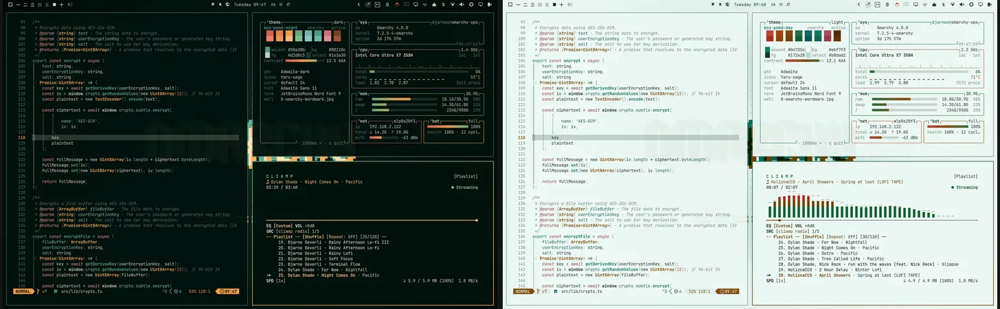](https://bjarneo.github.io/various-themes/#koi-pond)

`047` · Folder: [`koi-pond/`](koi-pond/) · Scene: koi pond · [Open on the site](https://bjarneo.github.io/various-themes/#koi-pond)

Koi under lily pads in a dark pond. Koi oranges and reds fill 3 slots. Pond greens fill 3 slots. Slots that leave their usual hue: `blue`.

| Variant | Theme name | `background` | `foreground` | `accent` | Icons |
| --- | --- | --- | --- | --- | --- |
| Night | [`koi-pond-night`](koi-pond/night/) | `#00110c` | `#d2d0c5` | `#50a38b` | `Yaru-sage` |
| Day | [`koi-pond-day`](koi-pond/day/) | `#ebf7f3` | `#172e28` | `#04735c` | `Yaru-sage` |

<details>
<summary>All 16 ANSI colors of each variant</summary>

| Variant | Normal, 0 to 7 | Bright, 8 to 15 |
| --- | --- | --- |
| Night | `#00110c` `#dd614f` `#6cac7a` `#fba044` `#50a38b` `#d3737c` `#75b9b2` `#d2d0c5` | `#4b7368` `#f58270` `#88c394` `#febb7f` `#72bba4` `#e99197` `#90cdc6` `#eeede8` |
| Day | `#ebf7f3` `#bd3b2c` `#216837` `#7d4501` `#04735c` `#a64552` `#0d615c` `#172e28` | `#6d857e` `#ac2518` `#0d5b2a` `#6d3c01` `#04634e` `#963543` `#025450` `#071512` |

</details>

<details>
<summary>Wallpaper credits</summary>

- Night, `3-koi-tuntorp-red.jpg`: [Koi in a garden pond in Tuntorp 5](https://commons.wikimedia.org/wiki/File:Koi_in_a_garden_pond_in_Tuntorp_5.jpg) by W.carter, [CC BY-SA 4.0](https://creativecommons.org/licenses/by-sa/4.0)
- Night, `4-koi-dark-pond-hong-kong.jpg`: [Koi in a fish pond in Hong Kong (Feb. 2016)](https://commons.wikimedia.org/wiki/File:Koi_in_a_fish_pond_in_Hong_Kong_(Feb._2016).jpg) by Alice Mourou alicemourou, [CC0](http://creativecommons.org/publicdomain/zero/1.0/deed.en)
- Day, `3-koi-almaty-green-pond.jpg`: [Алматы, ботсад, карпы кои в пруду (1)](https://commons.wikimedia.org/wiki/File:%D0%90%D0%BB%D0%BC%D0%B0%D1%82%D1%8B,_%D0%B1%D0%BE%D1%82%D1%81%D0%B0%D0%B4,_%D0%BA%D0%B0%D1%80%D0%BF%D1%8B_%D0%BA%D0%BE%D0%B8_%D0%B2_%D0%BF%D1%80%D1%83%D0%B4%D1%83_(1).jpg) by Nikolai Bulykin, [CC BY-SA 4.0](https://creativecommons.org/licenses/by-sa/4.0)
- Day, `4-koi-pale-pond.jpg`: [Koi in a fish pond-1](https://commons.wikimedia.org/wiki/File:Koi_in_a_fish_pond-1.jpg) by Pogaface, [CC BY-SA 3.0](https://creativecommons.org/licenses/by-sa/3.0)

</details>

```bash
curl -fsSL https://bjarneo.github.io/various-themes/install.sh | bash -s -- koi-pond --set
```

### Bauhaus

[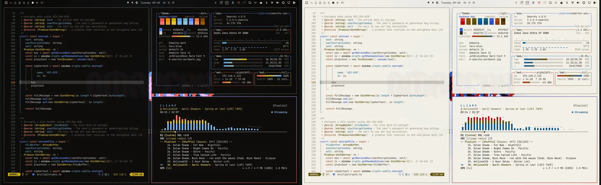](https://bjarneo.github.io/various-themes/#bauhaus)

`048` · Folder: [`bauhaus/`](bauhaus/) · Scene: bauhaus · [Open on the site](https://bjarneo.github.io/various-themes/#bauhaus)

Primary shapes on a Bauhaus poster. Red, yellow and blue fill all 6 slots, on off-white in the day variant. Slots that leave their usual hue: `green`, `magenta`.

| Variant | Theme name | `background` | `foreground` | `accent` | Icons |
| --- | --- | --- | --- | --- | --- |
| Night | [`bauhaus-night`](bauhaus/night/) | `#0e0d0b` | `#d1d0cb` | `#608efb` | `Yaru-blue` |
| Day | [`bauhaus-day`](bauhaus/day/) | `#f3f0e7` | `#2a2721` | `#3059c9` | `Yaru-blue` |

<details>
<summary>All 16 ANSI colors of each variant</summary>

| Variant | Normal, 0 to 7 | Bright, 8 to 15 |
| --- | --- | --- |
| Night | `#0e0d0b` `#eb5347` `#5ea5e6` `#d8b604` `#608efb` `#ea763c` `#76b7d6` `#d1d0cb` | `#6f6a5d` `#ff7a6b` `#7cbcf7` `#ebca40` `#83aaff` `#fe9361` `#91cbe7` `#ededea` |
| Day | `#f3f0e7` `#c8201e` `#025d9c` `#5e4d00` `#3059c9` `#a14102` `#085a78` `#2a2721` | `#837d6a` `#b3000b` `#005088` `#514200` `#2249bb` `#8c3600` `#034e69` `#0f0d0a` |

</details>

<details>
<summary>Wallpaper credits</summary>

- Night, `3-bauhaus-dessau-workshop-wing.jpg`: [Erleuchtete Fassadenseite des Bauhausgebäudes in Dessau, 2019](https://commons.wikimedia.org/wiki/File:Erleuchtete_Fassadenseite_des_Bauhausgeb%C3%A4udes_in_Dessau,_2019.jpg) by Leojng, [CC BY-SA 4.0](https://creativecommons.org/licenses/by-sa/4.0)
- Night, `4-bauhaus-dessau-prellerhaus.jpg`: [Wohnheimseite des Bauhausgebäudes in Dessau, 2019](https://commons.wikimedia.org/wiki/File:Wohnheimseite_des_Bauhausgeb%C3%A4udes_in_Dessau,_2019.jpg) by Leojng, [CC BY-SA 4.0](https://creativecommons.org/licenses/by-sa/4.0)
- Day, `3-kandinsky-yellow-red-blue.jpg`: [Yellow-Red-Blue](https://commons.wikimedia.org/wiki/File:Gelb-Rot-Blau,_by_Wassily_Kandinsky.jpg) by Wassily Kandinsky, Public domain
- Day, `4-kandinsky-transverse-line.jpg`: [Durchgehender Strich](https://commons.wikimedia.org/wiki/File:Durchgehender_Strich_-_Wassily_Kandinsky.jpg) by Wassily Kandinsky, Public domain

</details>

```bash
curl -fsSL https://bjarneo.github.io/various-themes/install.sh | bash -s -- bauhaus --set
```

### Nightshade

[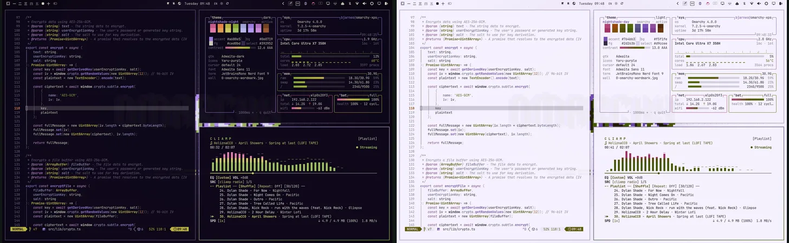](https://bjarneo.github.io/various-themes/#nightshade)

`049` · Folder: [`nightshade/`](nightshade/) · Scene: nightshade · [Open on the site](https://bjarneo.github.io/various-themes/#nightshade)

Purple nightshade flowers with yellow centers. Purples fill 3 slots. Yellow greens fill 2, and a berry red marks errors. Slots that leave their usual hue: `cyan`.

| Variant | Theme name | `background` | `foreground` | `accent` | Icons |
| --- | --- | --- | --- | --- | --- |
| Night | [`nightshade-night`](nightshade/night/) | `#0e0719` | `#ced0bd` | `#a680e5` | `Yaru-purple` |
| Day | [`nightshade-day`](nightshade/day/) | `#f5f1fe` | `#2d263b` | `#764bb3` | `Yaru-purple` |

<details>
<summary>All 16 ANSI colors of each variant</summary>

| Variant | Normal, 0 to 7 | Bright, 8 to 15 |
| --- | --- | --- |
| Night | `#0e0719` `#d06090` `#89ad36` `#c2b83e` `#a680e5` `#b875c8` `#a7a6de` `#ced0bd` | `#706388` `#e880ab` `#a0c35d` `#d3cc64` `#bd9bf8` `#cf91de` `#bcbbef` `#ebece2` |
| Day | `#f5f1fe` `#b03d73` `#4a6300` `#585300` `#764bb3` `#8e489d` `#535085` `#2d263b` | `#837b92` `#9f2a63` `#405502` `#4d4801` `#693ba4` `#7f388e` `#484479` `#130e1c` |

</details>

<details>
<summary>Wallpaper credits</summary>

- Night, `3-bittersweet-nightshade-on-black.jpg`: [Solanum dulcamara kz17](https://commons.wikimedia.org/wiki/File:Solanum_dulcamara_kz17.jpg) by Krzysztof Ziarnek, Kenraiz, [CC BY-SA 4.0](https://creativecommons.org/licenses/by-sa/4.0)
- Night, `4-purple-nightshade-santa-monica.jpg`: [Purple Night Shade (33330524931)](https://commons.wikimedia.org/wiki/File:Purple_Night_Shade_(33330524931).jpg) by Santa Monica Mountains National Recreation Area, Public domain
- Day, `3-potato-bush-flowers-pale-green.jpg`: [Solanum (Lycianthes) rantonnetii close-up](https://commons.wikimedia.org/wiki/File:Solanum_(Lycianthes)_rantonnetii_close-up.jpg) by BlackLotus1987, [CC BY-SA 4.0](https://creativecommons.org/licenses/by-sa/4.0)
- Day, `4-chilean-potato-vine-flowers.jpg`: [Solanum crispum JdP 2013-04-28 n02](https://commons.wikimedia.org/wiki/File:Solanum_crispum_JdP_2013-04-28_n02.jpg) by Marie-Lan Nguyen, [CC BY 2.5](https://creativecommons.org/licenses/by/2.5)

</details>

```bash
curl -fsSL https://bjarneo.github.io/various-themes/install.sh | bash -s -- nightshade --set
```

### Strawberry Mint

[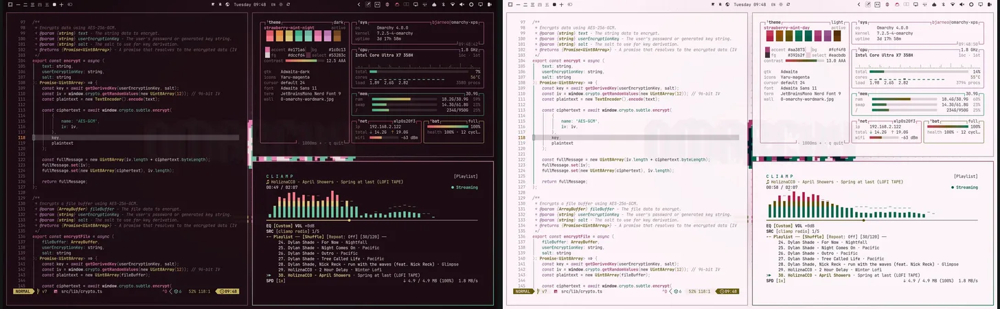](https://bjarneo.github.io/various-themes/#strawberry-mint)

`050` · Folder: [`strawberry-mint/`](strawberry-mint/) · Scene: strawberries · [Open on the site](https://bjarneo.github.io/various-themes/#strawberry-mint)

Strawberries with fresh mint. Strawberry pinks fill 3 slots and mint fills 2. The seeds add a yellow. Slots that leave their usual hue: `blue`.

| Variant | Theme name | `background` | `foreground` | `accent` | Icons |
| --- | --- | --- | --- | --- | --- |
| Night | [`strawberry-mint-night`](strawberry-mint/night/) | `#1c0c13` | `#dccfd4` | `#e171a6` | `Yaru-magenta` |
| Day | [`strawberry-mint-day`](strawberry-mint/day/) | `#fcf4f8` | `#39262f` | `#aa3873` | `Yaru-magenta` |

<details>
<summary>All 16 ANSI colors of each variant</summary>

| Variant | Normal, 0 to 7 | Bright, 8 to 15 |
| --- | --- | --- |
| Night | `#1c0c13` `#e45b6d` `#44b58b` `#cdb660` `#e171a6` `#c179b6` `#73bda9` `#dccfd4` | `#846371` `#fc7e8b` `#6bcba3` `#dfcb7e` `#f68fbe` `#d896ce` `#8fd1be` `#f4eef1` |
| Day | `#fcf4f8` `#c3324e` `#007252` `#645202` `#aa3873` `#944c8b` `#025e4e` `#39262f` | `#8f7c85` `#b1193e` `#046246` `#574700` `#9a2665` `#853c7d` `#005243` `#1c1116` |

</details>

<details>
<summary>Wallpaper credits</summary>

- Night, `3-strawberry-on-leaves.jpg`: [Fresh strawberry resting on vibrant green leaves in a garden](https://commons.wikimedia.org/wiki/File:Fresh_strawberry_resting_on_vibrant_green_leaves_in_a_garden.jpg) by Shixart1985, [CC BY 2.0](https://creativecommons.org/licenses/by/2.0)
- Night, `4-strawberries-crystal-bowl.jpg`: [Still life with strawberries in a crystal bowl](https://commons.wikimedia.org/wiki/File:Still_life_with_strawberries_in_a_crystal_bowl.jpg) by W.carter, [CC BY-SA 4.0](https://creativecommons.org/licenses/by-sa/4.0)
- Day, `3-halved-strawberry.jpg`: [Garden strawberry (Fragaria × ananassa) halved](https://commons.wikimedia.org/wiki/File:Garden_strawberry_(Fragaria_%C3%97_ananassa)_halved.jpg) by Ivar Leidus, [CC BY-SA 4.0](https://creativecommons.org/licenses/by-sa/4.0)
- Day, `4-strawberry-on-white.jpg`: [Strawberry on white background](https://commons.wikimedia.org/wiki/File:Strawberry_on_white_background.jpg) by Joselodos, [CC0](http://creativecommons.org/publicdomain/zero/1.0/deed.en)

</details>

```bash
curl -fsSL https://bjarneo.github.io/various-themes/install.sh | bash -s -- strawberry-mint --set
```

### Aperitivo

[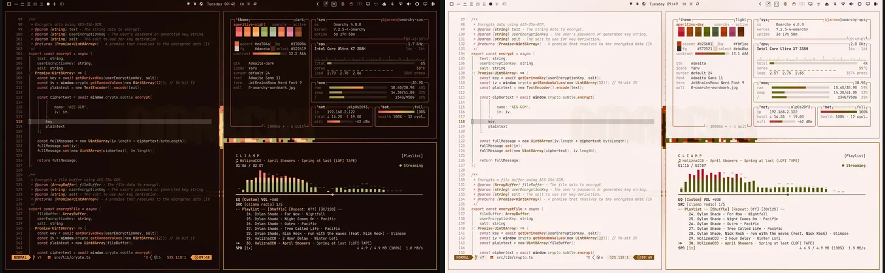](https://bjarneo.github.io/various-themes/#aperitivo)

`051` · Folder: [`aperitivo/`](aperitivo/) · Scene: aperitivo · [Open on the site](https://bjarneo.github.io/various-themes/#aperitivo)

A bitter orange aperitivo with green olives. Bitter reds and oranges fill 4 slots. Olive fills 2. Slots that leave their usual hue: `blue`, `cyan`.

| Variant | Theme name | `background` | `foreground` | `accent` | Icons |
| --- | --- | --- | --- | --- | --- |
| Night | [`aperitivo-night`](aperitivo/night/) | `#170906` | `#daceba` | `#ea704a` | `Yaru` |
| Day | [`aperitivo-day`](aperitivo/day/) | `#fbf1ee` | `#372521` | `#b23601` | `Yaru` |

<details>
<summary>All 16 ANSI colors of each variant</summary>

| Variant | Normal, 0 to 7 | Bright, 8 to 15 |
| --- | --- | --- |
| Night | `#170906` `#e65655` `#95a551` `#fb9f44` `#ea704a` `#d8728b` `#a0b38a` `#daceba` | `#82635a` `#fd7a75` `#adbc71` `#feba7d` `#fe8e6b` `#ed8fa5` `#b6c7a3` `#f2ece1` |
| Day | `#fbf1ee` `#c62a33` `#576300` `#7b4500` `#b23601` `#a63f5e` `#4a5b34` `#372521` | `#8f7a75` `#b40821` `#4a5501` `#6c3b00` `#9a2e01` `#962f4f` `#3f4f28` `#190e0c` |

</details>

<details>
<summary>Wallpaper credits</summary>

- Night, `3-orange-aperitivo-glass.jpg`: [Italian Aperitivo culture - pre-dinner evening drink as an appetizer (32876800955)](https://commons.wikimedia.org/wiki/File:Italian_Aperitivo_culture_-_pre-dinner_evening_drink_as_an_appetizer_(32876800955).jpg) by Ralf Steinberger, [CC BY 2.0](https://creativecommons.org/licenses/by/2.0)
- Night, `4-negroni-on-the-rocks.jpg`: [Negroni (cocktail)](https://commons.wikimedia.org/wiki/File:Negroni_(cocktail).jpg) by Sudhertzen, [CC BY-SA 4.0](https://creativecommons.org/licenses/by-sa/4.0)
- Day, `3-orange-halves.jpg`: [Oranges - whole-halved-segment](https://commons.wikimedia.org/wiki/File:Oranges_-_whole-halved-segment.jpg) by Ivar Leidus, [CC BY-SA 4.0](https://creativecommons.org/licenses/by-sa/4.0)
- Day, `4-olives-on-branch.jpg`: [OlivesCruzGrande](https://commons.wikimedia.org/wiki/File:OlivesCruzGrande.JPG) by AlejandroLinaresGarcia, [CC BY-SA 3.0](https://creativecommons.org/licenses/by-sa/3.0)

</details>

```bash
curl -fsSL https://bjarneo.github.io/various-themes/install.sh | bash -s -- aperitivo --set
```

### Mid Century

[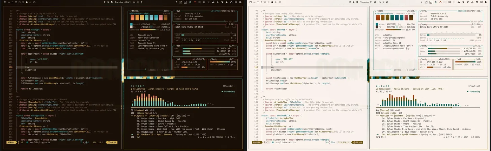](https://bjarneo.github.io/various-themes/#mid-century)

`052` · Folder: [`mid-century/`](mid-century/) · Scene: atomic · [Open on the site](https://bjarneo.github.io/various-themes/#mid-century)

A walnut sideboard with teal and mustard. Teals fill 3 slots. Mustard, burnt orange and rust fill 3 slots. Slots that leave their usual hue: `blue`, `magenta`.

| Variant | Theme name | `background` | `foreground` | `accent` | Icons |
| --- | --- | --- | --- | --- | --- |
| Night | [`mid-century-night`](mid-century/night/) | `#1a0f07` | `#dcd2bd` | `#2da3a8` | `Yaru-prussiangreen` |
| Day | [`mid-century-day`](mid-century/day/) | `#faf2ec` | `#35271d` | `#087277` | `Yaru-prussiangreen` |

<details>
<summary>All 16 ANSI colors of each variant</summary>

| Variant | Normal, 0 to 7 | Bright, 8 to 15 |
| --- | --- | --- |
| Night | `#1a0f07` `#d86a41` `#5ab4a3` `#ddb24a` `#2da3a8` `#d67770` `#79bcc9` `#dcd2bd` | `#826756` `#f08a65` `#7bcaba` `#eec76d` `#5cbcc1` `#ec948d` `#94d0dc` `#f5f0e5` |
| Day | `#faf2ec` `#b54311` `#02675a` `#694e01` `#087277` `#a64642` `#055b69` `#35271d` | `#8d7c71` `#9f3501` `#02594e` `#5b4400` `#026166` `#963633` `#034f5b` `#190f09` |

</details>

<details>
<summary>Wallpaper credits</summary>

- Night, `3-ph5-lamp-teal.jpg`: [Louis Poulsen PH5 Poul Hennigsen](https://commons.wikimedia.org/wiki/File:Louis_Poulsen_PH5_Poul_Hennigsen.jpg) by Richard Huber, [CC BY-SA 3.0](https://creativecommons.org/licenses/by-sa/3.0)
- Night, `4-la-concha-googie-night.jpg`: [Neon Museum, Googie DSC02218 (29097352858)](https://commons.wikimedia.org/wiki/File:Neon_Museum,_Googie_DSC02218_(29097352858).jpg) by Elizabeth K. Joseph, [CC BY 2.0](https://creativecommons.org/licenses/by/2.0)
- Day, `3-mid-century-living-room.jpg`: [Mid 20th-century interior design, Museum of the Home](https://commons.wikimedia.org/wiki/File:Mid_20th-century_interior_design,_Museum_of_the_Home.jpg) by JRennocks, [CC BY 4.0](https://creativecommons.org/licenses/by/4.0)
- Day, `4-eames-lcw-plywood-chair.jpg`: [First Generation LCW Plywood Lounge Chair attributed to Charles Eames](https://commons.wikimedia.org/wiki/File:First_Generation_LCW_Plywood_Lounge_Chair_attributed_to_Charles_Eames_-_DPLA_-_224bbbffbe211a35a03a26190e716884_(page_2).jpg) by Eames, Charles Ormand, Jr., 1907-1978, No restrictions

</details>

```bash
curl -fsSL https://bjarneo.github.io/various-themes/install.sh | bash -s -- mid-century --set
```

### Rhubarb Custard

[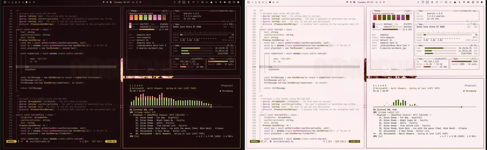](https://bjarneo.github.io/various-themes/#rhubarb-custard)

`053` · Folder: [`rhubarb-custard/`](rhubarb-custard/) · Scene: rhubarb · [Open on the site](https://bjarneo.github.io/various-themes/#rhubarb-custard)

Pink rhubarb with yellow custard. Rhubarb pinks fill 3 slots and custard yellows fill 2. Leaf green fills 1. Slots that leave their usual hue: `blue`, `cyan`.

| Variant | Theme name | `background` | `foreground` | `accent` | Icons |
| --- | --- | --- | --- | --- | --- |
| Night | [`rhubarb-custard-night`](rhubarb-custard/night/) | `#1a0a0c` | `#d6d1bb` | `#dc739f` | `Yaru-magenta` |
| Day | [`rhubarb-custard-day`](rhubarb-custard/day/) | `#fcf0f1` | `#382427` | `#a53a6c` | `Yaru-magenta` |

<details>
<summary>All 16 ANSI colors of each variant</summary>

| Variant | Normal, 0 to 7 | Bright, 8 to 15 |
| --- | --- | --- |
| Night | `#1a0a0c` `#de5e68` `#87a965` `#d3b63b` `#dc739f` `#c477ae` `#c2ae7c` `#d6d1bb` | `#866266` `#f58086` `#a1c082` `#e5ca63` `#f190b7` `#db93c6` `#d5c396` `#f0eee2` |
| Day | `#fcf0f1` `#bc3647` `#47661e` `#5c4b00` `#a53a6c` `#964882` `#6b5724` `#382427` | `#91797c` `#aa1f38` `#3a590a` `#504100` `#95295e` `#863973` `#5f4a13` `#1a0d0f` |

</details>

<details>
<summary>Wallpaper credits</summary>

- Night, `3-rhubarb-stalks-market.jpg`: [Rhubarb in Borough Market](https://commons.wikimedia.org/wiki/File:Rhubarb_in_Borough_Market.jpg) by Cory Doctorow, [CC BY-SA 2.0](https://creativecommons.org/licenses/by-sa/2.0)
- Night, `4-rhubarb-citrus-pan.jpg`: [Rhubarb & Lemon (7271176860)](https://commons.wikimedia.org/wiki/File:Rhubarb_%26_Lemon_(7271176860).jpg) by Rod Waddington, [CC BY-SA 2.0](https://creativecommons.org/licenses/by-sa/2.0)
- Day, `3-pink-rhubarb-stalks.jpg`: [Rhubarb at the Kenny Lake fair - panoramio](https://commons.wikimedia.org/wiki/File:Rhubarb_at_the_Kenny_Lake_fair_-_panoramio.jpg) by olekinderhook, [CC BY 3.0](https://creativecommons.org/licenses/by/3.0)
- Day, `4-rhubarb-bundle.jpg`: [CSA-Rhubarb](https://commons.wikimedia.org/wiki/File:CSA-Rhubarb.jpg) by Evan-Amos, Public domain

</details>

```bash
curl -fsSL https://bjarneo.github.io/various-themes/install.sh | bash -s -- rhubarb-custard --set
```

## Analogous

The 6 slots spread along 1 arc of the color wheel. No slot takes the opposite hue.

### Hydrangea

[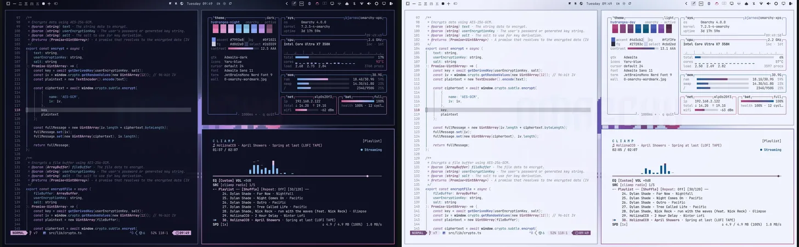](https://bjarneo.github.io/various-themes/#hydrangea)

`054` · Folder: [`hydrangea/`](hydrangea/) · Scene: hydrangea · [Open on the site](https://bjarneo.github.io/various-themes/#hydrangea)

Hydrangea heads from blue to pink. The slots run from blue through violet to pink. Slots that leave their usual hue: `green`, `yellow`.

| Variant | Theme name | `background` | `foreground` | `accent` | Icons |
| --- | --- | --- | --- | --- | --- |
| Night | [`hydrangea-night`](hydrangea/night/) | `#0f1021` | `#d0d2e0` | `#7993e8` | `Yaru-blue` |
| Day | [`hydrangea-day`](hydrangea/day/) | `#f1f3fe` | `#27283c` | `#465cb2` | `Yaru-blue` |

<details>
<summary>All 16 ANSI colors of each variant</summary>

| Variant | Normal, 0 to 7 | Bright, 8 to 15 |
| --- | --- | --- |
| Night | `#0f1021` `#d1659c` `#6ba7e4` `#d6a8dd` `#7993e8` `#ae7dd8` `#7cb7da` `#d0d2e0` | `#676a8d` `#ea85b7` `#88bef6` `#e8beee` `#94adfb` `#c69aed` `#96ccec` `#eef0f7` |
| Day | `#f1f3fe` `#ae3f7b` `#1d5f9b` `#6e4275` `#465cb2` `#814daa` `#1a5c7e` `#27283c` | `#7c7e94` `#9d2c6c` `#05528d` `#623769` `#394da3` `#733d9b` `#045073` `#10101d` |

</details>

<details>
<summary>Wallpaper credits</summary>

- Night, `3-blue-hydrangeas-unshoji-night.jpg`: [Blue hydrangea in Unsho-ji, Oga at night 20190703c](https://commons.wikimedia.org/wiki/File:Blue_hydrangea_in_Unsho-ji,_Oga_at_night_20190703c.jpg) by 掬茶, [CC BY-SA 4.0](https://creativecommons.org/licenses/by-sa/4.0)
- Night, `4-blue-hydrangea-tokyo-shade.jpg`: [Hydrangea, May 2016](https://commons.wikimedia.org/wiki/File:Hydrangea,_May_2016.jpg) by Alexandar Vujadinovic, [CC BY-SA 4.0](https://creativecommons.org/licenses/by-sa/4.0)
- Day, `3-hydrangea-blue-to-pink.jpg`: [Blue Hydrangea (Pink Hydrangea?) (5888804015)](https://commons.wikimedia.org/wiki/File:Blue_Hydrangea_(Pink_Hydrangea%3F)_(5888804015).jpg) by Dwight Sipler, [CC BY 2.0](https://creativecommons.org/licenses/by/2.0)
- Day, `4-pink-hydrangea-pale-wall.jpg`: [Hortensia June 2013-2](https://commons.wikimedia.org/wiki/File:Hortensia_June_2013-2.jpg) by Alvesgaspar, [CC BY-SA 3.0](https://creativecommons.org/licenses/by-sa/3.0)

</details>

```bash
curl -fsSL https://bjarneo.github.io/various-themes/install.sh | bash -s -- hydrangea --set
```

### Forge

[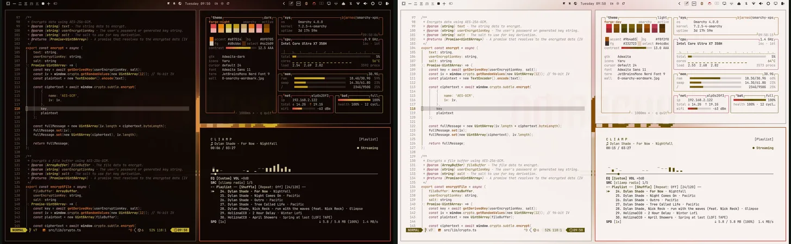](https://bjarneo.github.io/various-themes/#forge)

`055` · Folder: [`forge/`](forge/) · Scene: forge · [Open on the site](https://bjarneo.github.io/various-themes/#forge)

A blacksmith forge with hot iron. The slots run from red through orange to yellow, and the brights glow white hot. Slots that leave their usual hue: `green`, `blue`, `cyan`.

| Variant | Theme name | `background` | `foreground` | `accent` | Icons |
| --- | --- | --- | --- | --- | --- |
| Night | [`forge-night`](forge/night/) | `#0f0705` | `#d8cbbc` | `#e87514` | `Yaru` |
| Day | [`forge-day`](forge/day/) | `#f8f2f0` | `#332723` | `#9b4a03` | `Yaru` |

<details>
<summary>All 16 ANSI colors of each variant</summary>

| Variant | Normal, 0 to 7 | Bright, 8 to 15 |
| --- | --- | --- |
| Night | `#0f0705` `#e34a48` `#c59a15` `#d1b82b` `#e87514` `#e66575` `#cfa66b` `#d8cbbc` | `#7a645c` `#f6afa8` `#d2c093` `#e0d6a3` `#ecb595` `#eeb1b4` `#dcc9af` `#efe9e1` |
| Day | `#f8f2f0` `#ca222b` `#795d02` `#584b01` `#9b4a03` `#b9334c` `#754d01` `#332723` | `#8c7c76` `#962225` `#5d4600` `#443a00` `#783700` `#8a2b3a` `#593c0d` `#170f0d` |

</details>

<details>
<summary>Wallpaper credits</summary>

- Night, `3-forge-glowing-coals.jpg`: [Schmiedefeuer, Hammerschmiede, Mühlehorn](https://commons.wikimedia.org/wiki/File:Schmiedefeuer,_Hammerschmiede,_M%C3%BChlehorn.jpg) by Rudolf H. Boettcher, [CC BY-SA 4.0](https://creativecommons.org/licenses/by-sa/4.0)
- Night, `4-forge-fire-flames.jpg`: [Making a pan 03](https://commons.wikimedia.org/wiki/File:Making_a_pan_03.jpg) by Kritzolina, [CC BY-SA 4.0](https://creativecommons.org/licenses/by-sa/4.0)
- Day, `3-smithy-anvil-hearth.jpg`: [Schönberg am Kamp Museum Alte Schmiede Schauschmiede-0004](https://commons.wikimedia.org/wiki/File:Sch%C3%B6nberg_am_Kamp_Museum_Alte_Schmiede_Schauschmiede-0004.jpg) by Isiwal, [CC BY-SA 4.0](https://creativecommons.org/licenses/by-sa/4.0)
- Day, `4-smithy-tongs-on-wall.jpg`: [Münster, Freilichtmuseum Mühlenhof, Schmiede -- 2018 -- 2164](https://commons.wikimedia.org/wiki/File:M%C3%BCnster,_Freilichtmuseum_M%C3%BChlenhof,_Schmiede_--_2018_--_2164.jpg) by Dietmar Rabich, [CC BY-SA 4.0](https://creativecommons.org/licenses/by-sa/4.0)

</details>

```bash
curl -fsSL https://bjarneo.github.io/various-themes/install.sh | bash -s -- forge --set
```

### Jewel Beetle

[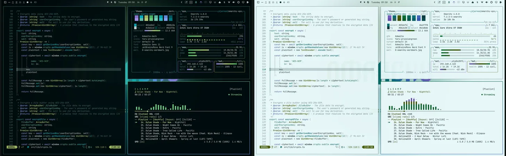](https://bjarneo.github.io/various-themes/#jewel-beetle)

`056` · Folder: [`jewel-beetle/`](jewel-beetle/) · Scene: beetle · [Open on the site](https://bjarneo.github.io/various-themes/#jewel-beetle)

The shell of a jewel beetle. The slots run from green through teal and blue to violet. Slots that leave their usual hue: `red`, `blue`, `magenta`.

| Variant | Theme name | `background` | `foreground` | `accent` | Icons |
| --- | --- | --- | --- | --- | --- |
| Night | [`jewel-beetle-night`](jewel-beetle/night/) | `#000c0e` | `#c0d1cd` | `#02a5b2` | `Yaru-prussiangreen` |
| Day | [`jewel-beetle-day`](jewel-beetle/day/) | `#e6f7f8` | `#0b2e30` | `#036b74` | `Yaru-prussiangreen` |

<details>
<summary>All 16 ANSI colors of each variant</summary>

| Variant | Normal, 0 to 7 | Bright, 8 to 15 |
| --- | --- | --- |
| Night | `#000c0e` `#8c77d6` `#48b567` `#a6be64` `#02a5b2` `#648be4` `#56bca7` `#c0d1cd` | `#3a7274` `#a694ec` `#6cca83` `#bad180` `#2dbecd` `#81a6f7` `#78d0bc` `#e4ecea` |
| Day | `#e6f7f8` `#7058ba` `#006a2e` `#475800` `#036b74` `#3c60bb` `#006254` `#0b2e30` | `#678587` `#6247aa` `#005b27` `#3d4c00` `#005c64` `#2d51ab` `#015549` `#011416` |

</details>

<details>
<summary>Wallpaper credits</summary>

- Night, `3-chrysodema-wings-open.jpg`: [Chrysodema dalmanni](https://commons.wikimedia.org/wiki/File:Chrysodema_dalmanni.jpg) by Kramthenik27, [CC BY-SA 4.0](https://creativecommons.org/licenses/by-sa/4.0)
- Night, `4-emerald-ash-borer-macro.jpg`: [Emerald ash borer, side, md 2016-03-03-17.18](https://commons.wikimedia.org/wiki/File:Emerald_ash_borer,_side,_md_2016-03-03-17.18.jpg) by Sam Droege, Public domain
- Day, `3-tamamushi-beetle.jpg`: [Chrysochroa fulgidissima (48723501341)](https://commons.wikimedia.org/wiki/File:Chrysochroa_fulgidissima_(48723501341).jpg) by Auckland Museum Collections, [CC BY 2.0](https://creativecommons.org/licenses/by/2.0)
- Day, `4-teal-jewel-beetle-flowers.jpg`: [Jewel Beetle (6368395285)](https://commons.wikimedia.org/wiki/File:Jewel_Beetle_(6368395285).jpg) by John Tann, [CC BY 2.0](https://creativecommons.org/licenses/by/2.0)

</details>

```bash
curl -fsSL https://bjarneo.github.io/various-themes/install.sh | bash -s -- jewel-beetle --set
```

### Thermal

[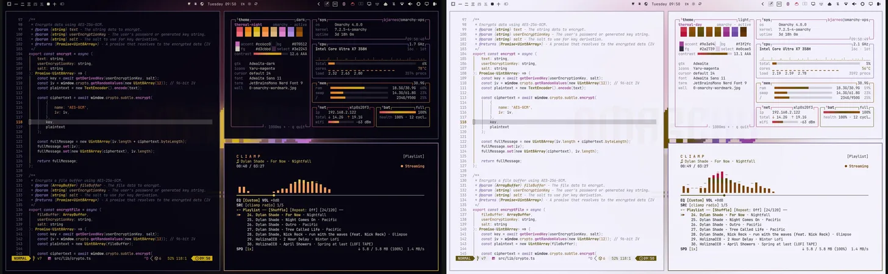](https://bjarneo.github.io/various-themes/#thermal)

`057` · Folder: [`thermal/`](thermal/) · Scene: thermal · [Open on the site](https://bjarneo.github.io/various-themes/#thermal)

A heat map from a thermal camera. The slots run from violet through magenta and red to yellow. Slots that leave their usual hue: `green`, `blue`, `cyan`.

| Variant | Theme name | `background` | `foreground` | `accent` | Icons |
| --- | --- | --- | --- | --- | --- |
| Night | [`thermal-night`](thermal/night/) | `#070512` | `#d3cbbd` | `#cc6cc0` | `Yaru-magenta` |
| Day | [`thermal-day`](thermal/day/) | `#f3f2fc` | `#2a2739` | `#9e3a94` | `Yaru-magenta` |

<details>
<summary>All 16 ANSI colors of each variant</summary>

| Variant | Normal, 0 to 7 | Bright, 8 to 15 |
| --- | --- | --- |
| Night | `#070512` `#e04e5e` `#ed842c` `#d7b40c` `#cc6cc0` `#9975d2` `#d0a76c` `#d3cbbd` | `#686583` `#f8737c` `#fe9e57` `#e6c84b` `#e289d5` `#b192e8` `#e2bc87` `#ece8e1` |
| Day | `#f3f2fc` `#c72b44` `#8f4800` `#5c4c02` `#9e3a94` `#7953b3` `#764e03` `#2a2739` | `#7f7d91` `#b50734` `#7c3e02` `#504200` `#8f2885` `#6b42a3` `#674301` `#110f1a` |

</details>

<details>
<summary>Wallpaper credits</summary>

- Night, `3-ceres-earth-heat-map.jpg`: [CERES Radiation Fluxes (SVS30604 - ceres lw all average 2000-2015)](https://commons.wikimedia.org/wiki/File:CERES_Radiation_Fluxes_(SVS30604_-_ceres_lw_all_average_2000-2015).png) by NASA's Scientific Visualization Studio - Marit Jentoft-Nilsen, Global Science and Technology, Inc./Amy Moran, Global Science and Technology, Inc./Heather Hanson, Public domain
- Night, `4-milky-way-center-infrared.jpg`: [Center of the Milky Way Galaxy IV – Composite](https://commons.wikimedia.org/wiki/File:Center_of_the_Milky_Way_Galaxy_IV_%E2%80%93_Composite.jpg) by NASA/JPL-Caltech/ESA/CXC/STScI, Public domain
- Day, `3-irma-viirs-thermal.jpg`: [Irma 2017-09-08 0642Z](https://commons.wikimedia.org/wiki/File:Irma_2017-09-08_0642Z.jpg) by National Aeronautics and Space Administration, LANCE/EOSDIS Rapid Response, captured on Suomi NPP satellite, Public domain
- Day, `4-debby-infrared-heat-map.jpg`: [Debby 2012-06-25 1835Z IR](https://commons.wikimedia.org/wiki/File:Debby_2012-06-25_1835Z_IR.jpg) by NOAA, Public domain

</details>

```bash
curl -fsSL https://bjarneo.github.io/various-themes/install.sh | bash -s -- thermal --set
```

### Meadow

[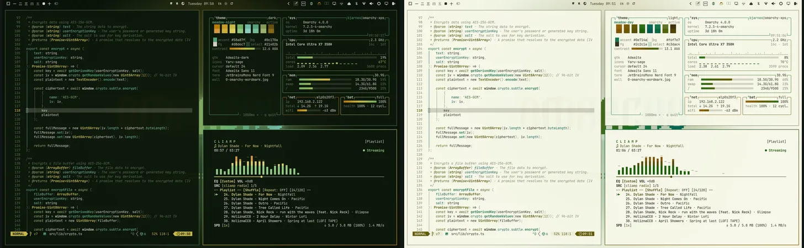](https://bjarneo.github.io/various-themes/#meadow)

`058` · Folder: [`meadow/`](meadow/) · Scene: meadow · [Open on the site](https://bjarneo.github.io/various-themes/#meadow)

A summer meadow in the sun. The slots run from gold through green to teal. Slots that leave their usual hue: `blue`, `magenta`.

| Variant | Theme name | `background` | `foreground` | `accent` | Icons |
| --- | --- | --- | --- | --- | --- |
| Night | [`meadow-night`](meadow/night/) | `#0c170a` | `#d8d6c7` | `#58a87f` | `Yaru-sage` |
| Day | [`meadow-day`](meadow/day/) | `#f6f7e7` | `#2c2c1a` | `#0e714a` | `Yaru-sage` |

<details>
<summary>All 16 ANSI colors of each variant</summary>

| Variant | Normal, 0 to 7 | Bright, 8 to 15 |
| --- | --- | --- |
| Night | `#0c170a` `#c07d00` `#73b565` `#cdbe44` `#58a87f` `#879c54` `#74c0ae` `#d8d6c7` | `#5e7459` `#d99b44` `#90cb82` `#dfd26a` `#7ac09b` `#a2b675` `#91d4c4` `#f4f3eb` |
| Day | `#f6f7e7` `#925f02` `#266b13` `#5d5300` `#0e714a` `#5a6d1e` `#006355` `#2c2c1a` | `#818269` `#7e5101` `#175d00` `#514801` `#02623e` `#4c5e03` `#02564a` `#141409` |

</details>

<details>
<summary>Wallpaper credits</summary>

- Night, `3-meadow-fireflies-field.jpg`: [Field-of-fireflies-wilkes-ecology-preserve-photo-by-tyler-savitski](https://commons.wikimedia.org/wiki/File:Field-of-fireflies-wilkes-ecology-preserve-photo-by-tyler-savitski.jpg) by Tyler Savitski, [CC BY-SA 4.0](https://creativecommons.org/licenses/by-sa/4.0)
- Night, `4-meadow-lupines-fireflies.jpg`: [Lupines and Fireflies No. 4 (14505155544)](https://commons.wikimedia.org/wiki/File:Lupines_and_Fireflies_No._4_(14505155544).jpg) by Mike Lewinski, [CC BY 2.0](https://creativecommons.org/licenses/by/2.0)
- Day, `3-smoky-mountains-meadow.jpg`: [Meadow in the Smoky Mountains (41923p)](https://commons.wikimedia.org/wiki/File:Meadow_in_the_Smoky_Mountains_(41923p).jpg) by Rhododendrites, [CC BY-SA 4.0](https://creativecommons.org/licenses/by-sa/4.0)
- Day, `4-steinalm-flower-meadow.jpg`: [Blumenwiese bei der Steinalm](https://commons.wikimedia.org/wiki/File:Blumenwiese_bei_der_Steinalm.jpg) by Hermann Hammer, [CC BY-SA 4.0](https://creativecommons.org/licenses/by-sa/4.0)

</details>

```bash
curl -fsSL https://bjarneo.github.io/various-themes/install.sh | bash -s -- meadow --set
```

### Kelp

[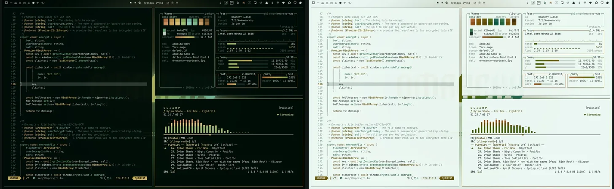](https://bjarneo.github.io/various-themes/#kelp)

`059` · Folder: [`kelp/`](kelp/) · Scene: kelp forest · [Open on the site](https://bjarneo.github.io/various-themes/#kelp)

A kelp forest under the sea. The slots run from brown through olive to sea green. Slots that leave their usual hue: `blue`, `magenta`.

| Variant | Theme name | `background` | `foreground` | `accent` | Icons |
| --- | --- | --- | --- | --- | --- |
| Night | [`kelp-night`](kelp/night/) | `#000d07` | `#c4d1c6` | `#64a074` | `Yaru-sage` |
| Day | [`kelp-day`](kelp/day/) | `#ebf7f2` | `#182e27` | `#2f6e44` | `Yaru-sage` |

<details>
<summary>All 16 ANSI colors of each variant</summary>

| Variant | Normal, 0 to 7 | Bright, 8 to 15 |
| --- | --- | --- |
| Night | `#000d07` `#b17245` `#88a95c` `#ccb15b` `#64a074` `#b38c51` `#79b7a5` `#c4d1c6` | `#4b7163` `#ca9067` `#a0bf79` `#ddc57a` `#82b88f` `#caa571` `#92cbba` `#e6ece6` |
| Day | `#ebf7f2` `#9d5c2c` `#48660d` `#655100` `#2f6e44` `#825a16` `#1b6151` `#182e27` | `#6e857c` `#8c4b16` `#3c5800` `#594600` `#1d6036` `#734c00` `#035545` `#071511` |

</details>

<details>
<summary>Wallpaper credits</summary>

- Night, `3-kelp-forest-beagle-channel.jpg`: [Macrocystis pyrifera Canal Beagle](https://commons.wikimedia.org/wiki/File:Macrocystis_pyrifera_Canal_Beagle.jpg) by BravoGonzalo, [CC BY-SA 4.0](https://creativecommons.org/licenses/by-sa/4.0)
- Night, `4-kelp-bed-ouessant.jpg`: [Paysage de laminaires à Ouessant (Ifremer 00565-67735 - 24712)](https://commons.wikimedia.org/wiki/File:Paysage_de_laminaires_%C3%A0_Ouessant_(Ifremer_00565-67735_-_24712).jpg) by Olivier Dugornay (Ifremer), [CC BY 4.0](https://creativecommons.org/licenses/by/4.0)
- Day, `3-kelp-bed-molene.jpg`: [Paysage de laminaires à Molène (Ifremer 00753-86498 - 44332)](https://commons.wikimedia.org/wiki/File:Paysage_de_laminaires_%C3%A0_Mol%C3%A8ne_(Ifremer_00753-86498_-_44332).jpg) by Olivier Dugornay (Ifremer), [CC BY 4.0](https://creativecommons.org/licenses/by/4.0)
- Day, `4-kelp-canopy-glacier-bay.jpg`: [Kelp forest aerial survey view Glacier Bay National Park-Alaska-RM-009 (52503070553)](https://commons.wikimedia.org/wiki/File:Kelp_forest_aerial_survey_view_Glacier_Bay_National_Park-Alaska-RM-009_(52503070553).jpg) by Forest Service Alaska Region, USDA, Public domain

</details>

```bash
curl -fsSL https://bjarneo.github.io/various-themes/install.sh | bash -s -- kelp --set
```

### Grapefruit

[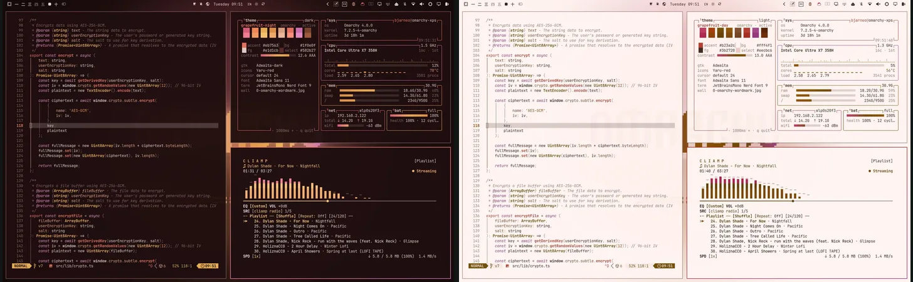](https://bjarneo.github.io/various-themes/#grapefruit)

`060` · Folder: [`grapefruit/`](grapefruit/) · Scene: grapefruit · [Open on the site](https://bjarneo.github.io/various-themes/#grapefruit)

Pink grapefruit cut in half. The slots run from magenta through pink and coral to orange. Slots that leave their usual hue: `green`, `blue`, `cyan`.

| Variant | Theme name | `background` | `foreground` | `accent` | Icons |
| --- | --- | --- | --- | --- | --- |
| Night | [`grapefruit-night`](grapefruit/night/) | `#1f0e0f` | `#e1d1cb` | `#eb7563` | `Yaru-red` |
| Day | [`grapefruit-day`](grapefruit/day/) | `#fff4f1` | `#3b2720` | `#b23a2c` | `Yaru-red` |

<details>
<summary>All 16 ANSI colors of each variant</summary>

| Variant | Normal, 0 to 7 | Bright, 8 to 15 |
| --- | --- | --- |
| Night | `#1f0e0f` `#df607a` `#e2954a` `#eeb155` `#eb7563` `#d073b3` `#dfa686` `#e1d1cb` | `#886466` `#f78296` `#f5ae6d` `#fec675` `#ff9382` `#e691ca` `#f1bca0` `#f8f0ed` |
| Day | `#fff4f1` `#bd385a` `#8f5001` `#6e4800` `#b23a2c` `#a14387` `#7e4a2b` `#3b2720` | `#917d75` `#ab224a` `#7c4502` `#603e01` `#a2271a` `#913278` `#723e1e` `#1e110d` |

</details>

<details>
<summary>Wallpaper credits</summary>

- Night, `3-shady-grapefruit.jpg`: [Shady Grapefruit (Unsplash)](https://commons.wikimedia.org/wiki/File:Shady_Grapefruit_(Unsplash).jpg) by Hans Vivek rickyzden, [CC0](http://creativecommons.org/publicdomain/zero/1.0/deed.en)
- Night, `4-grapefruit-raspberries.jpg`: [Rød grape, hindbær og lakrids (5950896761)](https://commons.wikimedia.org/wiki/File:R%C3%B8d_grape,_hindb%C3%A6r_og_lakrids_(5950896761).jpg) by cyclonebill, [CC BY-SA 2.0](https://creativecommons.org/licenses/by-sa/2.0)
- Day, `3-grapefruit-cut-half.jpg`: [Grapefruit cut](https://commons.wikimedia.org/wiki/File:Grapefruit_cut.jpg) by Jedesto, [CC BY-SA 4.0](https://creativecommons.org/licenses/by-sa/4.0)
- Day, `4-grapefruit-whole-and-split.jpg`: [Grapefruit-Whole-&-Split](https://commons.wikimedia.org/wiki/File:Grapefruit-Whole-%26-Split.jpg) by Evan-Amos, Public domain

</details>

```bash
curl -fsSL https://bjarneo.github.io/various-themes/install.sh | bash -s -- grapefruit --set
```

### Mariana

[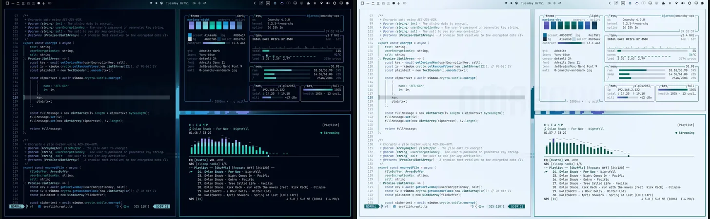](https://bjarneo.github.io/various-themes/#mariana)

`061` · Folder: [`mariana/`](mariana/) · Scene: deep sea · [Open on the site](https://bjarneo.github.io/various-themes/#mariana)

The deep sea, where light comes from animals. The slots run from teal through blue to indigo, and the brights glow cyan. Slots that leave their usual hue: `red`, `yellow`, `magenta`.

| Variant | Theme name | `background` | `foreground` | `accent` | Icons |
| --- | --- | --- | --- | --- | --- |
| Night | [`mariana-night`](mariana/night/) | `#000614` | `#bdcfd3` | `#149ada` | `Yaru-blue` |
| Day | [`mariana-day`](mariana/day/) | `#ecf5fe` | `#1a2b3d` | `#036897` | `Yaru-blue` |

<details>
<summary>All 16 ANSI colors of each variant</summary>

| Variant | Normal, 0 to 7 | Bright, 8 to 15 |
| --- | --- | --- |
| Night | `#000614` `#777bd8` `#17ae96` `#7fc3cf` `#149ada` `#608bdc` `#16bcbd` `#bdcfd3` | `#4d6a88` `#9298ee` `#19d7bd` `#74dfea` `#4fb3ee` `#7da6ef` `#14e2dd` `#e1eaec` |
| Day | `#ecf5fe` `#5d5dbf` `#047060` `#01535e` `#036897` `#3862b4` `#026161` `#1a2b3d` | `#708194` `#4f4dae` `#015146` `#01474e` `#025982` `#2953a4` `#034a48` `#08121e` |

</details>

<details>
<summary>Wallpaper credits</summary>

- Night, `3-glowing-moon-jellies.jpg`: [Pilatph8](https://commons.wikimedia.org/wiki/File:Pilatph8.jpg) by Alexandpilat, [CC BY 4.0](https://creativecommons.org/licenses/by/4.0)
- Night, `4-chrysaora-dark-water.jpg`: [Meduse-Chrysaora hysoscella-Nausicaa-07-2024-Luc-Viatour](https://commons.wikimedia.org/wiki/File:Meduse-Chrysaora_hysoscella-Nausicaa-07-2024-Luc-Viatour.jpg) by Lviatour, [CC BY-SA 3.0](http://creativecommons.org/licenses/by-sa/3.0/)
- Day, `3-moon-jellies-pale-blue.jpg`: [Aurelia aurita 03](https://commons.wikimedia.org/wiki/File:Aurelia_aurita_03.jpg) by Σ64, [CC BY 3.0](https://creativecommons.org/licenses/by/3.0)
- Day, `4-barrel-jellyfish-sunlit.jpg`: [Fatamorgana - Rhizostoma Pulmo](https://commons.wikimedia.org/wiki/File:Fatamorgana_-_Rhizostoma_Pulmo.JPG) by Francesco Ranieri, [CC BY-SA 4.0](https://creativecommons.org/licenses/by-sa/4.0)

</details>

```bash
curl -fsSL https://bjarneo.github.io/various-themes/install.sh | bash -s -- mariana --set
```

### Bramble

[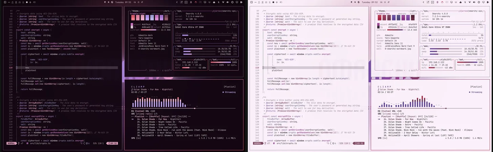](https://bjarneo.github.io/various-themes/#bramble)

`062` · Folder: [`bramble/`](bramble/) · Scene: blackberries · [Open on the site](https://bjarneo.github.io/various-themes/#bramble)

Blackberries on a thorny bramble. The slots run from violet through magenta to berry red. Slots that leave their usual hue: `green`, `yellow`, `blue`, `cyan`.

| Variant | Theme name | `background` | `foreground` | `accent` | Icons |
| --- | --- | --- | --- | --- | --- |
| Night | [`bramble-night`](bramble/night/) | `#130612` | `#d8cad2` | `#cb74c4` | `Yaru-magenta` |
| Day | [`bramble-day`](bramble/day/) | `#faf0f9` | `#352434` | `#973e92` | `Yaru-magenta` |

<details>
<summary>All 16 ANSI colors of each variant</summary>

| Variant | Normal, 0 to 7 | Bright, 8 to 15 |
| --- | --- | --- |
| Night | `#130612` `#db5c6c` `#ad8fe9` `#e6a1c1` `#cb74c4` `#a773cc` `#a7a6dd` `#d8cad2` | `#7d607a` `#f37d89` `#c1a8f9` `#f5b7d3` `#e190d9` `#c090e2` `#bcbbee` `#f0e9ed` |
| Day | `#faf0f9` `#bc364e` `#6b4aa3` `#7b3c5c` `#973e92` `#864eab` `#535085` `#352434` | `#8c798a` `#aa203e` `#5e3d95` `#6f3151` `#882d84` `#763e9b` `#484479` `#180d17` |

</details>

<details>
<summary>Wallpaper credits</summary>

- Night, `3-thorny-bramble-berries.jpg`: [Unripe blackberries in Norrkila 2](https://commons.wikimedia.org/wiki/File:Unripe_blackberries_in_Norrkila_2.jpg) by W.carter, [CC BY-SA 4.0](https://creativecommons.org/licenses/by-sa/4.0)
- Night, `4-bramble-flower-black.jpg`: [Rubus spp., 2 Howard County, MD, Helen Lowe Metzman 2017-07-25-19.16 (39292707851)](https://commons.wikimedia.org/wiki/File:Rubus_spp.,_2_Howard_County,_MD,_Helen_Lowe_Metzman_2017-07-25-19.16_(39292707851).jpg) by USGS Bee Inventory and Monitoring Lab, Public domain
- Day, `3-blackberries-on-bramble.jpg`: [More di rovo](https://commons.wikimedia.org/wiki/File:More_di_rovo.jpg) by Matulus, [CC BY-SA 4.0](https://creativecommons.org/licenses/by-sa/4.0)
- Day, `4-single-blackberry.jpg`: [Blackberry (Rubus fruticosus)](https://commons.wikimedia.org/wiki/File:Blackberry_(Rubus_fruticosus).jpg) by Ivar Leidus, [CC BY-SA 4.0](https://creativecommons.org/licenses/by-sa/4.0)

</details>

```bash
curl -fsSL https://bjarneo.github.io/various-themes/install.sh | bash -s -- bramble --set
```

### Ice Cave

[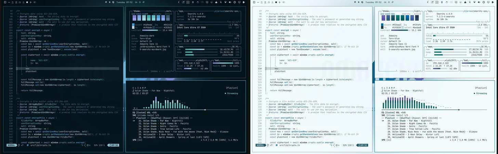](https://bjarneo.github.io/various-themes/#ice-cave)

`063` · Folder: [`ice-cave/`](ice-cave/) · Scene: ice cave · [Open on the site](https://bjarneo.github.io/various-themes/#ice-cave)

Light through the walls of an ice cave. The slots run from cyan through blue to violet. Slots that leave their usual hue: `red`, `yellow`, `magenta`.

| Variant | Theme name | `background` | `foreground` | `accent` | Icons |
| --- | --- | --- | --- | --- | --- |
| Night | [`ice-cave-night`](ice-cave/night/) | `#04141d` | `#c9d6da` | `#4a9eda` | `Yaru-blue` |
| Day | [`ice-cave-day`](ice-cave/day/) | `#f3fafc` | `#193038` | `#016aa2` | `Yaru-blue` |

<details>
<summary>All 16 ANSI colors of each variant</summary>

| Variant | Normal, 0 to 7 | Bright, 8 to 15 |
| --- | --- | --- |
| Night | `#04141d` `#8581d2` `#41b1aa` `#91c6d7` `#4a9eda` `#7291d7` `#60bec8` `#c9d6da` | `#517184` `#a09ee9` `#6ac8c1` `#a9d9e8` `#6eb7ee` `#8eacec` `#80d2dc` `#ebf2f4` |
| Day | `#f3fafc` `#6861b5` `#027672` `#1a5363` `#016aa2` `#4765ac` `#03636c` `#193038` | `#73868d` `#5951a5` `#056561` `#09495a` `#005b8c` `#39569d` `#00565e` `#0a191d` |

</details>

<details>
<summary>Wallpaper credits</summary>

- Night, `3-blue-ice-cave-stream.jpg`: [Blue Ice Cave - Flickr - Eric Kilby](https://commons.wikimedia.org/wiki/File:Blue_Ice_Cave_-_Flickr_-_Eric_Kilby.jpg) by Eric Kilby, [CC BY-SA 2.0](https://creativecommons.org/licenses/by-sa/2.0)
- Night, `4-glacier-ice-cave-opening.jpg`: [Natural glacier ice cave (16281963418)](https://commons.wikimedia.org/wiki/File:Natural_glacier_ice_cave_(16281963418).jpg) by sergejf, [CC BY-SA 2.0](https://creativecommons.org/licenses/by-sa/2.0)
- Day, `3-blackcomb-glacier-ice-arch.jpg`: [Ice cave inside glacier Whistler Blackcomb](https://commons.wikimedia.org/wiki/File:Ice_cave_inside_glacier_Whistler_Blackcomb.jpg) by Lianguanlun, [CC BY 4.0](https://creativecommons.org/licenses/by/4.0)
- Day, `4-bogdanovich-glacier-ice-cave.jpg`: [Ледовая стена пещеры Октябрьская ледника Богдановича (3)](https://commons.wikimedia.org/wiki/File:%D0%9B%D0%B5%D0%B4%D0%BE%D0%B2%D0%B0%D1%8F_%D1%81%D1%82%D0%B5%D0%BD%D0%B0_%D0%BF%D0%B5%D1%89%D0%B5%D1%80%D1%8B_%D0%9E%D0%BA%D1%82%D1%8F%D0%B1%D1%80%D1%8C%D1%81%D0%BA%D0%B0%D1%8F_%D0%BB%D0%B5%D0%B4%D0%BD%D0%B8%D0%BA%D0%B0_%D0%91%D0%BE%D0%B3%D0%B4%D0%B0%D0%BD%D0%BE%D0%B2%D0%B8%D1%87%D0%B0_(3).jpg) by Exxocette, [CC BY-SA 4.0](https://creativecommons.org/licenses/by-sa/4.0)

</details>

```bash
curl -fsSL https://bjarneo.github.io/various-themes/install.sh | bash -s -- ice-cave --set
```

## Earth

Chroma stays low. Earth hues fill all slots, so cyan can be gold and blue can be olive.

### Peat

[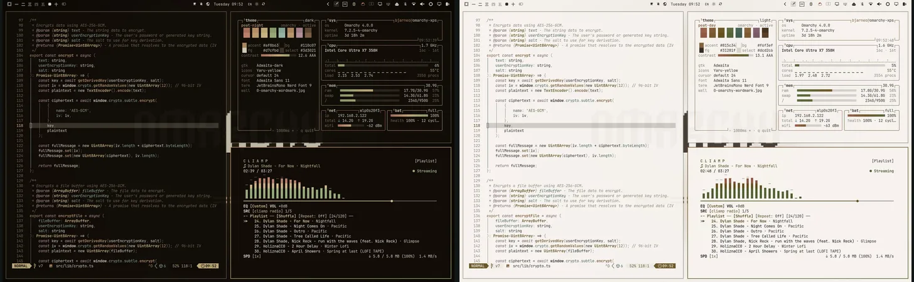](https://bjarneo.github.io/various-themes/#peat)

`064` · Folder: [`peat/`](peat/) · Scene: peat bog · [Open on the site](https://bjarneo.github.io/various-themes/#peat)

A peat bog after rain. Bog browns, sphagnum green and dark water fill the slots. Slots that leave their usual hue: `blue`.

| Variant | Theme name | `background` | `foreground` | `accent` | Icons |
| --- | --- | --- | --- | --- | --- |
| Night | [`peat-night`](peat/night/) | `#110c07` | `#d7cfbd` | `#af8b63` | `Yaru-yellow` |
| Day | [`peat-day`](peat/day/) | `#f6f3ef` | `#31281f` | `#815c34` | `Yaru-yellow` |

<details>
<summary>All 16 ANSI colors of each variant</summary>

| Variant | Normal, 0 to 7 | Bright, 8 to 15 |
| --- | --- | --- |
| Night | `#110c07` `#ae735f` `#8e9f70` `#c3ac7b` `#af8b63` `#a88390` `#8cab9c` `#d7cfbd` | `#766857` `#c08570` `#9bae7e` `#cfb987` `#c09a72` `#b993a0` `#99b9aa` `#f0ece3` |
| Day | `#f6f3ef` `#975c47` `#546635` `#68521f` `#815c34` `#815b6a` `#426053` `#31281f` | `#887e71` `#8b523d` `#4d5d2d` `#604b17` `#77532b` `#765260` `#3b584b` `#16100b` |

</details>

<details>
<summary>Wallpaper credits</summary>

- Night, `3-luhasoo-bog-milky-way.jpg`: [In the photo there is one Perseid, Milky Way and Andromega galaxy and light pollution…](https://commons.wikimedia.org/wiki/File:In_the_photo_there_is_one_Perseid,_Milky_Way_and_Andromega_galaxy_and_light_pollution_on_the_horizon_-_Luhasoo_bog_in_Estonia.jpg) by Martin Mark, [CC BY-SA 4.0](https://creativecommons.org/licenses/by-sa/4.0)
- Night, `4-kemeri-bog-pool-dawn.jpg`: [Morning in Kemeri](https://commons.wikimedia.org/wiki/File:Morning_in_Kemeri.jpg) by VolodyaVoronin, [CC BY-SA 4.0](https://creativecommons.org/licenses/by-sa/4.0)
- Day, `3-kakerdaja-bog-fog.jpg`: [Hommikune udu Kakerdaja rabas](https://commons.wikimedia.org/wiki/File:Hommikune_udu_Kakerdaja_rabas.jpg) by Abrget47j, [CC BY-SA 3.0](https://creativecommons.org/licenses/by-sa/3.0)
- Day, `4-mannikjarve-bog-pools.jpg`: [Männikjärve raba tornist](https://commons.wikimedia.org/wiki/File:M%C3%A4nnikj%C3%A4rve_raba_tornist.jpg) by Abrget47j, [CC BY-SA 3.0](https://creativecommons.org/licenses/by-sa/3.0)

</details>

```bash
curl -fsSL https://bjarneo.github.io/various-themes/install.sh | bash -s -- peat --set
```

### Terracotta

[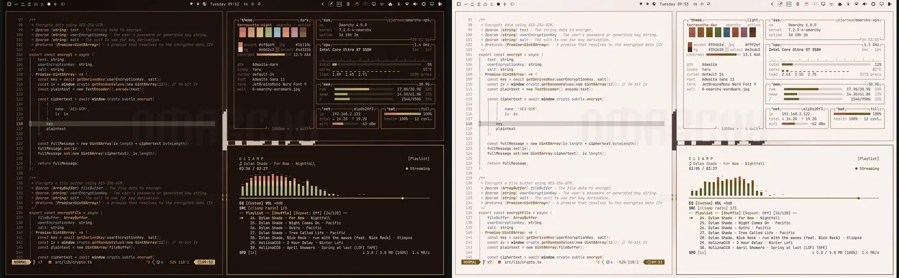](https://bjarneo.github.io/various-themes/#terracotta)

`065` · Folder: [`terracotta/`](terracotta/) · Scene: terracotta pots · [Open on the site](https://bjarneo.github.io/various-themes/#terracotta)

Clay pots in a dry garden. Clay reds, olive and a faded sky fill the slots. Slots that leave their usual hue: `blue`.

| Variant | Theme name | `background` | `foreground` | `accent` | Icons |
| --- | --- | --- | --- | --- | --- |
| Night | [`terracotta-night`](terracotta/night/) | `#1b110c` | `#e0d2c3` | `#cf8669` | `Yaru` |
| Day | [`terracotta-day`](terracotta/day/) | `#f9f2ef` | `#352620` | `#934b2e` | `Yaru` |

<details>
<summary>All 16 ANSI colors of each variant</summary>

| Variant | Normal, 0 to 7 | Bright, 8 to 15 |
| --- | --- | --- |
| Night | `#1b110c` `#c07367` `#9ea673` `#d2b07b` `#cf8669` `#bb848f` `#95b3c3` `#e0d2c3` | `#82685d` `#d38577` `#adb581` `#dfbd87` `#e09578` `#cc949f` `#a2c0d0` `#f7f1e9` |
| Day | `#f9f2ef` `#a5574b` `#5b612e` `#6f4e13` `#934b2e` `#8b5562` `#3e5b6a` `#352620` | `#8d7c74` `#994c41` `#525925` `#674709` `#894226` `#814b58` `#365362` `#180f0c` |

</details>

<details>
<summary>Wallpaper credits</summary>

- Night, `3-upturned-clay-pots.jpg`: [Terracotta Pots (Unsplash)](https://commons.wikimedia.org/wiki/File:Terracotta_Pots_(Unsplash).jpg) by Annie Spratt anniespratt, [CC0](http://creativecommons.org/publicdomain/zero/1.0/deed.en)
- Night, `4-etruscan-clay-amphora.jpg`: [Ánfora etrusca de vino. MARQ 01](https://commons.wikimedia.org/wiki/File:%C3%81nfora_etrusca_de_vino._MARQ_01.jpg) by Dorieo, [CC BY-SA 4.0](https://creativecommons.org/licenses/by-sa/4.0)
- Day, `3-pile-of-clay-pots.jpg`: [Clay Pots-IMG 7301-2](https://commons.wikimedia.org/wiki/File:Clay_Pots-IMG_7301-2.jpg) by Bijay chaurasia, [CC BY-SA 4.0](https://creativecommons.org/licenses/by-sa/4.0)
- Day, `4-pompeii-amphorae.jpg`: [Cart and amphoras (Pompeii)](https://commons.wikimedia.org/wiki/File:Cart_and_amphoras_(Pompeii).jpg) by Bernard Gagnon, [CC BY 4.0](https://creativecommons.org/licenses/by/4.0)

</details>

```bash
curl -fsSL https://bjarneo.github.io/various-themes/install.sh | bash -s -- terracotta --set
```

### Tweed

[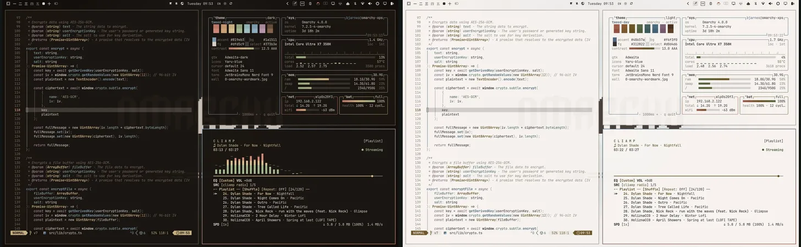](https://bjarneo.github.io/various-themes/#tweed)

`066` · Folder: [`tweed/`](tweed/) · Scene: tweed · [Open on the site](https://bjarneo.github.io/various-themes/#tweed)

A tweed jacket up close. Wool brown with flecks of rust, moss, mustard, heather and slate.

| Variant | Theme name | `background` | `foreground` | `accent` | Icons |
| --- | --- | --- | --- | --- | --- |
| Night | [`tweed-night`](tweed/night/) | `#1a1511` | `#dfd5c9` | `#819eb3` | `Yaru-blue` |
| Day | [`tweed-day`](tweed/day/) | `#f6f3f0` | `#312822` | `#48657a` | `Yaru-blue` |

<details>
<summary>All 16 ANSI colors of each variant</summary>

| Variant | Normal, 0 to 7 | Bright, 8 to 15 |
| --- | --- | --- |
| Night | `#1a1511` `#c07b6a` `#95aa82` `#ceb484` `#819eb3` `#ad8ba0` `#96b7b8` `#dfd5c9` | `#7d6c60` `#d28d7b` `#a4b991` `#dbc191` `#90aec3` `#bd9bb1` `#a4c4c6` `#f9f4ed` |
| Day | `#f6f3f0` `#9a5645` `#50633d` `#69501f` `#48657a` `#7b5b70` `#3d5c5e` `#312822` | `#8a7d74` `#8f4c3c` `#485a35` `#614917` `#405c71` `#715266` `#355456` `#16100c` |

</details>

<details>
<summary>Wallpaper credits</summary>

- Night, `3-brown-twill-tweed.jpg`: [Harristweed16](https://commons.wikimedia.org/wiki/File:Harristweed16.jpg) by Giftzwerg 88, [CC BY-SA 3.0](https://creativecommons.org/licenses/by-sa/3.0)
- Night, `4-slate-check-tweed.jpg`: [Harristweed17](https://commons.wikimedia.org/wiki/File:Harristweed17.jpg) by Giftzwerg 88, [CC BY-SA 3.0](https://creativecommons.org/licenses/by-sa/3.0)
- Day, `3-houndstooth-tweed-weave.jpg`: [Harris Tweed Sakko - Ausschnitt Stoff - Bild 001](https://commons.wikimedia.org/wiki/File:Harris_Tweed_Sakko_-_Ausschnitt_Stoff_-_Bild_001.jpg) by Lupus in Saxonia, [CC BY-SA 4.0](https://creativecommons.org/licenses/by-sa/4.0)
- Day, `4-donegal-herringbone-flecks.jpg`: [Donegal Tweed](https://commons.wikimedia.org/wiki/File:Donegal_Tweed.JPG) by Toxophilus, [CC BY-SA 4.0](https://creativecommons.org/licenses/by-sa/4.0)

</details>

```bash
curl -fsSL https://bjarneo.github.io/various-themes/install.sh | bash -s -- tweed --set
```

### Driftwood

[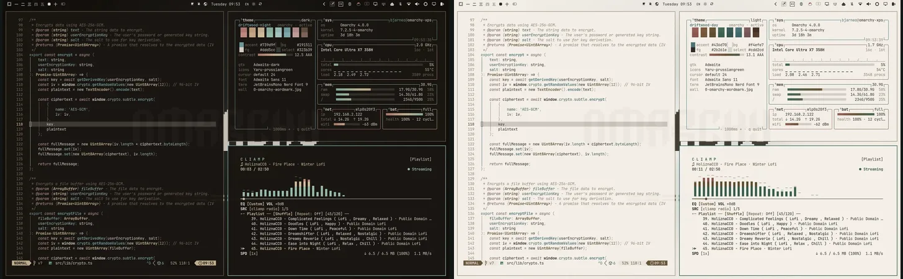](https://bjarneo.github.io/various-themes/#driftwood)

`067` · Folder: [`driftwood/`](driftwood/) · Scene: driftwood · [Open on the site](https://bjarneo.github.io/various-themes/#driftwood)

Bleached driftwood with sea glass. Grey browns sit with soft sea glass greens and blues. Slots that leave their usual hue: `blue`.

| Variant | Theme name | `background` | `foreground` | `accent` | Icons |
| --- | --- | --- | --- | --- | --- |
| Night | [`driftwood-night`](driftwood/night/) | `#191511` | `#ddd5cc` | `#739d9f` | `Yaru-prussiangreen` |
| Day | [`driftwood-day`](driftwood/day/) | `#f4efe7` | `#2b261e` | `#436d70` | `Yaru-prussiangreen` |

<details>
<summary>All 16 ANSI colors of each variant</summary>

| Variant | Normal, 0 to 7 | Bright, 8 to 15 |
| --- | --- | --- |
| Night | `#191511` `#b07a70` `#88b09d` `#c8b494` `#739d9f` `#b59091` `#9bbbb8` `#ddd5cc` | `#796d5f` `#c38c82` `#96beab` `#d5c19f` `#83adaf` `#c5a0a1` `#a7c8c5` `#f7f4ef` |
| Day | `#f4efe7` `#925b52` `#3c6352` `#624f30` `#436d70` `#7a5659` `#355452` `#2b261e` | `#867b6a` `#865148` `#345a4a` `#5a4829` `#396366` `#704d50` `#2f4d4b` `#100c08` |

</details>

<details>
<summary>Wallpaper credits</summary>

- Night, `3-driftwood-aurora.jpg`: [Lion Rock, driftwood and Aurora Australis](https://commons.wikimedia.org/wiki/File:Lion_Rock,_driftwood_and_Aurora_Australis.jpg) by Jamen Percy, [CC BY-SA 4.0](https://creativecommons.org/licenses/by-sa/4.0)
- Night, `4-great-slave-lake-driftwood.jpg`: [Great Slave Lake Sunset over Driftwood](https://commons.wikimedia.org/wiki/File:Great_Slave_Lake_Sunset_over_Driftwood.jpg) by Carl Young, [CC BY-SA 4.0](https://creativecommons.org/licenses/by-sa/4.0)
- Day, `3-kaikoura-driftwood.jpg`: [Driftwood on the beach north of Kaikoura, Canterbury, New Zealand 02](https://commons.wikimedia.org/wiki/File:Driftwood_on_the_beach_north_of_Kaikoura,_Canterbury,_New_Zealand_02.jpg) by Michal Klajban, [CC BY-SA 4.0](https://creativecommons.org/licenses/by-sa/4.0)
- Day, `4-driftwood-grain.jpg`: [Pattern Driftwood Double Bluff Whidbey Mar23 A7R 03958](https://commons.wikimedia.org/wiki/File:Pattern_Driftwood_Double_Bluff_Whidbey_Mar23_A7R_03958.jpg) by Timothy A. Gonsalves, [CC BY-SA 4.0](https://creativecommons.org/licenses/by-sa/4.0)

</details>

```bash
curl -fsSL https://bjarneo.github.io/various-themes/install.sh | bash -s -- driftwood --set
```

### Olive Grove

[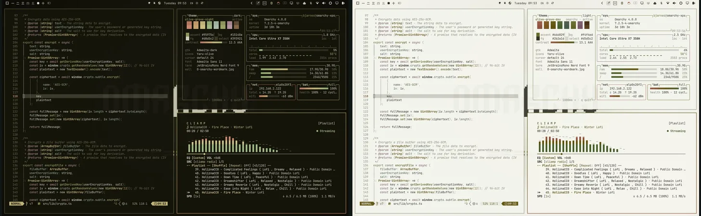](https://bjarneo.github.io/various-themes/#olive-grove)

`068` · Folder: [`olive-grove/`](olive-grove/) · Scene: olive grove · [Open on the site](https://bjarneo.github.io/various-themes/#olive-grove)

An olive grove on a dry hillside. Olive greens, silver leaves and red soil fill the slots. Slots that leave their usual hue: `blue`.

| Variant | Theme name | `background` | `foreground` | `accent` | Icons |
| --- | --- | --- | --- | --- | --- |
| Night | [`olive-grove-night`](olive-grove/night/) | `#15140a` | `#d8d5c2` | `#95975c` | `Yaru-olive` |
| Day | [`olive-grove-day`](olive-grove/day/) | `#f4f4ed` | `#2b2a1d` | `#666829` | `Yaru-olive` |

<details>
<summary>All 16 ANSI colors of each variant</summary>

| Variant | Normal, 0 to 7 | Bright, 8 to 15 |
| --- | --- | --- |
| Night | `#15140a` `#bd7b63` `#94af79` `#c6b77b` `#95975c` `#ae8999` `#a1b7a4` `#d8d5c2` | `#706f56` `#cf8c74` `#a2bd87` `#d3c488` `#a5a76b` `#be99a9` `#aec4b1` `#f4f3e9` |
| Day | `#f4f4ed` `#99573f` `#4a632e` `#62520e` `#666829` `#7f5a6b` `#475b4b` `#2b2a1d` | `#818070` `#8e4d37` `#425a26` `#5a4b03` `#5e5e20` `#745162` `#3f5343` `#131209` |

</details>

<details>
<summary>Wallpaper credits</summary>

- Night, `3-moneglia-olive-grove-sunset.jpg`: [Sunset at olive grove (Moneglia, IT) (15274111609)](https://commons.wikimedia.org/wiki/File:Sunset_at_olive_grove_(Moneglia,_IT)_(15274111609).jpg) by Jan Remund, [CC BY 2.0](https://creativecommons.org/licenses/by/2.0)
- Night, `4-ripe-olives-branch.jpg`: [Olive grove Kamou ac (2)](https://commons.wikimedia.org/wiki/File:Olive_grove_Kamou_ac_(2).jpg) by Asturio Cantabrio, [CC BY-SA 4.0](https://creativecommons.org/licenses/by-sa/4.0)
- Day, `3-spello-olive-hillside.jpg`: [Olive Groves Fields Spello Umbria Sep23 A7C 07785](https://commons.wikimedia.org/wiki/File:Olive_Groves_Fields_Spello_Umbria_Sep23_A7C_07785.jpg) by Timothy A. Gonsalves, [CC BY-SA 4.0](https://creativecommons.org/licenses/by-sa/4.0)
- Day, `4-van-gogh-olive-trees-yellow-sky.jpg`: [Olive Trees / Olive Trees with yellow sky and sun](https://commons.wikimedia.org/wiki/File:Vincent_van_Gogh_Olive_Trees_MIA_517.jpg) by Vincent van Gogh, Public domain

</details>

```bash
curl -fsSL https://bjarneo.github.io/various-themes/install.sh | bash -s -- olive-grove --set
```

### Eucalyptus

[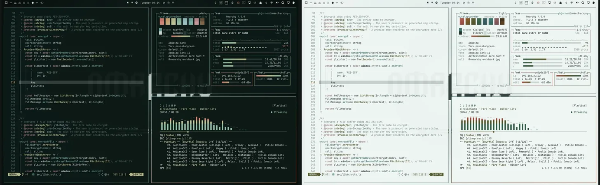](https://bjarneo.github.io/various-themes/#eucalyptus)

`069` · Folder: [`eucalyptus/`](eucalyptus/) · Scene: eucalyptus · [Open on the site](https://bjarneo.github.io/various-themes/#eucalyptus)

Eucalyptus leaves and gum nuts. Silver blue greens fill most slots, and a gum nut red marks errors. Slots that leave their usual hue: `blue`.

| Variant | Theme name | `background` | `foreground` | `accent` | Icons |
| --- | --- | --- | --- | --- | --- |
| Night | [`eucalyptus-night`](eucalyptus/night/) | `#0d1916` | `#cedad5` | `#6d9f99` | `Yaru-prussiangreen` |
| Day | [`eucalyptus-day`](eucalyptus/day/) | `#eef5f3` | `#1d2d29` | `#3c716b` | `Yaru-prussiangreen` |

<details>
<summary>All 16 ANSI colors of each variant</summary>

| Variant | Normal, 0 to 7 | Bright, 8 to 15 |
| --- | --- | --- |
| Night | `#0d1916` `#c6796c` `#86b297` `#b8bb8e` `#6d9f99` `#b9898d` `#93b8bb` `#cedad5` | `#5a766d` `#d98a7c` `#94c0a6` `#c5c89b` `#7cb0a9` `#ca999d` `#a0c6c8` `#f0f7f4` |
| Day | `#eef5f3` `#a05246` `#38634b` `#55572b` `#3c716b` `#87575d` `#365b5d` `#1d2d29` | `#70837e` `#94483d` `#305b44` `#4f4f24` `#326761` `#7c4e54` `#2f5356` `#0a1311` |

</details>

<details>
<summary>Wallpaper credits</summary>

- Night, `3-gum-tree-under-the-moon.jpg`: [Gum tree with moon, Mount Majura Nature Reserve](https://commons.wikimedia.org/wiki/File:Gum_tree_with_moon,_Mount_Majura_Nature_Reserve.jpg) by Thennicke, [CC BY-SA 4.0](https://creativecommons.org/licenses/by-sa/4.0)
- Night, `4-silver-dollar-gum-in-shade.jpg`: [Eucalyptus polyanthemos plantas santa fe salida villa california-35](https://commons.wikimedia.org/wiki/File:Eucalyptus_polyanthemos_plantas_santa_fe_salida_villa_california-35.jpg) by TitiNicola, [CC BY-SA 4.0](https://creativecommons.org/licenses/by-sa/4.0)
- Day, `3-silver-dollar-eucalyptus-leaves.jpg`: [Eucalyptus cinerea Silver Dollar in Parc de la Tete d'Or (2)](https://commons.wikimedia.org/wiki/File:Eucalyptus_cinerea_Silver_Dollar_in_Parc_de_la_Tete_d%27Or_(2).jpg) by Tournasol7, [CC BY 4.0](https://creativecommons.org/licenses/by/4.0)
- Day, `4-silver-gum-branch-sky.jpg`: [Starr-140203-3271-Eucalyptus pulverulenta-leaves-Kula Ag Station-Maui (25146913871)](https://commons.wikimedia.org/wiki/File:Starr-140203-3271-Eucalyptus_pulverulenta-leaves-Kula_Ag_Station-Maui_(25146913871).jpg) by Forest and Kim Starr, [CC BY 3.0 us](https://creativecommons.org/licenses/by/3.0/us/deed.en)

</details>

```bash
curl -fsSL https://bjarneo.github.io/various-themes/install.sh | bash -s -- eucalyptus --set
```

### Lichen

[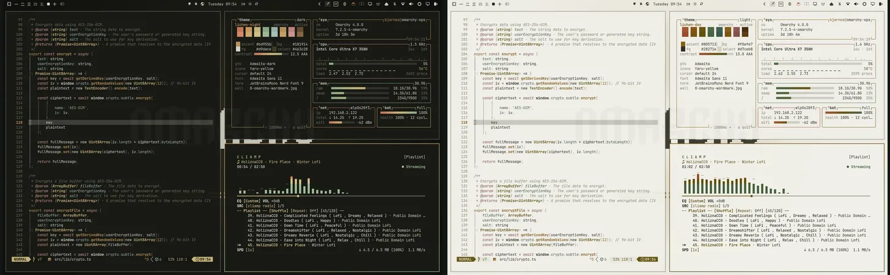](https://bjarneo.github.io/various-themes/#lichen)

`070` · Folder: [`lichen/`](lichen/) · Scene: lichen · [Open on the site](https://bjarneo.github.io/various-themes/#lichen)

Lichen on grey stone. Stone greys, sage, and lichen oranges and yellows fill the slots. Slots that leave their usual hue: `blue`, `magenta`.

| Variant | Theme name | `background` | `foreground` | `accent` | Icons |
| --- | --- | --- | --- | --- | --- |
| Night | [`lichen-night`](lichen/night/) | `#181914` | `#d9dace` | `#bd955b` | `Yaru-yellow` |
| Day | [`lichen-day`](lichen/day/) | `#f0efe7` | `#28271e` | `#805713` | `Yaru-yellow` |

<details>
<summary>All 16 ANSI colors of each variant</summary>

| Variant | Normal, 0 to 7 | Bright, 8 to 15 |
| --- | --- | --- |
| Night | `#181914` `#ca7a5a` `#90ae8a` `#ccb87d` `#bd955b` `#c18983` `#9db9ae` `#d9dace` | `#6e7362` `#dd8c6c` `#9fbd98` `#d8c589` `#cea56a` `#d29993` `#aac7bb` `#f7f8f2` |
| Day | `#f0efe7` `#9f4f2e` `#486542` `#62500a` `#805713` `#8a534f` `#3c584d` `#28271e` | `#7f7d6b` `#934524` `#415c3a` `#5b4800` `#764e05` `#7f4a46` `#355047` `#0c0c06` |

</details>

<details>
<summary>Wallpaper credits</summary>

- Night, `3-map-lichen.jpg`: [Map Lichen - Rhizocarpon geographicum (22724651116)](https://commons.wikimedia.org/wiki/File:Map_Lichen_-_Rhizocarpon_geographicum_(22724651116).jpg) by Björn S..., [CC BY-SA 2.0](https://creativecommons.org/licenses/by-sa/2.0)
- Night, `4-crustose-lichen-stone.jpg`: [Crustose Lichen 7-13-10 (14328231290)](https://commons.wikimedia.org/wiki/File:Crustose_Lichen_7-13-10_(14328231290).jpg) by USFWSAlaska, Public domain
- Day, `3-lichen-boulder.jpg`: [Lichen, County Down, August 2009](https://commons.wikimedia.org/wiki/File:Lichen,_County_Down,_August_2009.JPG) by Ardfern, [CC BY-SA 3.0](https://creativecommons.org/licenses/by-sa/3.0)
- Day, `4-sunburst-lichen.jpg`: [Yellow Map Lichen, Single-spored Map Lichen, and Elegant Sunburst Lichen at Huron…](https://commons.wikimedia.org/wiki/File:Yellow_Map_Lichen,_Single-spored_Map_Lichen,_and_Elegant_Sunburst_Lichen_at_Huron_National_Wildlife_Refuge_(50009656537).jpg) by U.S. Fish and Wildlife Service - Midwest Region, Public domain

</details>

```bash
curl -fsSL https://bjarneo.github.io/various-themes/install.sh | bash -s -- lichen --set
```

### Herbarium

[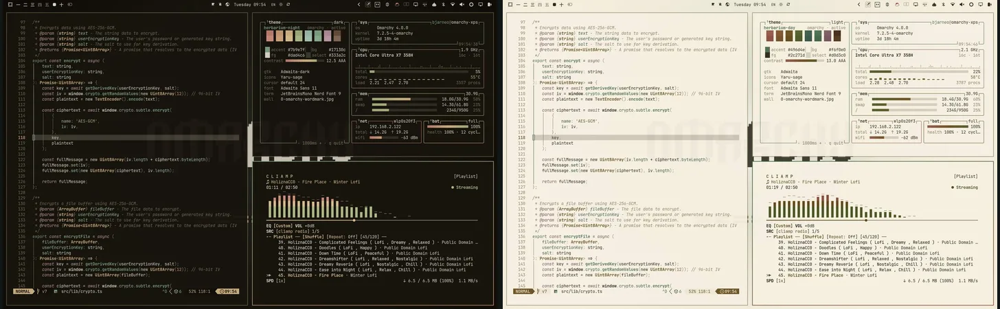](https://bjarneo.github.io/various-themes/#herbarium)

`071` · Folder: [`herbarium/`](herbarium/) · Scene: herbarium · [Open on the site](https://bjarneo.github.io/various-themes/#herbarium)

Pressed plants on an old herbarium sheet. Faded greens and browns sit on paper in the day variant. Slots that leave their usual hue: `blue`.

| Variant | Theme name | `background` | `foreground` | `accent` | Icons |
| --- | --- | --- | --- | --- | --- |
| Night | [`herbarium-night`](herbarium/night/) | `#17130c` | `#dad4c6` | `#7b9e7f` | `Yaru-sage` |
| Day | [`herbarium-day`](herbarium/day/) | `#f6f0e0` | `#2c271d` | `#496d4e` | `Yaru-sage` |

<details>
<summary>All 16 ANSI colors of each variant</summary>

| Variant | Normal, 0 to 7 | Bright, 8 to 15 |
| --- | --- | --- |
| Night | `#17130c` `#b87c6c` `#9fac7a` `#ceb183` `#7b9e7f` `#af8996` `#98b8a9` `#dad4c6` | `#766d59` `#cb8d7d` `#adba87` `#dabe8e` `#8aae8e` `#bf99a6` `#a5c5b5` `#f4f2ea` |
| Day | `#f6f0e0` `#935647` `#505c2a` `#694e1e` `#496d4e` `#7e5866` `#3c5b4d` `#2c271d` | `#877c63` `#884c3e` `#495423` `#614716` `#416345` `#744f5d` `#365346` `#100d07` |

</details>

<details>
<summary>Wallpaper credits</summary>

- Night, `3-melica-nutans-specimen.jpg`: [Melica nutans MHNT.BOT.2011.18.4](https://commons.wikimedia.org/wiki/File:Melica_nutans_MHNT.BOT.2011.18.4.jpg) by Roger Culos, [CC BY-SA 3.0](https://creativecommons.org/licenses/by-sa/3.0)
- Night, `4-aegilops-specimen.jpg`: [Aegilops geniculata MHNT.BOT.2011.18.8](https://commons.wikimedia.org/wiki/File:Aegilops_geniculata_MHNT.BOT.2011.18.8.jpg) by Roger Culos, [CC BY-SA 3.0](https://creativecommons.org/licenses/by-sa/3.0)
- Day, `3-aust-agder-herbarium-1906.jpg`: [Herbarium fra Aust-Agder, 1906](https://commons.wikimedia.org/wiki/File:Herbarium_fra_Aust-Agder,_1906.jpg) by Anders Torjussen, [CC BY-SA 4.0](https://creativecommons.org/licenses/by-sa/4.0)
- Day, `4-herbarium-sheets-in-a-row.jpg`: [Rubber clone specimens](https://commons.wikimedia.org/wiki/File:Rubber_clone_specimens.jpg) by Vis M, [CC BY-SA 4.0](https://creativecommons.org/licenses/by-sa/4.0)

</details>

```bash
curl -fsSL https://bjarneo.github.io/various-themes/install.sh | bash -s -- herbarium --set
```

### Antique Map

[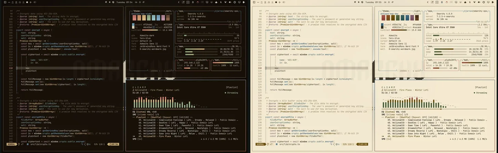](https://bjarneo.github.io/various-themes/#antique-map)

`072` · Folder: [`antique-map/`](antique-map/) · Scene: old map · [Open on the site](https://bjarneo.github.io/various-themes/#antique-map)

An antique map on parchment. Faded red, green, ochre and sea blue inks fill the slots.

| Variant | Theme name | `background` | `foreground` | `accent` | Icons |
| --- | --- | --- | --- | --- | --- |
| Night | [`antique-map-night`](antique-map/night/) | `#171008` | `#dcd2bd` | `#719cb6` | `Yaru-blue` |
| Day | [`antique-map-day`](antique-map/day/) | `#f4e8d0` | `#282216` | `#35617a` | `Yaru-blue` |

<details>
<summary>All 16 ANSI colors of each variant</summary>

| Variant | Normal, 0 to 7 | Bright, 8 to 15 |
| --- | --- | --- |
| Night | `#171008` `#c27568` `#8fa882` `#cfaf79` `#719cb6` `#b18599` `#8bb5b9` `#dcd2bd` | `#7a6a55` `#d58678` `#9db790` `#dcbc85` `#80acc5` `#c195a9` `#98c2c6` `#f5f0e5` |
| Day | `#f4e8d0` `#994b40` `#475e3a` `#674908` `#35617a` `#7c5266` `#2d575c` `#282216` | `#877754` `#8d4137` `#3f5532` `#5f4200` `#2c5871` `#72495d` `#264f54` `#040200` |

</details>

<details>
<summary>Wallpaper credits</summary>

- Night, `3-coronelli-globes.jpg`: [Globes de Coronelli (terrestre et celeste)](https://commons.wikimedia.org/wiki/File:Globes_de_Coronelli_(terrestre_et_celeste).jpg) by Zubro, [CC BY-SA 4.0](https://creativecommons.org/licenses/by-sa/4.0)
- Night, `4-vienna-celestial-globe.jpg`: [Vienna - Celestial globe - 6777](https://commons.wikimedia.org/wiki/File:Vienna_-_Celestial_globe_-_6777.jpg) by Jorge Royan, [CC BY-SA 3.0](https://creativecommons.org/licenses/by-sa/3.0)
- Day, `3-maggiolo-portolan-1563.jpg`: [Giacomo Maggiolo 1563 Portolan chart (Central Europe) 20260724 110532](https://commons.wikimedia.org/wiki/File:Giacomo_Maggiolo_1563_Portolan_chart_(Central_Europe)_20260724_110532.jpg) by Iacopo Maggiolo, [CC0](http://creativecommons.org/publicdomain/zero/1.0/deed.en)
- Day, `4-carta-marina-1539.jpg`: [Carta marina et descriptio septemtrionalium terrarum ac mirabilium rerum in eis…](https://commons.wikimedia.org/wiki/File:Carta_Marina.jpeg) by Olaus Magnus, Public domain

</details>

```bash
curl -fsSL https://bjarneo.github.io/various-themes/install.sh | bash -s -- antique-map --set
```

### Bracken

[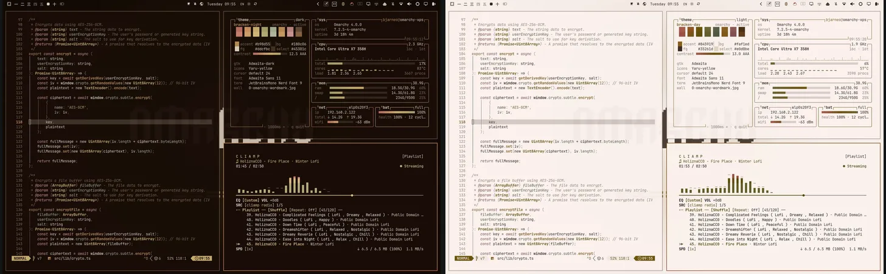](https://bjarneo.github.io/various-themes/#bracken)

`073` · Folder: [`bracken/`](bracken/) · Scene: bracken · [Open on the site](https://bjarneo.github.io/various-themes/#bracken)

Bracken ferns in autumn. Rust browns and dried golds fill the slots. Slots that leave their usual hue: `blue`, `cyan`.

| Variant | Theme name | `background` | `foreground` | `accent` | Icons |
| --- | --- | --- | --- | --- | --- |
| Night | [`bracken-night`](bracken/night/) | `#180c06` | `#ddcfbc` | `#b98d55` | `Yaru-yellow` |
| Day | [`bracken-day`](bracken/day/) | `#faf1ed` | `#35261d` | `#845919` | `Yaru-yellow` |

<details>
<summary>All 16 ANSI colors of each variant</summary>

| Variant | Normal, 0 to 7 | Bright, 8 to 15 |
| --- | --- | --- |
| Night | `#180c06` `#ba6f60` `#a8a06c` `#ccb16f` `#b98d55` `#bf8685` `#a5b094` `#ddcfbc` | `#816656` `#ce8171` `#b7ae7a` `#d9bd7b` `#c99c65` `#cf9695` `#b2bda1` `#f4ede3` |
| Day | `#faf1ed` `#a35547` `#69602b` `#664d00` `#845919` `#895252` `#515a41` `#35261d` | `#8e7b72` `#964b3c` `#605722` `#5c4702` `#7a500e` `#7f494a` `#495239` `#180e09` |

</details>

<details>
<summary>Wallpaper credits</summary>

- Night, `3-golden-bracken-frond-on-black.jpg`: [Clermont - 20191025 (2)](https://commons.wikimedia.org/wiki/File:Clermont_-_20191025_(2).jpg) by Olybrius, [CC BY-SA 4.0](https://creativecommons.org/licenses/by-sa/4.0)
- Night, `4-backlit-bracken-myrstigen.jpg`: [Contre-jour bracken at Myrstigen 9](https://commons.wikimedia.org/wiki/File:Contre-jour_bracken_at_Myrstigen_9.jpg) by W.carter, [CC BY 4.0](https://creativecommons.org/licenses/by/4.0)
- Day, `3-dried-bracken-frond.jpg`: [Pteridium aquilinum kz10](https://commons.wikimedia.org/wiki/File:Pteridium_aquilinum_kz10.jpg) by Krzysztof Ziarnek, Kenraiz, [CC BY-SA 4.0](https://creativecommons.org/licenses/by-sa/4.0)
- Day, `4-golden-bracken-merthyr-mawr.jpg`: [Merthyr Mawr October](https://commons.wikimedia.org/wiki/File:Merthyr_Mawr_October.jpg) by WelshDave, [CC BY-SA 4.0](https://creativecommons.org/licenses/by-sa/4.0)

</details>

```bash
curl -fsSL https://bjarneo.github.io/various-themes/install.sh | bash -s -- bracken --set
```

### Adobe

[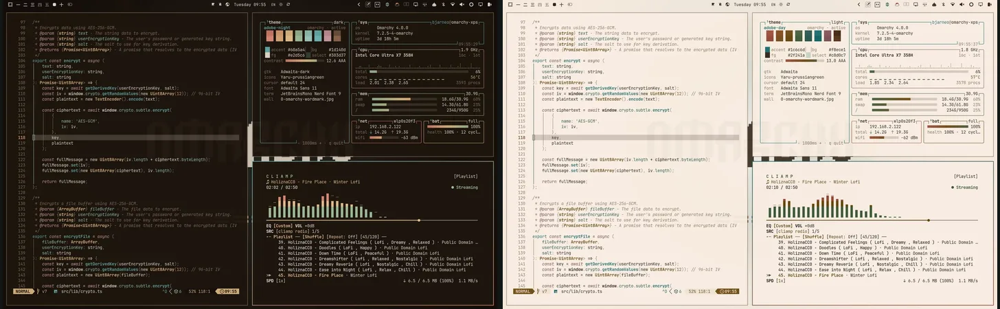](https://bjarneo.github.io/various-themes/#adobe)

`074` · Folder: [`adobe/`](adobe/) · Scene: adobe · [Open on the site](https://bjarneo.github.io/various-themes/#adobe)

An adobe house with turquoise trim. Sun baked clay, sage and turquoise fill the slots. Slots that leave their usual hue: `blue`.

| Variant | Theme name | `background` | `foreground` | `accent` | Icons |
| --- | --- | --- | --- | --- | --- |
| Night | [`adobe-night`](adobe/night/) | `#1d140d` | `#e2d5c6` | `#60a5a4` | `Yaru-prussiangreen` |
| Day | [`adobe-day`](adobe/day/) | `#f8ece1` | `#2f241a` | `#1c6c6d` | `Yaru-prussiangreen` |

<details>
<summary>All 16 ANSI colors of each variant</summary>

| Variant | Normal, 0 to 7 | Bright, 8 to 15 |
| --- | --- | --- |
| Night | `#1d140d` `#c47965` `#8eac88` `#d6b17d` `#60a5a4` `#b8888e` `#8cbab0` `#e2d5c6` | `#816b5c` `#d78a76` `#9dbb96` `#e3be8a` `#6fb5b4` `#c9989e` `#9ac7bd` `#faf4ec` |
| Day | `#f8ece1` `#9c4f3d` `#45613f` `#6d4a10` `#1c6c6d` `#84545b` `#2b5951` `#2f241a` | `#8c7866` `#904533` `#3d5837` `#654306` `#0e6263` `#794b52` `#245149` `#100905` |

</details>

<details>
<summary>Wallpaper credits</summary>

- Night, `3-abo-pueblo-night.jpg`: [Abo Pueblo ruins in New Mexico](https://commons.wikimedia.org/wiki/File:Abo_Pueblo_ruins_in_New_Mexico.jpg) by Mcla2448, [CC BY-SA 4.0](https://creativecommons.org/licenses/by-sa/4.0)
- Night, `4-pueblo-bonito-walls.jpg`: [PUEBLO BONITO - Chaco Culture National Historical Park , New Mexico, US - panoramio (17)](https://commons.wikimedia.org/wiki/File:PUEBLO_BONITO_-_Chaco_Culture_National_Historical_Park_,_New_Mexico,_US_-_panoramio_(17).jpg) by MARELBU, [CC BY 3.0](https://creativecommons.org/licenses/by/3.0)
- Day, `3-taos-pueblo-turquoise-doors.jpg`: [Taos Pueblo, New Mexico](https://commons.wikimedia.org/wiki/File:Taos_Pueblo,_New_Mexico.jpg) by James Moyers, [CC BY-SA 4.0](https://creativecommons.org/licenses/by-sa/4.0)
- Day, `4-taos-pueblo-turquoise-trim.jpg`: [Taos Pueblo (13) (15783703008)](https://commons.wikimedia.org/wiki/File:Taos_Pueblo_(13)_(15783703008).jpg) by Kyle Magnuson, [CC BY 2.0](https://creativecommons.org/licenses/by/2.0)

</details>

```bash
curl -fsSL https://bjarneo.github.io/various-themes/install.sh | bash -s -- adobe --set
```

### Moorland

[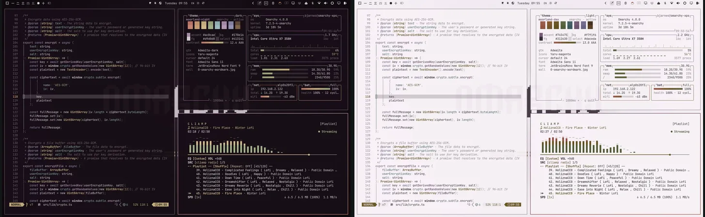](https://bjarneo.github.io/various-themes/#moorland)

`075` · Folder: [`moorland/`](moorland/) · Scene: moor · [Open on the site](https://bjarneo.github.io/various-themes/#moorland)

A moor with heather and bracken. Muted heather, rust, moss and a grey sky fill the slots. Slots that leave their usual hue: `blue`.

| Variant | Theme name | `background` | `foreground` | `accent` | Icons |
| --- | --- | --- | --- | --- | --- |
| Night | [`moorland-night`](moorland/night/) | `#170e16` | `#d9d0d8` | `#ac8cae` | `Yaru-magenta` |
| Day | [`moorland-day`](moorland/day/) | `#f7f1f6` | `#312630` | `#745475` | `Yaru-magenta` |

<details>
<summary>All 16 ANSI colors of each variant</summary>

| Variant | Normal, 0 to 7 | Bright, 8 to 15 |
| --- | --- | --- |
| Night | `#170e16` `#bc7866` `#96a67d` `#c8b180` `#ac8cae` `#8985aa` `#93b3b8` `#d9d0d8` | `#7a6678` `#ce8977` `#a4b58b` `#d5be8d` `#bc9bbd` `#9a96bb` `#a0c0c5` `#f3eef3` |
| Day | `#f7f1f6` `#9a5544` `#54623a` `#67511e` `#745475` `#6c678d` `#3d5c61` `#312630` | `#897a87` `#8e4b3b` `#4b5932` `#5f4a16` `#6a4c6c` `#615d81` `#36545a` `#150e15` |

</details>

<details>
<summary>Wallpaper credits</summary>

- Night, `3-highland-heather-dusk.jpg`: [Highland Heather - Flickr - ABel-Photo](https://commons.wikimedia.org/wiki/File:Highland_Heather_-_Flickr_-_ABel-Photo.jpg) by Andy Belshaw, [CC BY 2.0](https://creativecommons.org/licenses/by/2.0)
- Night, `4-dartmoor-dewstone-sunset.jpg`: [Dewstone Sunset Landscape (30415175045)](https://commons.wikimedia.org/wiki/File:Dewstone_Sunset_Landscape_(30415175045).jpg) by Stephen Steven Hodge, [CC BY 2.0](https://creativecommons.org/licenses/by/2.0)
- Day, `3-north-york-moors-heather.jpg`: [The sea of purple in North York Moors 03](https://commons.wikimedia.org/wiki/File:The_sea_of_purple_in_North_York_Moors_03.jpg) by Thelight00702, [CC BY-SA 4.0](https://creativecommons.org/licenses/by-sa/4.0)
- Day, `4-westruper-heide-mist.jpg`: [Haltern am See, Westruper Heide -- 2021 -- 4752](https://commons.wikimedia.org/wiki/File:Haltern_am_See,_Westruper_Heide_--_2021_--_4752.jpg) by Dietmar Rabich, [CC BY-SA 4.0](https://creativecommons.org/licenses/by-sa/4.0)

</details>

```bash
curl -fsSL https://bjarneo.github.io/various-themes/install.sh | bash -s -- moorland --set
```

## Grey and signal

Most slots are neutral greys. 1 or 2 slots carry a signal color.

### Sumi

[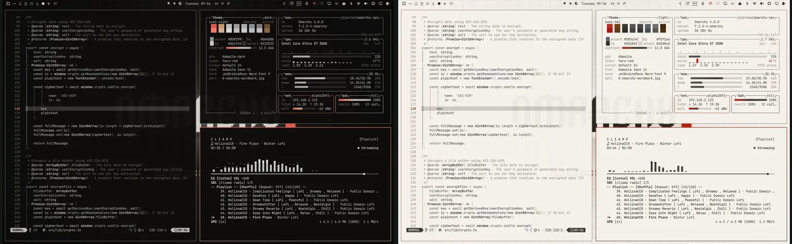](https://bjarneo.github.io/various-themes/#sumi)

`076` · Folder: [`sumi/`](sumi/) · Scene: ink wash · [Open on the site](https://bjarneo.github.io/various-themes/#sumi)

Sumi ink on rice paper with a red seal. Ink greys fill 5 slots, and vermilion fills red.

| Variant | Theme name | `background` | `foreground` | `accent` | Icons |
| --- | --- | --- | --- | --- | --- |
| Night | [`sumi-night`](sumi/night/) | `#0e0d0b` | `#d2cfcb` | `#8d9299` | `Yaru-red` |
| Day | [`sumi-day`](sumi/day/) | `#f5f1ea` | `#2b2823` | `#585c64` | `Yaru-red` |

<details>
<summary>All 16 ANSI colors of each variant</summary>

| Variant | Normal, 0 to 7 | Bright, 8 to 15 |
| --- | --- | --- |
| Night | `#0e0d0b` `#e95b48` `#a3a29e` `#c4c1bc` `#8d9299` `#817e7b` `#b2b1ad` `#d2cfcb` | `#706a5e` `#ff7e6b` `#c4c4c2` `#dfdddb` `#c1c3c7` `#c4c3c1` `#d0d0ce` `#eeedea` |
| Day | `#f5f1ea` `#bb2013` `#504e4b` `#36332f` `#585c64` `#6d6967` `#413f3d` `#2b2823` | `#867d6d` `#a80800` `#3d3c3a` `#272522` `#43464c` `#514f4d` `#31302d` `#110f0b` |

</details>

<details>
<summary>Wallpaper credits</summary>

- Night, `3-shohaku-dragon-and-clouds.jpg`: [Dragon and Clouds](https://commons.wikimedia.org/wiki/File:Dragon_and_Clouds_by_Soga_Shohaku,_1763,_set_of_eight_panels,_ink_on_paper_DSC02757.JPG) by Soga Shōhaku, Public domain
- Night, `4-qu-ding-summer-mountains.jpg`: [北宋 傳屈鼎 夏山圖 卷](https://commons.wikimedia.org/wiki/File:%E5%8C%97%E5%AE%8B_%E5%82%B3%E5%B1%88%E9%BC%8E_%E5%A4%8F%E5%B1%B1%E5%9C%96_%E5%8D%B7-Summer_Mountains_MET_DP151484.jpg) by Qu Ding, [CC0](http://creativecommons.org/publicdomain/zero/1.0/deed.en)
- Day, `3-jeong-seon-inwang-after-rain.jpg`: [Inwang jesaekdo](https://commons.wikimedia.org/wiki/File:Inwangjesaekdo.jpg) by Jeong Seon, Public domain
- Day, `4-kuncan-spring-landscape.jpg`: [Spring Landscape](https://commons.wikimedia.org/wiki/File:Kuncan_-_Spring_Landscape_-_1966.367_-_Cleveland_Museum_of_Art.tif) by Kuncan, [CC0](http://creativecommons.org/publicdomain/zero/1.0/deed.en)

</details>

```bash
curl -fsSL https://bjarneo.github.io/various-themes/install.sh | bash -s -- sumi --set
```

### Newsprint

[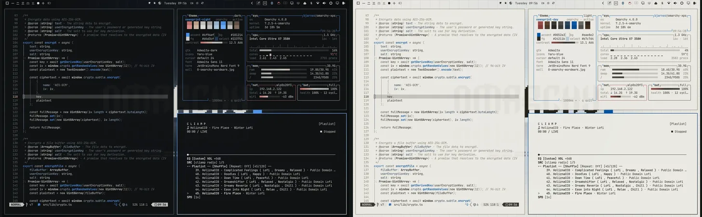](https://bjarneo.github.io/various-themes/#newsprint)

`077` · Folder: [`newsprint/`](newsprint/) · Scene: newsprint · [Open on the site](https://bjarneo.github.io/various-themes/#newsprint)

A newspaper page with the blue pencil of an editor. Ink greys fill 4 slots. Blue pencil fills blue, and a faded red marks errors.

| Variant | Theme name | `background` | `foreground` | `accent` | Icons |
| --- | --- | --- | --- | --- | --- |
| Night | [`newsprint-night`](newsprint/night/) | `#101214` | `#d4d3cf` | `#4f96ef` | `Yaru-blue` |
| Day | [`newsprint-day`](newsprint/day/) | `#eae8e2` | `#24211b` | `#0052a3` | `Yaru-blue` |

<details>
<summary>All 16 ANSI colors of each variant</summary>

| Variant | Normal, 0 to 7 | Bright, 8 to 15 |
| --- | --- | --- |
| Night | `#101214` `#c3746e` `#a6a5a1` `#c6c5c0` `#4f96ef` `#81817e` `#9ab7d2` `#d4d3cf` | `#636e79` `#dc928c` `#c8c7c6` `#e2e1df` `#73b1ff` `#c7c6c5` `#b0cce4` `#f1f1ef` |
| Day | `#eae8e2` `#934541` `#484643` `#312f2b` `#0052a3` `#656462` `#223e56` `#24211b` | `#7d7868` `#833633` `#353432` `#211f1d` `#00468d` `#4b4a48` `#18354c` `#020101` |

</details>

<details>
<summary>Wallpaper credits</summary>

- Night, `3-linotype-keyboard.jpg`: [Linotype typesetting machine (32658353528)](https://commons.wikimedia.org/wiki/File:Linotype_typesetting_machine_(32658353528).jpg) by Richard Ash, [CC BY-SA 2.0](https://creativecommons.org/licenses/by-sa/2.0)
- Night, `4-linotype-deutsches-museum.jpg`: [Munich - Deutsches Museum - 07-0541](https://commons.wikimedia.org/wiki/File:Munich_-_Deutsches_Museum_-_07-0541.jpg) by Jorge Royan, [CC BY-SA 3.0](https://creativecommons.org/licenses/by-sa/3.0)
- Day, `3-old-orchard-beach-1923-halftone.jpg`: [Aerial photograph of Old Orchard Beach, Maine in 1923](https://commons.wikimedia.org/wiki/File:Aerial_photograph_of_Old_Orchard_Beach,_Maine_in_1923.jpg) by Arthur M. Galaid, Boston photographer, Public domain
- Day, `4-bound-newspapers-panjim.jpg`: [Old newspapers at the Central Library, Panjim, Goa](https://commons.wikimedia.org/wiki/File:Old_newspapers_at_the_Central_Library,_Panjim,_Goa.jpg) by Fredericknoronha, [CC BY-SA 4.0](https://creativecommons.org/licenses/by-sa/4.0)

</details>

```bash
curl -fsSL https://bjarneo.github.io/various-themes/install.sh | bash -s -- newsprint --set
```

### Brutalist

[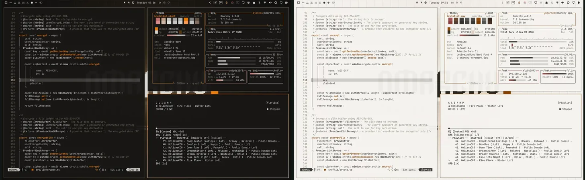](https://bjarneo.github.io/various-themes/#brutalist)

`078` · Folder: [`brutalist/`](brutalist/) · Scene: concrete · [Open on the site](https://bjarneo.github.io/various-themes/#brutalist)

Raw concrete with a safety orange sign. Concrete greys fill 4 slots. Safety orange fills blue, and a muted red marks errors. Slots that leave their usual hue: `blue`.

| Variant | Theme name | `background` | `foreground` | `accent` | Icons |
| --- | --- | --- | --- | --- | --- |
| Night | [`brutalist-night`](brutalist/night/) | `#171614` | `#d8d7d4` | `#f07e06` | `Yaru` |
| Day | [`brutalist-day`](brutalist/day/) | `#f5f3f0` | `#2c2923` | `#884300` | `Yaru` |

<details>
<summary>All 16 ANSI colors of each variant</summary>

| Variant | Normal, 0 to 7 | Bright, 8 to 15 |
| --- | --- | --- |
| Night | `#171614` `#c37471` `#a9a8a5` `#c9c8c4` `#f07e06` `#848482` `#b8b7b3` `#d8d7d4` | `#736f63` `#dc9390` `#cbcbc9` `#e5e5e3` `#ff9e57` `#cacac9` `#d7d7d5` `#f5f5f3` |
| Day | `#f5f3f0` `#9d4e4d` `#504f4d` `#363532` `#884300` `#6c6b6a` `#44423f` `#2c2923` | `#847f72` `#8d3e3f` `#3e3d3b` `#282725` `#763a00` `#51504f` `#333330` `#13110e` |

</details>

<details>
<summary>Wallpaper credits</summary>

- Night, `3-barbican-lake-night.jpg`: [Barbican Estate 2023 night 04](https://commons.wikimedia.org/wiki/File:Barbican_Estate_2023_night_04.jpg) by Jonathan Platteau, [CC BY-SA 4.0](https://creativecommons.org/licenses/by-sa/4.0)
- Night, `4-park-hill-dusk.jpg`: [Sunlight on Park Hill 19th January 2020](https://commons.wikimedia.org/wiki/File:Sunlight_on_Park_Hill_19th_January_2020.jpg) by Graceimagery, [CC BY-SA 4.0](https://creativecommons.org/licenses/by-sa/4.0)
- Day, `3-habitat-67.jpg`: [Habitat 67 (8126687023)](https://commons.wikimedia.org/wiki/File:Habitat_67_(8126687023).jpg) by Matias Garabedian, [CC BY-SA 2.0](https://creativecommons.org/licenses/by-sa/2.0)
- Day, `4-barbican-towers.jpg`: [London - Barbican Estate (5)](https://commons.wikimedia.org/wiki/File:London_-_Barbican_Estate_(5).jpg) by Fred Romero, [CC BY 2.0](https://creativecommons.org/licenses/by/2.0)

</details>

```bash
curl -fsSL https://bjarneo.github.io/various-themes/install.sh | bash -s -- brutalist --set
```

### Gunmetal

[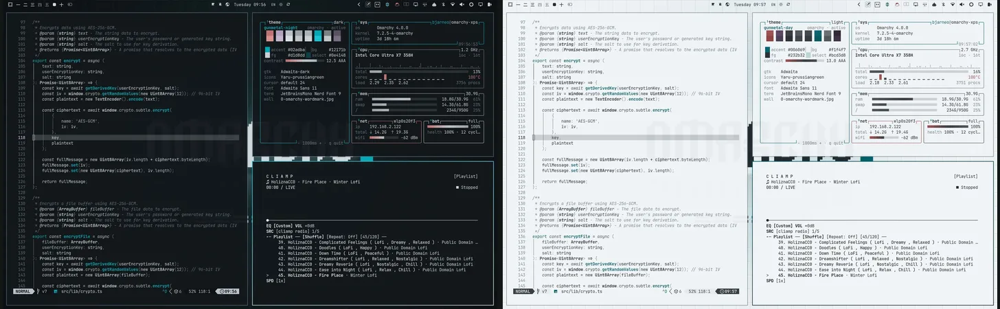](https://bjarneo.github.io/various-themes/#gunmetal)

`079` · Folder: [`gunmetal/`](gunmetal/) · Scene: machined · [Open on the site](https://bjarneo.github.io/various-themes/#gunmetal)

Machined gunmetal with a cyan readout. Blue grey steel fills 4 slots, and cyan fills blue. Slots that leave their usual hue: `blue`.

| Variant | Theme name | `background` | `foreground` | `accent` | Icons |
| --- | --- | --- | --- | --- | --- |
| Night | [`gunmetal-night`](gunmetal/night/) | `#12171b` | `#d1d8dd` | `#02adba` | `Yaru-prussiangreen` |
| Day | [`gunmetal-day`](gunmetal/day/) | `#f1f4f7` | `#232b32` | `#006069` | `Yaru-prussiangreen` |

<details>
<summary>All 16 ANSI colors of each variant</summary>

| Variant | Normal, 0 to 7 | Bright, 8 to 15 |
| --- | --- | --- |
| Night | `#12171b` `#c67777` `#a3a9af` `#c2c9d2` `#02adba` `#80858a` `#afb9c1` `#d1d8dd` | `#63717f` `#df9595` `#c9cbcf` `#e2e6e9` `#1cc8d7` `#c8cbcd` `#d3d8db` `#f2f6f8` |
| Day | `#f1f4f7` `#9b4b4d` `#4b5057` `#30363d` `#006069` `#676c71` `#3b434b` `#232b32` | `#76808c` `#8b3c3f` `#3a3e42` `#23282d` `#00535b` `#4e5155` `#2d3339` `#0e1217` |

</details>

<details>
<summary>Wallpaper credits</summary>

- Night, `3-turbine-blades.jpg`: [Munich - Deutsches Museum - 07-0153](https://commons.wikimedia.org/wiki/File:Munich_-_Deutsches_Museum_-_07-0153.jpg) by Jorge Royan, [CC BY-SA 3.0](https://creativecommons.org/licenses/by-sa/3.0)
- Night, `4-gear-teeth.jpg`: [Duisburg, Landschaftspark Duisburg-Nord, Hochofen 5 -- 2016 -- 1177 (bw)](https://commons.wikimedia.org/wiki/File:Duisburg,_Landschaftspark_Duisburg-Nord,_Hochofen_5_--_2016_--_1177_(bw).jpg) by Dietmar Rabich, [CC BY-SA 4.0](https://creativecommons.org/licenses/by-sa/4.0)
- Day, `3-steel-wire-rope.jpg`: [Stainless steel wire rope](https://commons.wikimedia.org/wiki/File:Stainless_steel_wire_rope.jpg) by Spring9910, [CC BY-SA 4.0](https://creativecommons.org/licenses/by-sa/4.0)
- Day, `4-machined-crankshaft.jpg`: [Crankshaft jap grayscale](https://commons.wikimedia.org/wiki/File:Crankshaft_jap_grayscale.jpg) by Alex Kovach and Saibo, [CC BY 2.0](https://creativecommons.org/licenses/by/2.0)

</details>

```bash
curl -fsSL https://bjarneo.github.io/various-themes/install.sh | bash -s -- gunmetal --set
```

### Nitrate

[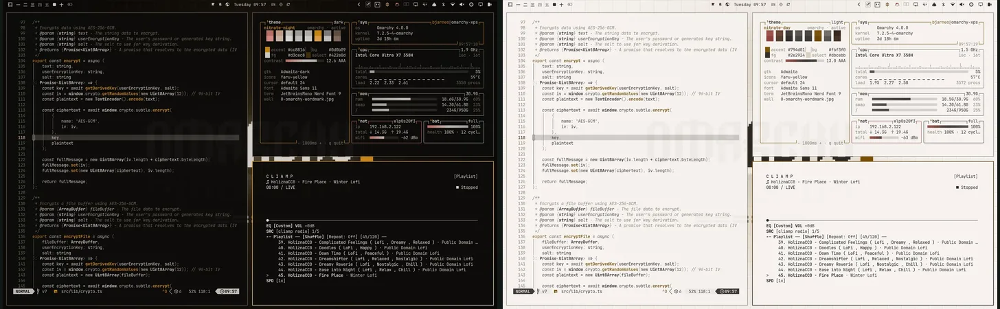](https://bjarneo.github.io/various-themes/#nitrate)

`080` · Folder: [`nitrate/`](nitrate/) · Scene: film reel · [Open on the site](https://bjarneo.github.io/various-themes/#nitrate)

Silver nitrate film in a projector beam. Silver greys fill 4 slots, and projector amber fills blue. Slots that leave their usual hue: `blue`.

| Variant | Theme name | `background` | `foreground` | `accent` | Icons |
| --- | --- | --- | --- | --- | --- |
| Night | [`nitrate-night`](nitrate/night/) | `#0d0b09` | `#d3cec8` | `#cc8816` | `Yaru-yellow` |
| Day | [`nitrate-day`](nitrate/day/) | `#f6f3f0` | `#2e2924` | `#794d01` | `Yaru-yellow` |

<details>
<summary>All 16 ANSI colors of each variant</summary>

| Variant | Normal, 0 to 7 | Bright, 8 to 15 |
| --- | --- | --- |
| Night | `#0d0b09` `#bf716a` `#a4a19d` `#c4c0bb` `#cc8816` `#807d7a` `#b3afab` `#d3cec8` | `#72685c` `#d78f88` `#c4c3c1` `#dedcda` `#e1a24c` `#c3c2c0` `#d0cecc` `#edebe8` |
| Day | `#f6f3f0` `#9a4c47` `#524f4c` `#383431` `#794d01` `#6d6b68` `#45423f` `#2e2924` | `#887e72` `#8b3c39` `#3f3d3b` `#292624` `#694200` `#52504f` `#353230` `#14110e` |

</details>

<details>
<summary>Wallpaper credits</summary>

- Night, `3-film-reels-stacked.jpg`: [Kino Tatran](https://commons.wikimedia.org/wiki/File:Kino_Tatran.JPG) by Martinmlynar, [CC BY-SA 4.0](https://creativecommons.org/licenses/by-sa/4.0)
- Night, `4-projector-arc-lamp.jpg`: [Regent Hokitika Interior MRD 06](https://commons.wikimedia.org/wiki/File:Regent_Hokitika_Interior_MRD_06.jpg) by Mike Dickison, [CC BY 4.0](https://creativecommons.org/licenses/by/4.0)
- Day, `3-film-can-with-leader.jpg`: [16mm countdown (6498612331)](https://commons.wikimedia.org/wiki/File:16mm_countdown_(6498612331).jpg) by DRs Kulturarvsprojekt, [CC BY-SA 2.0](https://creativecommons.org/licenses/by-sa/2.0)
- Day, `4-1910-projector-film-gate.jpg`: [Mécanisme de projection 35 mm amateur (1910)](https://commons.wikimedia.org/wiki/File:M%C3%A9canisme_de_projection_35_mm_amateur_(1910).JPG) by User:PODZO DI BORGO, [CC BY-SA 3.0](https://creativecommons.org/licenses/by-sa/3.0)

</details>

```bash
curl -fsSL https://bjarneo.github.io/various-themes/install.sh | bash -s -- nitrate --set
```

### Chalkboard

[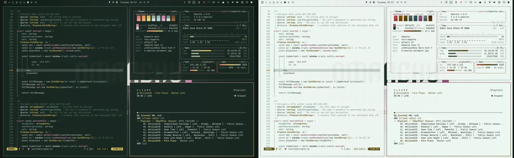](https://bjarneo.github.io/various-themes/#chalkboard)

`081` · Folder: [`chalkboard/`](chalkboard/) · Scene: chalkboard · [Open on the site](https://bjarneo.github.io/various-themes/#chalkboard)

Chalk on a green slate board. Chalk greys fill 3 slots. Yellow, pink and red chalk fill the rest. Slots that leave their usual hue: `blue`.

| Variant | Theme name | `background` | `foreground` | `accent` | Icons |
| --- | --- | --- | --- | --- | --- |
| Night | [`chalkboard-night`](chalkboard/night/) | `#182821` | `#dcdad3` | `#cd87ae` | `Yaru-magenta` |
| Day | [`chalkboard-day`](chalkboard/day/) | `#edf6f1` | `#1c2d26` | `#8f4a73` | `Yaru-magenta` |

<details>
<summary>All 16 ANSI colors of each variant</summary>

| Variant | Normal, 0 to 7 | Bright, 8 to 15 |
| --- | --- | --- |
| Night | `#182821` `#dd756e` `#9baba3` `#d8bf5e` `#cd87ae` `#848f8a` `#98bebf` `#dcdad3` | `#628273` `#f89890` `#d4dcd8` `#edd681` `#e7a6ca` `#d6dcd9` `#b4d6d7` `#fdfcf9` |
| Day | `#edf6f1` `#af4743` `#4d5b55` `#554602` `#8f4a73` `#66716b` `#2f5355` `#1c2d26` | `#70847b` `#9e3533` `#3c4641` `#4a3d00` `#803c65` `#4c5451` `#23494b` `#091410` |

</details>

<details>
<summary>Wallpaper credits</summary>

- Night, `3-chalk-equations-bokeh.jpg`: [Superbokehtheorie](https://commons.wikimedia.org/wiki/File:Superbokehtheorie.jpg) by Eric Wüstenhagen, [CC BY-SA 2.0](https://creativecommons.org/licenses/by-sa/2.0)
- Night, `4-spring-blackboard.jpg`: [黒板 4月 (5595045738)](https://commons.wikimedia.org/wiki/File:%E9%BB%92%E6%9D%BF_4%E6%9C%88_(5595045738).jpg) by hiro, [CC BY-SA 2.0](https://creativecommons.org/licenses/by-sa/2.0)
- Day, `3-pastel-chalk.jpg`: [Pastel Chalk (46887606994)](https://commons.wikimedia.org/wiki/File:Pastel_Chalk_(46887606994).jpg) by Tanja-Milfoil, [CC BY-SA 2.0](https://creativecommons.org/licenses/by-sa/2.0)
- Day, `4-school-chalk-tray.jpg`: [School Chalk Tray](https://commons.wikimedia.org/wiki/File:School_Chalk_Tray.jpg) by Revisorius, [CC BY-SA 4.0](https://creativecommons.org/licenses/by-sa/4.0)

</details>

```bash
curl -fsSL https://bjarneo.github.io/various-themes/install.sh | bash -s -- chalkboard --set
```

### Overcast

[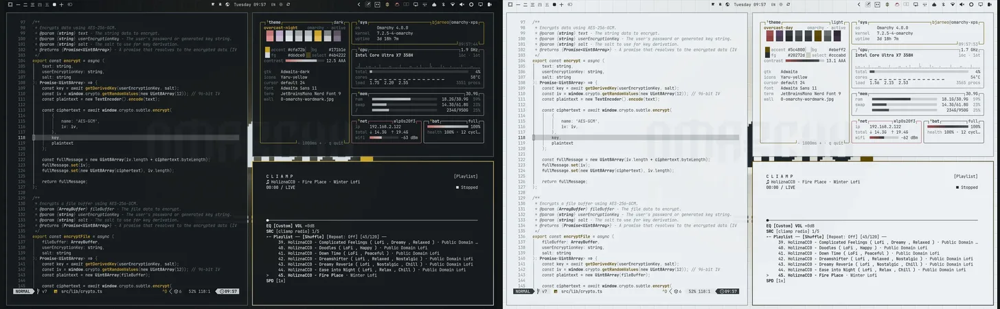](https://bjarneo.github.io/various-themes/#overcast)

`082` · Folder: [`overcast/`](overcast/) · Scene: overcast · [Open on the site](https://bjarneo.github.io/various-themes/#overcast)

A grey sky with a break of sun. Cloud greys fill 4 slots. Sun yellow fills blue, and a muted red marks errors. Slots that leave their usual hue: `blue`.

| Variant | Theme name | `background` | `foreground` | `accent` | Icons |
| --- | --- | --- | --- | --- | --- |
| Night | [`overcast-night`](overcast/night/) | `#171b1e` | `#d6dce0` | `#cfa72b` | `Yaru-yellow` |
| Day | [`overcast-day`](overcast/day/) | `#ebeff2` | `#20272d` | `#5c4800` | `Yaru-yellow` |

<details>
<summary>All 16 ANSI colors of each variant</summary>

| Variant | Normal, 0 to 7 | Bright, 8 to 15 |
| --- | --- | --- |
| Night | `#171b1e` `#ca7a77` `#a7adb0` `#c7cdd2` `#cfa72b` `#84888a` `#b4bcc2` `#d6dce0` | `#66747e` `#e39995` `#cdd0d1` `#e6eaec` `#e3c05b` `#cdced0` `#d8dcde` `#f7fafc` |
| Day | `#ebeff2` `#974948` `#494d51` `#2d3337` `#5c4800` `#65686b` `#3a4046` `#20272d` | `#717e88` `#88393a` `#373b3d` `#212427` `#503e00` `#4b4e50` `#2c3034` `#070b0f` |

</details>

<details>
<summary>Wallpaper credits</summary>

- Night, `3-sun-break-over-dark-sea.jpg`: [Sun breaking through clouds over ocean.](https://commons.wikimedia.org/wiki/File:Sun_breaking_through_clouds_over_ocean.jpg) by bigwavephoto, [CC BY-SA 4.0](https://creativecommons.org/licenses/by-sa/4.0)
- Night, `4-dark-clouds-pale-sun.jpg`: [Iridescent clouds during snowfall 1](https://commons.wikimedia.org/wiki/File:Iridescent_clouds_during_snowfall_1.jpg) by W.carter, [CC BY-SA 4.0](https://creativecommons.org/licenses/by-sa/4.0)
- Day, `3-lake-hawea-sun-rays.jpg`: [Sun over Lake Hawea, New Zealand](https://commons.wikimedia.org/wiki/File:Sun_over_Lake_Hawea,_New_Zealand.jpg) by Michal Klajban, [CC BY-SA 4.0](https://creativecommons.org/licenses/by-sa/4.0)
- Day, `4-grey-sky-sun-rays-sea.jpg`: [Sun Rays Clouds Beach Uthandi Chennai Aug22 D72 24916](https://commons.wikimedia.org/wiki/File:Sun_Rays_Clouds_Beach_Uthandi_Chennai_Aug22_D72_24916.jpg) by Timothy A. Gonsalves, [CC BY-SA 4.0](https://creativecommons.org/licenses/by-sa/4.0)

</details>

```bash
curl -fsSL https://bjarneo.github.io/various-themes/install.sh | bash -s -- overcast --set
```

### Carbon

[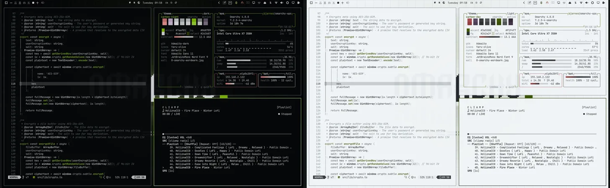](https://bjarneo.github.io/various-themes/#carbon)

`083` · Folder: [`carbon/`](carbon/) · Scene: carbon fiber · [Open on the site](https://bjarneo.github.io/various-themes/#carbon)

Carbon fiber with a lime signal. Carbon greys fill 4 slots. Lime fills blue, and a muted red marks errors. Slots that leave their usual hue: `blue`.

| Variant | Theme name | `background` | `foreground` | `accent` | Icons |
| --- | --- | --- | --- | --- | --- |
| Night | [`carbon-night`](carbon/night/) | `#060709` | `#cacccf` | `#7aaf01` | `Yaru-olive` |
| Day | [`carbon-day`](carbon/day/) | `#f1f4f7` | `#262a2f` | `#3a5500` | `Yaru-olive` |

<details>
<summary>All 16 ANSI colors of each variant</summary>

| Variant | Normal, 0 to 7 | Bright, 8 to 15 |
| --- | --- | --- |
| Night | `#060709` `#c26c6a` `#9da0a2` `#bbbec2` `#7aaf01` `#7a7c7d` `#abaeb0` `#cacccf` | `#5f6973` `#da8a87` `#c0c1c2` `#d8dadb` `#90c632` `#bfc0c0` `#cbccce` `#e7e9ea` |
| Day | `#f1f4f7` `#a04848` `#4e4f52` `#333538` `#3a5500` `#6a6b6d` `#414345` `#262a2f` | `#76818b` `#90393a` `#3c3d3f` `#25272a` `#324a01` `#4f5052` `#323335` `#0f1215` |

</details>

<details>
<summary>Wallpaper credits</summary>

- Night, `3-carbon-weave.jpg`: [Woven carbon fiber fabric](https://commons.wikimedia.org/wiki/File:Woven_carbon_fiber_fabric.jpg) by Acheolg, [CC BY-SA 4.0](https://creativecommons.org/licenses/by-sa/4.0)
- Night, `4-carbon-loom.jpg`: [Carbon fibre weave](https://commons.wikimedia.org/wiki/File:Carbon_fibre_weave.jpg) by Christine Twigg, [CC BY-SA 4.0](https://creativecommons.org/licenses/by-sa/4.0)
- Day, `3-carbon-sheet.jpg`: [Ready to use carbon fiber sheet](https://commons.wikimedia.org/wiki/File:Ready_to_use_carbon_fiber_sheet.jpg) by Duboyong, [CC BY-SA 4.0](https://creativecommons.org/licenses/by-sa/4.0)
- Day, `4-carbon-tow.jpg`: [Carbon fiber bundle](https://commons.wikimedia.org/wiki/File:Carbon_fiber_bundle.jpg) by Acheolg, [CC BY-SA 4.0](https://creativecommons.org/licenses/by-sa/4.0)

</details>

```bash
curl -fsSL https://bjarneo.github.io/various-themes/install.sh | bash -s -- carbon --set
```

## Tuned spectrum

All 6 hues stay in their usual slots. 1 chroma and lightness mood ties them together.

### Stained Glass

[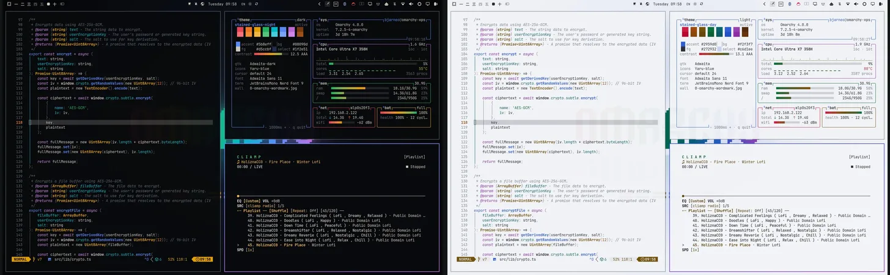](https://bjarneo.github.io/various-themes/#stained-glass)

`084` · Folder: [`stained-glass/`](stained-glass/) · Scene: stained glass · [Open on the site](https://bjarneo.github.io/various-themes/#stained-glass)

Light through a stained glass window. Ruby, emerald, amber, sapphire, amethyst and aqua fill their usual slots.

| Variant | Theme name | `background` | `foreground` | `accent` | Icons |
| --- | --- | --- | --- | --- | --- |
| Night | [`stained-glass-night`](stained-glass/night/) | `#08090d` | `#d5ccbf` | `#5b8eff` | `Yaru-blue` |
| Day | [`stained-glass-day`](stained-glass/day/) | `#f2f3f7` | `#272932` | `#2959d0` | `Yaru-blue` |

<details>
<summary>All 16 ANSI colors of each variant</summary>

| Variant | Normal, 0 to 7 | Bright, 8 to 15 |
| --- | --- | --- |
| Night | `#08090d` `#ee4958` `#24b762` `#eca504` `#5b8eff` `#c36ddd` `#02bdcc` `#d5ccbf` | `#636978` `#ff757a` `#57cc7f` `#fabb4c` `#81aaff` `#d98bf0` `#48d2e0` `#eeeae3` |
| Day | `#f2f3f7` `#ce1138` `#016933` `#6e4c01` `#2959d0` `#953aaf` `#005f68` `#272932` | `#7b7f8c` `#b4002d` `#005b2b` `#604102` `#1b49c2` `#8726a1` `#01525a` `#0f1117` |

</details>

<details>
<summary>Wallpaper credits</summary>

- Night, `3-nasir-al-mulk-light.jpg`: [Nasir-al molk -1](https://commons.wikimedia.org/wiki/File:Nasir-al_molk_-1.jpg) by Ayyoubsabawiki, [CC BY-SA 4.0](https://creativecommons.org/licenses/by-sa/4.0)
- Night, `4-saint-denis-rose-window.jpg`: [Basilica of Saint Denis North Transept Rose Window, Paris, France - Diliff](https://commons.wikimedia.org/wiki/File:Basilica_of_Saint_Denis_North_Transept_Rose_Window,_Paris,_France_-_Diliff.jpg) by Diliff, [CC BY-SA 3.0](https://creativecommons.org/licenses/by-sa/3.0)
- Day, `3-sagrada-familia-warm-glass.jpg`: [Sagrada Familia Stained Glass 10](https://commons.wikimedia.org/wiki/File:Sagrada_Familia_Stained_Glass_10.jpg) by Ank Kumar, [CC BY-SA 4.0](https://creativecommons.org/licenses/by-sa/4.0)
- Day, `4-sagrada-familia-cool-glass.jpg`: [Stained Glass paintings at Sagrada Familia, Barcelona 09](https://commons.wikimedia.org/wiki/File:Stained_Glass_paintings_at_Sagrada_Familia,_Barcelona_09.jpg) by Ank Kumar, [CC BY-SA 4.0](https://creativecommons.org/licenses/by-sa/4.0)

</details>

```bash
curl -fsSL https://bjarneo.github.io/various-themes/install.sh | bash -s -- stained-glass --set
```

### Gouache

[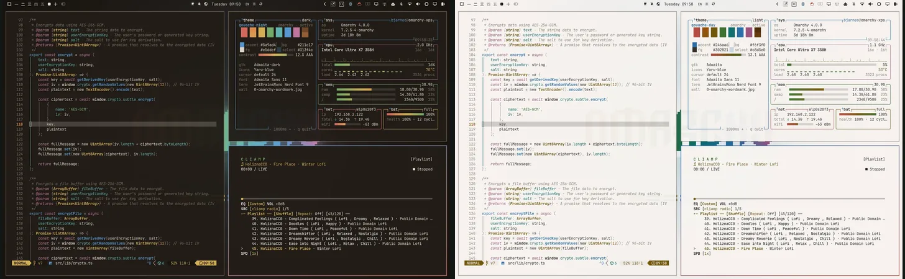](https://bjarneo.github.io/various-themes/#gouache)

`085` · Folder: [`gouache/`](gouache/) · Scene: gouache · [Open on the site](https://bjarneo.github.io/various-themes/#gouache)

Matte gouache paint on a warm grey board. Mid chroma pigments fill their usual slots.

| Variant | Theme name | `background` | `foreground` | `accent` | Icons |
| --- | --- | --- | --- | --- | --- |
| Night | [`gouache-night`](gouache/night/) | `#211c17` | `#e5ddcf` | `#5a9ad4` | `Yaru-blue` |
| Day | [`gouache-day`](gouache/day/) | `#f6f3f0` | `#302821` | `#246aa6` | `Yaru-blue` |

<details>
<summary>All 16 ANSI colors of each variant</summary>

| Variant | Normal, 0 to 7 | Bright, 8 to 15 |
| --- | --- | --- |
| Night | `#211c17` `#d96b5f` `#79b06d` `#dcb457` `#5a9ad4` `#c67aa5` `#65b7b6` `#e5ddcf` | `#817163` `#d96b5f` `#79b06d` `#dcb457` `#5a9ad4` `#c67aa5` `#65b7b6` `#fffcf8` |
| Day | `#f6f3f0` `#b7463c` `#366d29` `#6e5201` `#246aa6` `#9b4e7c` `#066869` `#302821` | `#897d73` `#b7463c` `#366d29` `#6e5201` `#246aa6` `#9b4e7c` `#066869` `#15110c` |

</details>

<details>
<summary>Wallpaper credits</summary>

- Night, `3-vesuvius-eruption-gouache.jpg`: [Gran Eruzione del 1794](https://commons.wikimedia.org/wiki/File:Gran_Eruzione_del_1794.jpg) by Unknown authorUnknown author, Public domain
- Night, `4-jaxa-moonlit-pier.jpg`: [Seascape.](https://commons.wikimedia.org/wiki/File:Soter_Jaxa-Ma%C5%82achowski_-_Pejza%C5%BC_morski_1941.jpg) by Soter Jaxa-Małachowski, Public domain
- Day, `3-hodler-silvaplana-lake.jpg`: [Der Silvaplanersee im Herbst](https://commons.wikimedia.org/wiki/File:Hodler_-_Der_Silvaplanersee_im_Herbst_-_1907.jpg) by Ferdinand Hodler, Public domain
- Day, `4-reschreiter-hollental-glacier.jpg`: [Rudolf Reschreiter Blick von der Höllentalangerhütte zum Höllentalgletscher und den…](https://commons.wikimedia.org/wiki/File:Rudolf_Reschreiter_Blick_von_der_H%C3%B6llentalangerh%C3%BCtte_zum_H%C3%B6llentalgletscher_und_den_Riffelwandspitzen_1921.jpg) by Rudolf Reschreiter, Public domain

</details>

```bash
curl -fsSL https://bjarneo.github.io/various-themes/install.sh | bash -s -- gouache --set
```

### Tapestry

[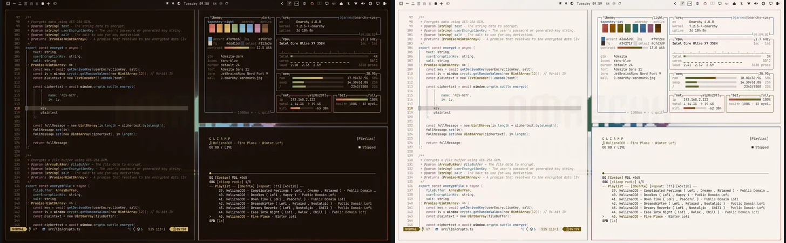](https://bjarneo.github.io/various-themes/#tapestry)

`086` · Folder: [`tapestry/`](tapestry/) · Scene: tapestry · [Open on the site](https://bjarneo.github.io/various-themes/#tapestry)

A woven tapestry in old plant dyes. Faded madder, weld and woad fill their usual slots.

| Variant | Theme name | `background` | `foreground` | `accent` | Icons |
| --- | --- | --- | --- | --- | --- |
| Night | [`tapestry-night`](tapestry/night/) | `#190f09` | `#ddd1bd` | `#709bc6` | `Yaru-blue` |
| Day | [`tapestry-day`](tapestry/day/) | `#f9f2ee` | `#34271f` | `#3a6590` | `Yaru-blue` |

<details>
<summary>All 16 ANSI colors of each variant</summary>

| Variant | Normal, 0 to 7 | Bright, 8 to 15 |
| --- | --- | --- |
| Night | `#190f09` `#cc6f61` `#90a872` `#d2b268` `#709bc6` `#ba819d` `#7fb6c1` `#ddd1bd` | `#7e6859` `#df8071` `#9eb780` `#dfbe75` `#80aad7` `#cb91ae` `#8cc3cf` `#f6efe5` |
| Day | `#f9f2ee` `#aa4b3e` `#4e642e` `#6a4f03` `#3a6590` `#8b5370` `#235f6a` `#34271f` | `#8c7c72` `#9e4135` `#455b25` `#614801` `#315c86` `#814966` `#1b5763` `#17100a` |

</details>

<details>
<summary>Wallpaper credits</summary>

- Night, `3-millefleur-unicorn-stag.jpg`: [Unicorn and Stag](https://commons.wikimedia.org/wiki/File:Tapestry_Unicorn_Stag.jpg) by Circle of Flemish Region, [CC0](http://creativecommons.org/publicdomain/zero/1.0/deed.en)
- Night, `4-millefleur-rabbits-cluny.jpg`: [Cluny-Dame à la licorne-Detail 16](https://commons.wikimedia.org/wiki/File:Cluny-Dame_%C3%A0_la_licorne-Detail_16.JPG) by Salix, Public domain
- Day, `3-verdure-swans.jpg`: [Interieur, gobelin in de Burgerzaal- De Verdures. De zwanen. Detail. T18 - Nijmegen…](https://commons.wikimedia.org/wiki/File:Interieur,_gobelin_in_de_Burgerzaal-_De_Verdures._De_zwanen._Detail._T18_-_Nijmegen_-_20421953_-_RCE.jpg) by Chris Booms / Paul van Galen, [CC BY-SA 4.0](https://creativecommons.org/licenses/by-sa/4.0)
- Day, `4-millefleur-madder-cluny.jpg`: [Touch](https://commons.wikimedia.org/wiki/File:Cluny-Dame_%C3%A0_la_licorne-Detail_03.JPG) by anonymous, Public domain

</details>

```bash
curl -fsSL https://bjarneo.github.io/various-themes/install.sh | bash -s -- tapestry --set
```

### Harbor

[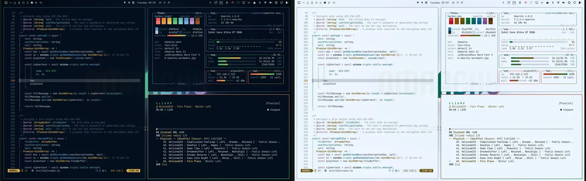](https://bjarneo.github.io/various-themes/#harbor)

`087` · Folder: [`harbor/`](harbor/) · Scene: harbor · [Open on the site](https://bjarneo.github.io/various-themes/#harbor)

A harbor at night. Port red and starboard green are bright, and sodium lamps add a yellow.

| Variant | Theme name | `background` | `foreground` | `accent` | Icons |
| --- | --- | --- | --- | --- | --- |
| Night | [`harbor-night`](harbor/night/) | `#030e1c` | `#c6d2d7` | `#589bcb` | `Yaru-blue` |
| Day | [`harbor-day`](harbor/day/) | `#ecf5fe` | `#1c2b3b` | `#1a6798` | `Yaru-blue` |

<details>
<summary>All 16 ANSI colors of each variant</summary>

| Variant | Normal, 0 to 7 | Bright, 8 to 15 |
| --- | --- | --- |
| Night | `#030e1c` `#ea5a55` `#40b865` `#deb049` `#589bcb` `#ae7fb9` `#66b8bc` `#c6d2d7` | `#526d88` `#ff7e77` `#69cd82` `#edc56c` `#78b4e1` `#c69ad0` `#85ccd0` `#e8eef1` |
| Day | `#ecf5fe` `#c5292f` `#036a2f` `#694d01` `#1a6798` `#83538e` `#006166` `#1c2b3b` | `#718193` `#b3061d` `#005c27` `#5b4300` `#005988` `#744480` `#035458` `#09121c` |

</details>

<details>
<summary>Wallpaper credits</summary>

- Night, `3-stykkisholmur-harbour-night.jpg`: [Stykkisholmur Harbour at night (21907475888)](https://commons.wikimedia.org/wiki/File:Stykkisholmur_Harbour_at_night_(21907475888).jpg) by Richard Whitaker, [CC BY 2.0](https://creativecommons.org/licenses/by/2.0)
- Night, `4-hjalteyri-boats-night.jpg`: [Hafen Hjalteyri - panoramio](https://commons.wikimedia.org/wiki/File:Hafen_Hjalteyri_-_panoramio.jpg) by Jürgen Regel, Marian…, [CC BY 3.0](https://creativecommons.org/licenses/by/3.0)
- Day, `3-koyilandy-harbour-boats.jpg`: [Koyilandy harbour 03736](https://commons.wikimedia.org/wiki/File:Koyilandy_harbour_03736.jpg) by Vengolis, [CC BY-SA 4.0](https://creativecommons.org/licenses/by-sa/4.0)
- Day, `4-yvoire-harbour-sailboats.jpg`: [Sailing boats moored in the harbour, Yvoire, Haute-Savoie](https://commons.wikimedia.org/wiki/File:Sailing_boats_moored_in_the_harbour,_Yvoire,_Haute-Savoie.jpg) by Christian David, [CC BY-SA 4.0](https://creativecommons.org/licenses/by-sa/4.0)

</details>

```bash
curl -fsSL https://bjarneo.github.io/various-themes/install.sh | bash -s -- harbor --set
```

### Resistor

[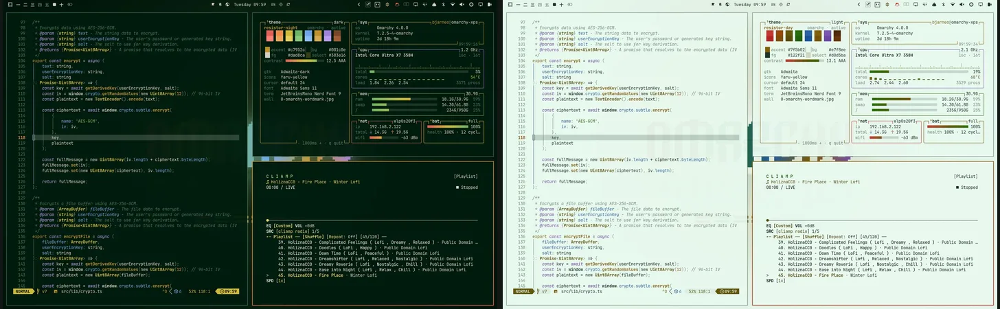](https://bjarneo.github.io/various-themes/#resistor)

`088` · Folder: [`resistor/`](resistor/) · Scene: circuit board · [Open on the site](https://bjarneo.github.io/various-themes/#resistor)

Resistors on a green circuit board. The resistor band colors fill their usual slots, and gold fills blue. Slots that leave their usual hue: `blue`, `cyan`.

| Variant | Theme name | `background` | `foreground` | `accent` | Icons |
| --- | --- | --- | --- | --- | --- |
| Night | [`resistor-night`](resistor/night/) | `#001c0e` | `#dad8ca` | `#c7952c` | `Yaru-yellow` |
| Day | [`resistor-day`](resistor/day/) | `#e7f8ee` | `#122f21` | `#7f5b02` | `Yaru-yellow` |

<details>
<summary>All 16 ANSI colors of each variant</summary>

| Variant | Normal, 0 to 7 | Bright, 8 to 15 |
| --- | --- | --- |
| Night | `#001c0e` `#e96255` `#72ba63` `#d9c037` `#c7952c` `#a784e2` `#72aaf1` `#dad8ca` | `#4e7962` `#ff8678` `#8fd081` `#ebd463` `#dcb059` `#c0a0f8` `#92c2fe` `#f7f6ee` |
| Day | `#e7f8ee` `#c2332c` `#1d6a00` `#5e5001` `#7f5b02` `#7750b1` `#235da3` `#122f21` | `#6a8676` `#b01b19` `#185b00` `#524500` `#6e4e00` `#6940a1` `#114f95` `#04150c` |

</details>

<details>
<summary>Wallpaper credits</summary>

- Night, `3-banded-resistors.jpg`: [Dirty resistors (6952366994)](https://commons.wikimedia.org/wiki/File:Dirty_resistors_(6952366994).jpg) by Dennis van Zuijlekom, [CC BY-SA 2.0](https://creativecommons.org/licenses/by-sa/2.0)
- Night, `4-power-resistors.jpg`: [Dirty resistors (6952368086)](https://commons.wikimedia.org/wiki/File:Dirty_resistors_(6952368086).jpg) by Dennis van Zuijlekom, [CC BY-SA 2.0](https://creativecommons.org/licenses/by-sa/2.0)
- Day, `3-precision-resistors-tape.jpg`: [С2-10-1W individually-trimmed precision resistors (Erkon) 02](https://commons.wikimedia.org/wiki/File:%D0%A12-10-1W_individually-trimmed_precision_resistors_(Erkon)_02.jpg) by Retired electrician, [CC0](http://creativecommons.org/publicdomain/zero/1.0/deed.en)
- Day, `4-pcb-solder-traces.jpg`: [RS 42471-12 PCB solder side](https://commons.wikimedia.org/wiki/File:RS_42471-12_PCB_solder_side.jpg) by Mister rf, [CC BY-SA 4.0](https://creativecommons.org/licenses/by-sa/4.0)

</details>

```bash
curl -fsSL https://bjarneo.github.io/various-themes/install.sh | bash -s -- resistor --set
```

### Planetarium

[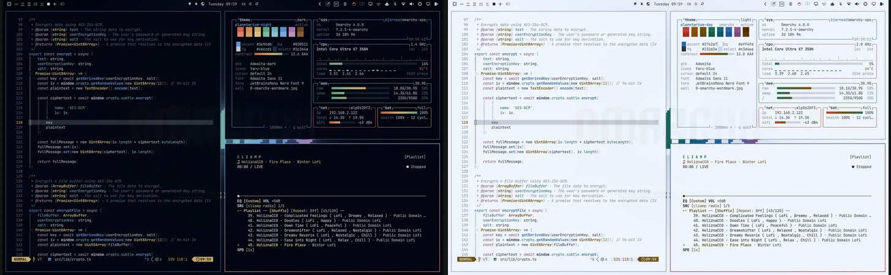](https://bjarneo.github.io/various-themes/#planetarium)

`089` · Folder: [`planetarium/`](planetarium/) · Scene: planetarium · [Open on the site](https://bjarneo.github.io/various-themes/#planetarium)

Stars on the dome of a planetarium. Star colors run from blue white to red, with nebula green and pink.

| Variant | Theme name | `background` | `foreground` | `accent` | Icons |
| --- | --- | --- | --- | --- | --- |
| Night | [`planetarium-night`](planetarium/night/) | `#020511` | `#c6ccd1` | `#5e96db` | `Yaru-blue` |
| Day | [`planetarium-day`](planetarium/day/) | `#eff4fd` | `#232a3a` | `#2762a7` | `Yaru-blue` |

<details>
<summary>All 16 ANSI colors of each variant</summary>

| Variant | Normal, 0 to 7 | Bright, 8 to 15 |
| --- | --- | --- |
| Night | `#020511` `#d7634e` `#64ab86` `#cfb166` `#5e96db` `#b279ac` `#75b4c7` `#c6ccd1` | `#5a6884` `#ed836e` `#82c09e` `#e0c582` `#7caeee` `#c994c3` `#90c8da` `#e5e8ea` |
| Day | `#eff4fd` `#b63e2a` `#186947` `#654d02` `#2762a7` `#8a5085` `#145d71` `#232a3a` | `#777f92` `#a52b17` `#005c3a` `#584302` `#16539a` `#7b4177` `#005164` `#0d111c` |

</details>

<details>
<summary>Wallpaper credits</summary>

- Night, `3-southern-sky-milky-way-arch.jpg`: [360-degree Panorama of the Southern Sky](https://commons.wikimedia.org/wiki/File:360-degree_Panorama_of_the_Southern_Sky.jpg) by ESO/H.H. Heyer, [CC BY 4.0](https://creativecommons.org/licenses/by/4.0)
- Night, `4-pedra-azul-milky-way.jpg`: [Pedra Azul Milky Way](https://commons.wikimedia.org/wiki/File:Pedra_Azul_Milky_Way.jpg) by EduardoMSNeves, [CC BY-SA 4.0](https://creativecommons.org/licenses/by-sa/4.0)
- Day, `3-eise-eisinga-orrery-ceiling.jpg`: [Planetarium Eise Eisinga in Franeker](https://commons.wikimedia.org/wiki/File:Planetarium_Eise_Eisinga_in_Franeker.jpg) by Erik Zachte, [CC BY-SA 4.0](https://creativecommons.org/licenses/by-sa/4.0)
- Day, `4-hemisferic-planetarium-valencia.jpg`: [El Hemisférico, Ciudad de las Artes y las Ciencias, Valencia, España, 2014-06-29, DD 37](https://commons.wikimedia.org/wiki/File:El_Hemisf%C3%A9rico,_Ciudad_de_las_Artes_y_las_Ciencias,_Valencia,_Espa%C3%B1a,_2014-06-29,_DD_37.JPG) by Diego Delso, [CC BY-SA 3.0](https://creativecommons.org/licenses/by-sa/3.0)

</details>

```bash
curl -fsSL https://bjarneo.github.io/various-themes/install.sh | bash -s -- planetarium --set
```

### Night Garden

[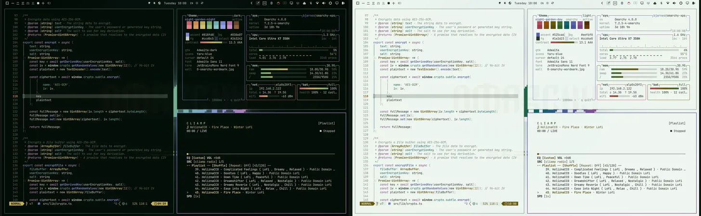](https://bjarneo.github.io/various-themes/#night-garden)

`090` · Folder: [`night-garden/`](night-garden/) · Scene: moonlit garden · [Open on the site](https://bjarneo.github.io/various-themes/#night-garden)

A garden by moonlight. Rose, leaf, primrose, moonflower and phlox colors fill their usual slots.

| Variant | Theme name | `background` | `foreground` | `accent` | Icons |
| --- | --- | --- | --- | --- | --- |
| Night | [`night-garden-night`](night-garden/night/) | `#030e07` | `#ccd0c5` | `#818fd8` | `Yaru-blue` |
| Day | [`night-garden-day`](night-garden/day/) | `#eef6f0` | `#1e2d23` | `#525ca6` | `Yaru-blue` |

<details>
<summary>All 16 ANSI colors of each variant</summary>

| Variant | Normal, 0 to 7 | Bright, 8 to 15 |
| --- | --- | --- |
| Night | `#030e07` `#cd6772` `#78aa6e` `#c9b35c` `#818fd8` `#bc77b6` `#70b5b8` `#ccd0c5` | `#55705d` `#e6868e` `#93c089` `#dbc77a` `#9ba9ec` `#d393cc` `#8cc9cd` `#ebece7` |
| Day | `#eef6f0` `#af4553` `#38692d` `#635100` `#525ca6` `#914b8c` `#096166` `#1e2d23` | `#728478` `#9e3344` `#295c1e` `#564600` `#444e97` `#823b7d` `#005458` `#0b140e` |

</details>

<details>
<summary>Wallpaper credits</summary>

- Night, `3-rose-in-the-night-garden.jpg`: [Rose flowers in the night - Flickr - e27182818284](https://commons.wikimedia.org/wiki/File:Rose_flowers_in_the_night_-_Flickr_-_e27182818284.jpg) by Michael Figiel, [CC BY 2.0](https://creativecommons.org/licenses/by/2.0)
- Night, `4-flower-garden-lit-at-night.jpg`: [Lit up flower garden at night](https://commons.wikimedia.org/wiki/File:Lit_up_flower_garden_at_night.jpg) by Pseudopanax at English Wikipedia, Public domain
- Day, `3-phlox-border-walled-garden.jpg`: [Herbaceous border at Mount Ephraim Gardens - geograph.org.uk - 5450049](https://commons.wikimedia.org/wiki/File:Herbaceous_border_at_Mount_Ephraim_Gardens_-_geograph.org.uk_-_5450049.jpg) by Marathon, [CC BY-SA 2.0](https://creativecommons.org/licenses/by-sa/2.0)
- Day, `4-summer-border-harlow-carr.jpg`: [RHS Harlow Carr, Herbaceous border - geograph.org.uk - 6652141](https://commons.wikimedia.org/wiki/File:RHS_Harlow_Carr,_Herbaceous_border_-_geograph.org.uk_-_6652141.jpg) by Michael Garlick, [CC BY-SA 2.0](https://creativecommons.org/licenses/by-sa/2.0)

</details>

```bash
curl -fsSL https://bjarneo.github.io/various-themes/install.sh | bash -s -- night-garden --set
```

### Pebble

[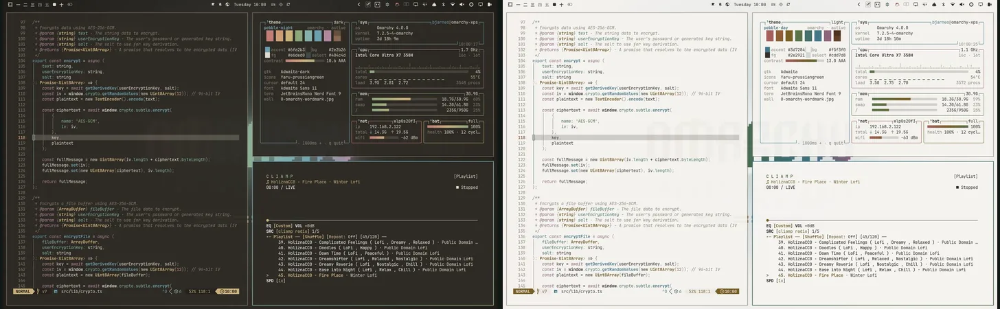](https://bjarneo.github.io/various-themes/#pebble)

`091` · Folder: [`pebble/`](pebble/) · Scene: pebbles · [Open on the site](https://bjarneo.github.io/various-themes/#pebble)

River pebbles on a warm grey base. Soft mid tones fill their usual slots.

| Variant | Theme name | `background` | `foreground` | `accent` | Icons |
| --- | --- | --- | --- | --- | --- |
| Night | [`pebble-night`](pebble/night/) | `#2e2b26` | `#e6ded0` | `#6fa2b3` | `Yaru-prussiangreen` |
| Day | [`pebble-day`](pebble/day/) | `#f5f3f0` | `#2e2921` | `#3d7284` | `Yaru-prussiangreen` |

<details>
<summary>All 16 ANSI colors of each variant</summary>

| Variant | Normal, 0 to 7 | Bright, 8 to 15 |
| --- | --- | --- |
| Night | `#2e2b26` `#c8817a` `#8fac7f` `#d2b67e` `#6fa2b3` `#b78aa3` `#87b5ae` `#e6ded0` | `#8b7f70` `#c8817a` `#8fac7f` `#d2b67e` `#6fa2b3` `#b78aa3` `#87b5ae` `#ffffff` |
| Day | `#f5f3f0` `#a15a54` `#526f43` `#74591c` `#3d7284` `#8c5f78` `#3c6b65` `#2e2921` | `#877e73` `#a15a54` `#526f43` `#74591c` `#3d7284` `#8c5f78` `#3c6b65` `#14110c` |

</details>

<details>
<summary>Wallpaper credits</summary>

- Night, `3-rethymno-pebbles.jpg`: [Pebbles in Rethymno's beach](https://commons.wikimedia.org/wiki/File:Pebbles_in_Rethymno%27s_beach.jpg) by Quim Gil, [CC0](http://creativecommons.org/publicdomain/zero/1.0/deed.en)
- Night, `4-inukshuk-moonrise.jpg`: [Vancouver Inukshuk](https://commons.wikimedia.org/wiki/File:Vancouver_Inukshuk.JPG) by Rleslievideo, [CC BY-SA 3.0](https://creativecommons.org/licenses/by-sa/3.0)
- Day, `3-chesil-beach-stones.jpg`: [Chesil Beach stones, Dorset, England](https://commons.wikimedia.org/wiki/File:Chesil_Beach_stones,_Dorset,_England.jpg) by Rosser1954, [CC BY-SA 4.0](https://creativecommons.org/licenses/by-sa/4.0)
- Day, `4-stone-cairn.jpg`: [Каменная пирамидка на Айдаркуле](https://commons.wikimedia.org/wiki/File:%D0%9A%D0%B0%D0%BC%D0%B5%D0%BD%D0%BD%D0%B0%D1%8F_%D0%BF%D0%B8%D1%80%D0%B0%D0%BC%D0%B8%D0%B4%D0%BA%D0%B0_%D0%BD%D0%B0_%D0%90%D0%B9%D0%B4%D0%B0%D1%80%D0%BA%D1%83%D0%BB%D0%B5.jpg) by Arina Pan, [CC BY-SA 4.0](https://creativecommons.org/licenses/by-sa/4.0)

</details>

```bash
curl -fsSL https://bjarneo.github.io/various-themes/install.sh | bash -s -- pebble --set
```

### Fresco

[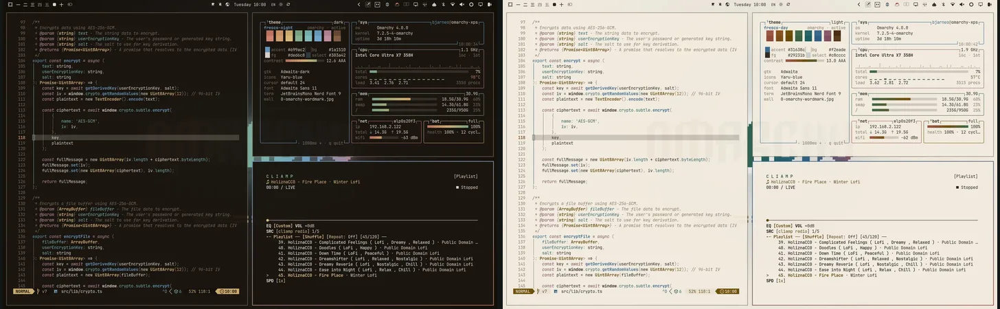](https://bjarneo.github.io/various-themes/#fresco)

`092` · Folder: [`fresco/`](fresco/) · Scene: fresco · [Open on the site](https://bjarneo.github.io/various-themes/#fresco)

A fresco on lime plaster. Earth pigments fill their usual slots: sinopia red, green earth, ochre and azurite.

| Variant | Theme name | `background` | `foreground` | `accent` | Icons |
| --- | --- | --- | --- | --- | --- |
| Night | [`fresco-night`](fresco/night/) | `#1a1510` | `#ded6c8` | `#699ac2` | `Yaru-blue` |
| Day | [`fresco-day`](fresco/day/) | `#f2eade` | `#29231b` | `#31638c` | `Yaru-blue` |

<details>
<summary>All 16 ANSI colors of each variant</summary>

| Variant | Normal, 0 to 7 | Bright, 8 to 15 |
| --- | --- | --- |
| Night | `#1a1510` `#c17662` `#7da985` `#d4b072` `#699ac2` `#b58194` `#78b2b4` `#ded6c8` | `#7a6d5e` `#d58773` `#8cb894` `#e1bd7f` `#79aad4` `#c792a5` `#86c0c2` `#f8f4ed` |
| Day | `#f2eade` `#9b4f3d` `#386442` `#6b4a01` `#31638c` `#865367` `#205f63` `#29231b` | `#857863` `#8f4533` `#305b3a` `#614300` `#285981` `#7c495d` `#16575a` `#080503` |

</details>

<details>
<summary>Wallpaper credits</summary>

- Night, `3-farnesina-black-wall.jpg`: [Wall painting - figured frieze and garland and white miniaturistic landscapes on black…](https://commons.wikimedia.org/wiki/File:Wall_painting_-_figured_frieze_and_garland_and_white_miniaturistic_landscapes_on_black_background_-_Rome_(Villa_della_Farnesina_-_triclinium_C)_-_Roma_MNR_PMaT_-_06.jpg) by ArchaiOptix, [CC BY-SA 4.0](https://creativecommons.org/licenses/by-sa/4.0)
- Night, `4-livia-garden-daisies.jpg`: [Fresco from the triclinium of the villa of Livia, wife of the Emperor Augustus, 30-20…](https://commons.wikimedia.org/wiki/File:Fresco_from_the_triclinium_of_the_villa_of_Livia,_wife_of_the_Emperor_Augustus,_30-20_BCE;_Palazzo_Massimo_alle_Terme,_Rome_(7).jpg) by Prof. Mortel, [CC BY 2.0](https://creativecommons.org/licenses/by/2.0)
- Day, `3-akrotiri-spring-lilies.jpg`: [Spring fresco from Akrotiri, NAMA BE 1974.29, 191200](https://commons.wikimedia.org/wiki/File:Spring_fresco_from_Akrotiri,_NAMA_BE_1974.29,_191200.jpg) by Zde, [CC BY-SA 4.0](https://creativecommons.org/licenses/by-sa/4.0)
- Day, `4-pompeii-swallow-fresco.jpg`: [Bird (Detail) - Garden painting (30-35 AD) from Pompeii, House of the Golden Bracelet…](https://commons.wikimedia.org/wiki/File:Bird_(Detail)_-_Garden_painting_(30-35_AD)_from_Pompeii,_House_of_the_Golden_Bracelet_-_Exhibition_%22Myth_and_Nature%22_at_Archaeological_Museum_of_Naples,_until_September_30,_2016_-_27699416421.jpg) by Carlo Raso, Public domain

</details>

```bash
curl -fsSL https://bjarneo.github.io/various-themes/install.sh | bash -s -- fresco --set
```

### Tin Toy

[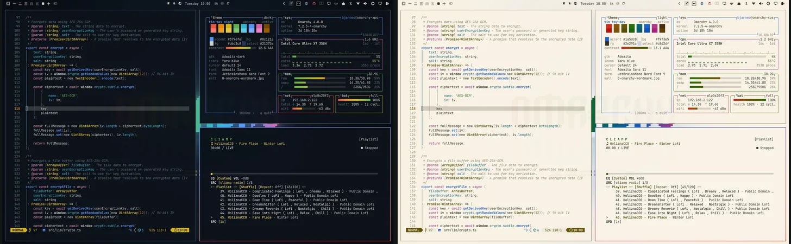](https://bjarneo.github.io/various-themes/#tin-toy)

`093` · Folder: [`tin-toy/`](tin-toy/) · Scene: tin litho · [Open on the site](https://bjarneo.github.io/various-themes/#tin-toy)

A tin toy in bright lithograph colors. Vivid primaries fill their usual slots, on cream in the day variant.

| Variant | Theme name | `background` | `foreground` | `accent` | Icons |
| --- | --- | --- | --- | --- | --- |
| Night | [`tin-toy-night`](tin-toy/night/) | `#0c121a` | `#d6d3c8` | `#5796fe` | `Yaru-blue` |
| Day | [`tin-toy-day`](tin-toy/day/) | `#f9f3e5` | `#2e291c` | `#1a5dc8` | `Yaru-blue` |

<details>
<summary>All 16 ANSI colors of each variant</summary>

| Variant | Normal, 0 to 7 | Bright, 8 to 15 |
| --- | --- | --- |
| Night | `#0c121a` `#ee5644` `#63b650` `#dbb911` `#5796fe` `#df67b0` `#2fbdd9` `#d6d3c8` | `#5e6e82` `#ff7f6d` `#81cc71` `#eccd51` `#82b1fe` `#f587c8` `#61d2eb` `#f2f0eb` |
| Day | `#f9f3e5` `#ca2517` `#1d6b00` `#604f00` `#1a5dc8` `#ae3183` `#026071` `#2e291c` | `#887e66` `#b50900` `#175c00` `#534400` `#024dba` `#9e1b74` `#025362` `#151109` |

</details>

<details>
<summary>Wallpaper credits</summary>

- Night, `3-tin-toy-firemen.jpg`: [Antique tin toy firemen (28413717583)](https://commons.wikimedia.org/wiki/File:Antique_tin_toy_firemen_(28413717583).jpg) by Thomas Quine, [CC BY 2.0](https://creativecommons.org/licenses/by/2.0)
- Night, `4-clockwork-tin-ship.jpg`: [Old tin toy clock work ship, pic1](https://commons.wikimedia.org/wiki/File:Old_tin_toy_clock_work_ship,_pic1.JPG) by Alf van Beem, [CC0](http://creativecommons.org/publicdomain/zero/1.0/deed.en)
- Day, `3-tin-rooster.jpg`: [GKN-Blechhahn, um 1948 (Foto Sp b)](https://commons.wikimedia.org/wiki/File:GKN-Blechhahn,_um_1948_(Foto_Sp_b).JPG) by Lothar Spurzem, [CC BY-SA 2.0 de](https://creativecommons.org/licenses/by-sa/2.0/de/deed.en)
- Day, `4-tin-fire-engine.jpg`: [Feuerwehrauto von Günthermann - tin toy (um 1950)](https://commons.wikimedia.org/wiki/File:Feuerwehrauto_von_G%C3%BCnthermann_-_tin_toy_(um_1950).jpg) by Lothar Spurzem, [CC BY-SA 2.0 de](https://creativecommons.org/licenses/by-sa/2.0/de/deed.en)

</details>

```bash
curl -fsSL https://bjarneo.github.io/various-themes/install.sh | bash -s -- tin-toy --set
```

### Watercolor

[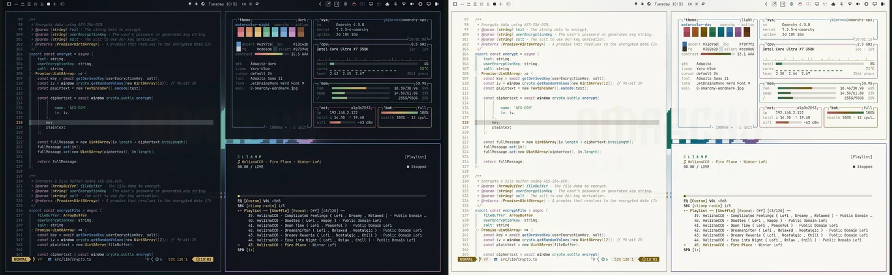](https://bjarneo.github.io/various-themes/#watercolor)

`094` · Folder: [`watercolor/`](watercolor/) · Scene: watercolor · [Open on the site](https://bjarneo.github.io/various-themes/#watercolor)

Watercolor washes on white paper. Soft clear colors fill their usual slots.

| Variant | Theme name | `background` | `foreground` | `accent` | Icons |
| --- | --- | --- | --- | --- | --- |
| Night | [`watercolor-night`](watercolor/night/) | `#10141b` | `#cdd6de` | `#6297ce` | `Yaru-blue` |
| Day | [`watercolor-day`](watercolor/day/) | `#f8f7f2` | `#302b20` | `#3169a0` | `Yaru-blue` |

<details>
<summary>All 16 ANSI colors of each variant</summary>

| Variant | Normal, 0 to 7 | Bright, 8 to 15 |
| --- | --- | --- |
| Night | `#10141b` `#cb6c75` `#6ead84` `#d3b168` `#6297ce` `#b77eb2` `#66b5c2` `#cdd6de` | `#636f81` `#e48c92` `#8bc49e` `#e6c686` `#81b1e4` `#d09aca` `#85cbd7` `#eef3f7` |
| Day | `#f8f7f2` `#ae4c58` `#286d45` `#6e5203` `#3169a0` `#8e5389` `#016674` `#302b20` | `#878173` `#9c3b49` `#145f38` `#614700` `#1f5a91` `#7e447a` `#035864` `#17150e` |

</details>

<details>
<summary>Wallpaper credits</summary>

- Night, `3-spilliaert-beach-moon.jpg`: [Strand met maan](https://commons.wikimedia.org/wiki/File:Strand_met_maan,_L%C3%A9on_Spilliaert,_Mu.ZEE_Oostende,_K000433.jpg) by Léon Spilliaert, Public domain
- Night, `4-spilliaert-blue-basin.jpg`: [De blauwe teil](https://commons.wikimedia.org/wiki/File:De_blauwe_teil,_L%C3%A9on_Spilliaert,_Mu.ZEE_Oostende,_SM000058.jpg) by Léon Spilliaert, Public domain
- Day, `3-cezanne-provence-landscape.jpg`: [Landscape in Provence](https://commons.wikimedia.org/wiki/File:Paul_C%C3%A9zanne_-_Landscape_in_Provence_-_Google_Art_Project.jpg) by Paul Cézanne, Public domain
- Day, `4-spilliaert-dunes.jpg`: [Duinen](https://commons.wikimedia.org/wiki/File:Duinen,_L%C3%A9on_Spilliaert,_Mu.ZEE_Oostende,_SM000477.jpg) by Léon Spilliaert, Public domain

</details>

```bash
curl -fsSL https://bjarneo.github.io/various-themes/install.sh | bash -s -- watercolor --set
```

## Pastel

The normal colors keep a mid chroma. The brights turn into near-white tints, and the foreground takes a contrasting hue.

### Nacre

[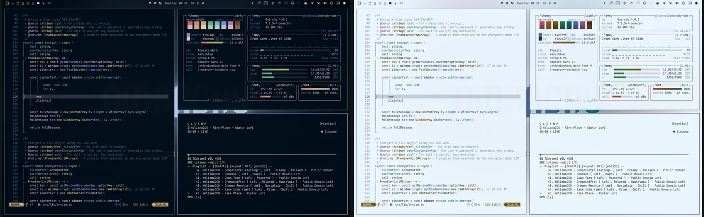](https://bjarneo.github.io/various-themes/#nacre)

`095` · Folder: [`nacre/`](nacre/) · Scene: nacre · [Open on the site](https://bjarneo.github.io/various-themes/#nacre)

The inside of a pearl shell. Pearl tints sit on deep sea navy, and the text has a soft pearl pink.

| Variant | Theme name | `background` | `foreground` | `accent` | Icons |
| --- | --- | --- | --- | --- | --- |
| Night | [`nacre-night`](nacre/night/) | `#000d18` | `#dbcbd1` | `#7d91d3` | `Yaru-blue` |
| Day | [`nacre-day`](nacre/day/) | `#eaf5fd` | `#182c39` | `#4c5f9f` | `Yaru-blue` |

<details>
<summary>All 16 ANSI colors of each variant</summary>

| Variant | Normal, 0 to 7 | Bright, 8 to 15 |
| --- | --- | --- |
| Night | `#000d18` `#cc6d76` `#6bac90` `#ceb070` `#7d91d3` `#b77eb2` `#72b7be` `#dbcbd1` | `#4c6e85` `#e5b7b9` `#acc9bb` `#ded1b4` `#b7c2e0` `#d5bad2` `#b3d1d4` `#f2eaed` |
| Day | `#eaf5fd` `#a84854` `#1e684e` `#6a4e00` `#4c5f9f` `#884f84` `#075f67` `#182c39` | `#6e8291` `#7e3840` `#1d4f3c` `#513c07` `#3b4877` `#673d63` `#11494f` `#06121b` |

</details>

<details>
<summary>Wallpaper credits</summary>

- Night, `3-greenlip-abalone.jpg`: [Haliotis laevigata 01](https://commons.wikimedia.org/wiki/File:Haliotis_laevigata_01.JPG) by H. Zell, [CC BY-SA 3.0](https://creativecommons.org/licenses/by-sa/3.0)
- Night, `4-polished-nautilus.jpg`: [Nautilus shell Natural History Museum University of Pisa C 3302](https://commons.wikimedia.org/wiki/File:Nautilus_shell_Natural_History_Museum_University_of_Pisa_C_3302.jpg) by Regione Toscana, [CC BY-SA 4.0](https://creativecommons.org/licenses/by-sa/4.0)
- Day, `3-abalone-nacre.jpg`: [Abalone shell (13785764994)](https://commons.wikimedia.org/wiki/File:Abalone_shell_(13785764994).jpg) by Paxson Woelber, [CC BY 2.0](https://creativecommons.org/licenses/by/2.0)
- Day, `4-abalone-nacre-layers.jpg`: [Abalone shell (13785447153)](https://commons.wikimedia.org/wiki/File:Abalone_shell_(13785447153).jpg) by Paxson Woelber, [CC BY 2.0](https://creativecommons.org/licenses/by/2.0)

</details>

```bash
curl -fsSL https://bjarneo.github.io/various-themes/install.sh | bash -s -- nacre --set
```

### Sherbet

[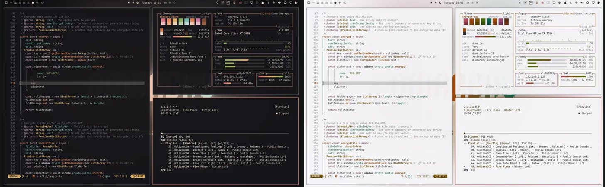](https://bjarneo.github.io/various-themes/#sherbet)

`096` · Folder: [`sherbet/`](sherbet/) · Scene: sherbet · [Open on the site](https://bjarneo.github.io/various-themes/#sherbet)

Orange, raspberry and lime sherbet. Soft pastels sit on charcoal. Slots that leave their usual hue: `blue`.

| Variant | Theme name | `background` | `foreground` | `accent` | Icons |
| --- | --- | --- | --- | --- | --- |
| Night | [`sherbet-night`](sherbet/night/) | `#161519` | `#e6d3c3` | `#de8251` | `Yaru` |
| Day | [`sherbet-day`](sherbet/day/) | `#f4f3f6` | `#2b2830` | `#a24703` | `Yaru` |

<details>
<summary>All 16 ANSI colors of each variant</summary>

| Variant | Normal, 0 to 7 | Bright, 8 to 15 |
| --- | --- | --- |
| Night | `#161519` `#dc6c7d` `#8ab25e` `#e2b366` `#de8251` `#d37ca6` `#76c1ad` `#e6d3c3` | `#716d7c` `#f2bcc1` `#bcd0ab` `#ecd7b6` `#ecc1ab` `#e8bed1` `#bbdad0` `#fdf2eb` |
| Day | `#f4f3f6` `#b13f56` `#416701` `#6f4c00` `#a24703` `#9c4573` `#046251` `#2b2830` | `#827d8b` `#843241` `#334e0c` `#573a00` `#793810` `#753656` `#0e4b3f` `#121116` |

</details>

<details>
<summary>Wallpaper credits</summary>

- Night, `3-raspberry-sorbet-cup.jpg`: [Glass cup with sorbet (5186725623)](https://commons.wikimedia.org/wiki/File:Glass_cup_with_sorbet_(5186725623).jpg) by star5112, [CC BY-SA 2.0](https://creativecommons.org/licenses/by-sa/2.0)
- Night, `4-sherbet-scoops-granite.jpg`: [Ice cream Cup](https://commons.wikimedia.org/wiki/File:Ice_cream_Cup.jpg) by Ahamed Kafir M, [CC BY-SA 4.0](https://creativecommons.org/licenses/by-sa/4.0)
- Day, `3-rainbow-sherbet.jpg`: [Rainbow Sherbet (38251341974)](https://commons.wikimedia.org/wiki/File:Rainbow_Sherbet_(38251341974).jpg) by Prayitno, [CC BY 2.0](https://creativecommons.org/licenses/by/2.0)
- Day, `4-raspberry-sherbet.jpg`: [Homemade raspberry sherbert (4426007421)](https://commons.wikimedia.org/wiki/File:Homemade_raspberry_sherbert_(4426007421).jpg) by star5112, [CC BY-SA 2.0](https://creativecommons.org/licenses/by-sa/2.0)

</details>

```bash
curl -fsSL https://bjarneo.github.io/various-themes/install.sh | bash -s -- sherbet --set
```

### Gelato

[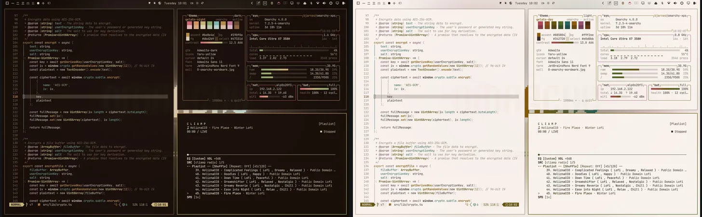](https://bjarneo.github.io/various-themes/#gelato)

`097` · Folder: [`gelato/`](gelato/) · Scene: gelato · [Open on the site](https://bjarneo.github.io/various-themes/#gelato)

Gelato in a shop window. Pistachio, strawberry and vanilla pastels sit on espresso brown. Slots that leave their usual hue: `blue`.

| Variant | Theme name | `background` | `foreground` | `accent` | Icons |
| --- | --- | --- | --- | --- | --- |
| Night | [`gelato-night`](gelato/night/) | `#190f0a` | `#dbd2b9` | `#be8e4e` | `Yaru-yellow` |
| Day | [`gelato-day`](gelato/day/) | `#f9f2ee` | `#342720` | `#885804` | `Yaru-yellow` |

<details>
<summary>All 16 ANSI colors of each variant</summary>

| Variant | Normal, 0 to 7 | Bright, 8 to 15 |
| --- | --- | --- |
| Night | `#190f0a` `#d46d77` `#8dac6f` `#ccb87d` `#be8e4e` `#c77ea0` `#80bab5` `#dbd2b9` | `#80685a` `#ecbabc` `#bccbaf` `#e0d7bd` `#d9c3a7` `#e0bdcc` `#bbd5d2` `#f4f0e3` |
| Day | `#f9f2ee` `#ad4352` `#486426` `#624f0a` `#885804` `#934c70` `#205f5c` `#342720` | `#8d7c73` `#81353f` `#384c21` `#4b3d11` `#664310` `#6f3b54` `#1d4946` `#180f0b` |

</details>

<details>
<summary>Wallpaper credits</summary>

- Night, `3-gelato-black-bowl.jpg`: [Homemade ice cream in clipper lounge](https://commons.wikimedia.org/wiki/File:Homemade_ice_cream_in_clipper_lounge.jpg) by Peachyeung316, [CC BY-SA 4.0](https://creativecommons.org/licenses/by-sa/4.0)
- Night, `4-gelato-display-case.jpg`: ["" Ice cream display (Crepes & Waffles, Quito) pic. bb8a](https://commons.wikimedia.org/wiki/File:%22%22_Ice_cream_display_(Crepes_%26_Waffles,_Quito)_pic._bb8a.jpg) by David Adam Kess, [CC BY-SA 4.0](https://creativecommons.org/licenses/by-sa/4.0)
- Day, `3-gelato-tubs-closeup.jpg`: [Gelato ice cream](https://commons.wikimedia.org/wiki/File:Gelato_ice_cream.jpg) by rawpixel, [CC0](http://creativecommons.org/publicdomain/zero/1.0/deed.en)
- Day, `4-gelato-roses-macarons.jpg`: [Amorino Gelato Flowers and Macaroons](https://commons.wikimedia.org/wiki/File:Amorino_Gelato_Flowers_and_Macaroons.jpg) by Rebecrs, [CC BY-SA 4.0](https://creativecommons.org/licenses/by-sa/4.0)

</details>

```bash
curl -fsSL https://bjarneo.github.io/various-themes/install.sh | bash -s -- gelato --set
```

### Rosewater

[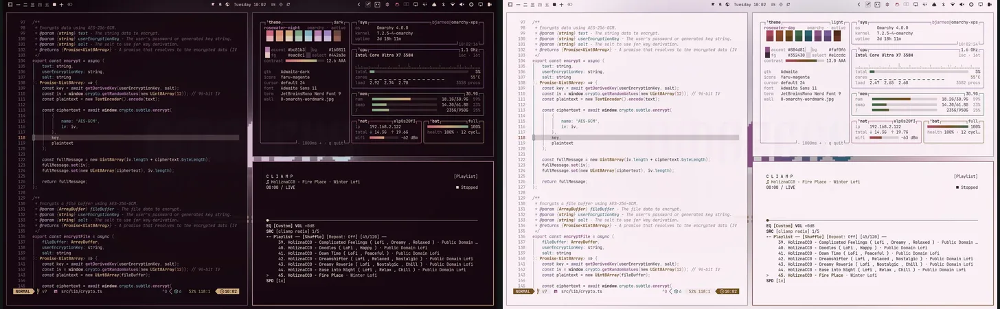](https://bjarneo.github.io/various-themes/#rosewater)

`098` · Folder: [`rosewater/`](rosewater/) · Scene: rose petals · [Open on the site](https://bjarneo.github.io/various-themes/#rosewater)

Rose petals in rosewater. Rose and peach pastels sit on plum black. Slots that leave their usual hue: `blue`.

| Variant | Theme name | `background` | `foreground` | `accent` | Icons |
| --- | --- | --- | --- | --- | --- |
| Night | [`rosewater-night`](rosewater/night/) | `#160811` | `#eac8c1` | `#bc81b3` | `Yaru-magenta` |
| Day | [`rosewater-day`](rosewater/day/) | `#faf0f6` | `#352430` | `#884d81` | `Yaru-magenta` |

<details>
<summary>All 16 ANSI colors of each variant</summary>

| Variant | Normal, 0 to 7 | Bright, 8 to 15 |
| --- | --- | --- |
| Night | `#160811` `#d06a7c` `#7eaa86` `#d6ad7d` `#bc81b3` `#a385c6` `#80b5c5` `#eac8c1` | `#806175` `#e8b6bc` `#b4c8b7` `#e3d0ba` `#d7bbd2` `#cbbddc` `#bad1d8` `#fae9e5` |
| Day | `#faf0f6` `#ab4359` `#396543` `#714a15` `#884d81` `#745597` `#245c6d` `#352430` | `#8d7986` `#7f3544` `#2e4d35` `#563916` `#663c61` `#584170` `#204652` `#180d15` |

</details>

<details>
<summary>Wallpaper credits</summary>

- Night, `3-peach-rose-in-the-dark.jpg`: [Roses in dark](https://commons.wikimedia.org/wiki/File:Roses_in_dark.jpg) by Kuleczkaxx, [CC BY-SA 4.0](https://creativecommons.org/licenses/by-sa/4.0)
- Night, `4-rose-petals-in-rosewater.jpg`: [مراسم گلابگیری در قمصر کاشان Golabgiri ("making Rosewater") - Ghamsar- Kashan- Iran 27](https://commons.wikimedia.org/wiki/File:%D9%85%D8%B1%D8%A7%D8%B3%D9%85_%DA%AF%D9%84%D8%A7%D8%A8%DA%AF%DB%8C%D8%B1%DB%8C_%D8%AF%D8%B1_%D9%82%D9%85%D8%B5%D8%B1_%DA%A9%D8%A7%D8%B4%D8%A7%D9%86_Golabgiri_(%22making_Rosewater%22)_-_Ghamsar-_Kashan-_Iran_27.jpg) by Mostafameraji, [CC BY-SA 4.0](https://creativecommons.org/licenses/by-sa/4.0)
- Day, `3-pink-rose-petal-swirl.jpg`: [Rose Petals (5850444953)](https://commons.wikimedia.org/wiki/File:Rose_Petals_(5850444953).jpg) by Eric Kilby, [CC BY-SA 2.0](https://creativecommons.org/licenses/by-sa/2.0)
- Day, `4-roses-in-a-vase-on-white.jpg`: [Roses (Unsplash PwWkzeJeJZE)](https://commons.wikimedia.org/wiki/File:Roses_(Unsplash_PwWkzeJeJZE).jpg) by Julia Janeta juliajanetawilling, [CC0](http://creativecommons.org/publicdomain/zero/1.0/deed.en)

</details>

```bash
curl -fsSL https://bjarneo.github.io/various-themes/install.sh | bash -s -- rosewater --set
```

### Pastel Goth

[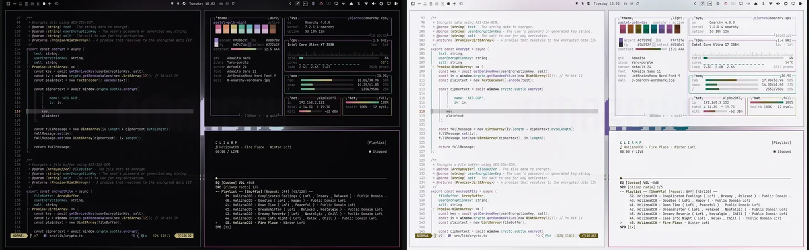](https://bjarneo.github.io/various-themes/#pastel-goth)

`099` · Folder: [`pastel-goth/`](pastel-goth/) · Scene: moon charms · [Open on the site](https://bjarneo.github.io/various-themes/#pastel-goth)

Pink, lilac and mint on black. Pastel colors sit on a near black background.

| Variant | Theme name | `background` | `foreground` | `accent` | Icons |
| --- | --- | --- | --- | --- | --- |
| Night | [`pastel-goth-night`](pastel-goth/night/) | `#080709` | `#d7c7da` | `#9d86c9` | `Yaru-purple` |
| Day | [`pastel-goth-day`](pastel-goth/day/) | `#f4f3f6` | `#2b292f` | `#6f5598` | `Yaru-purple` |

<details>
<summary>All 16 ANSI colors of each variant</summary>

| Variant | Normal, 0 to 7 | Bright, 8 to 15 |
| --- | --- | --- |
| Night | `#080709` `#c96890` `#53ad8e` `#c3b377` `#9d86c9` `#bd77b6` `#65b6bf` `#d7c7da` | `#6a6673` `#e2b4c4` `#a3c8b8` `#d8d1b6` `#c5bbda` `#d7b6d3` `#aecfd3` `#eee7f0` |
| Day | `#f4f3f6` `#a74470` `#00694f` `#60500b` `#6f5598` `#8f4a8a` `#006069` `#2b292f` | `#827d8b` `#7c3655` `#01513c` `#493e11` `#534272` `#6c3968` `#004a51` `#121115` |

</details>

<details>
<summary>Wallpaper credits</summary>

- Night, `3-rosy-maple-moth-verbena.jpg`: [- 7715 – Dryocampa rubicunda – Rosy Maple Moth (46880929995)](https://commons.wikimedia.org/wiki/File:-_7715_%E2%80%93_Dryocampa_rubicunda_%E2%80%93_Rosy_Maple_Moth_(46880929995).jpg) by Andy Reago & Chrissy McClarren, [CC BY 2.0](https://creativecommons.org/licenses/by/2.0)
- Night, `4-lilac-dawn-crescent.jpg`: [Crescent moon at dawn over Kolukkumalai Peak, Kerala](https://commons.wikimedia.org/wiki/File:Crescent_moon_at_dawn_over_Kolukkumalai_Peak,_Kerala.jpg) by Musheer1999, [CC BY-SA 4.0](https://creativecommons.org/licenses/by-sa/4.0)
- Day, `3-belt-of-venus-sea.jpg`: [Venus belt minus 5](https://commons.wikimedia.org/wiki/File:Venus_belt_minus_5.jpg) by LouisHeon, [CC BY-SA 4.0](https://creativecommons.org/licenses/by-sa/4.0)
- Day, `4-luna-moth-white.jpg`: [Actias luna UMFS 2](https://commons.wikimedia.org/wiki/File:Actias_luna_UMFS_2.jpg) by Fredlyfish4, [CC BY-SA 4.0](https://creativecommons.org/licenses/by-sa/4.0)

</details>

```bash
curl -fsSL https://bjarneo.github.io/various-themes/install.sh | bash -s -- pastel-goth --set
```

### Mochi

[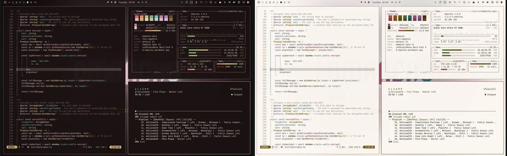](https://bjarneo.github.io/various-themes/#mochi)

`100` · Folder: [`mochi/`](mochi/) · Scene: mochi · [Open on the site](https://bjarneo.github.io/various-themes/#mochi)

Soft mochi in pastel colors. Sakura pink, matcha and kinako sit on rice white in the day variant. Slots that leave their usual hue: `blue`.

| Variant | Theme name | `background` | `foreground` | `accent` | Icons |
| --- | --- | --- | --- | --- | --- |
| Night | [`mochi-night`](mochi/night/) | `#1a1111` | `#dfd2c7` | `#cd829f` | `Yaru-magenta` |
| Day | [`mochi-day`](mochi/day/) | `#fbf6f1` | `#342a23` | `#964c6b` | `Yaru-magenta` |

<details>
<summary>All 16 ANSI colors of each variant</summary>

| Variant | Normal, 0 to 7 | Bright, 8 to 15 |
| --- | --- | --- |
| Night | `#1a1111` `#d36c6e` `#89af75` `#d1b674` `#cd829f` `#b286bb` `#81bbbd` `#dfd2c7` | `#806867` `#eebcba` `#bbcdb2` `#e3d7ba` `#e2becb` `#d5c1d9` `#bdd6d7` `#f7f1eb` |
| Day | `#fbf6f1` `#b1484d` `#43682e` `#6a5101` `#964c6b` `#81558b` `#226164` `#342a23` | `#8d7f74` `#84393c` `#364f26` `#523f09` `#713c51` `#614269` `#1f4b4d` `#1a130f` |

</details>

<details>
<summary>Wallpaper credits</summary>

- Night, `3-pastel-mochi-trio.jpg`: [Kuyakansuke-mochi, Wagashi, Mie](https://commons.wikimedia.org/wiki/File:Kuyakansuke-mochi,_Wagashi,_Mie.jpg) by 大野 一将, [CC BY-SA 4.0](https://creativecommons.org/licenses/by-sa/4.0)
- Night, `4-pink-wagashi-lacquer.jpg`: [Pink wagashi - flower with two birds - Japan (150)](https://commons.wikimedia.org/wiki/File:Pink_wagashi_-_flower_with_two_birds_-_Japan_(150).jpg) by Savannah Rivka, [CC BY-SA 4.0](https://creativecommons.org/licenses/by-sa/4.0)
- Day, `3-sanshoku-dango.jpg`: [Sanshoku Dango 001](https://commons.wikimedia.org/wiki/File:Sanshoku_Dango_001.jpg) by Ocdp, [CC0](http://creativecommons.org/publicdomain/zero/1.0/deed.en)
- Day, `4-matcha-mochi.jpg`: [Green Tea Mochi - 03](https://commons.wikimedia.org/wiki/File:Green_Tea_Mochi_-_03.jpg) by Poulpy, [CC BY-SA 3.0](https://creativecommons.org/licenses/by-sa/3.0)

</details>

```bash
curl -fsSL https://bjarneo.github.io/various-themes/install.sh | bash -s -- mochi --set
```

